# EliteShop Colombia Backend

Backend API for **EliteShop Colombia**, an e-commerce platform built with Spring Boot 4, Java 21, and Clean Architecture principles.

---

## Table of Contents

- [Executive Summary](#executive-summary)
- [Technical Summary](#technical-summary)
- [Architecture](#architecture)
- [Project Structure](#project-structure)
- [Modules](#modules)
- [Database Schema](#database-schema)
- [API Endpoints](#api-endpoints)
- [Getting Started](#getting-started)
- [Configuration](#configuration)
- [Development Guidelines](#development-guidelines)

---

## Executive Summary

EliteShop Colombia is a Colombian e-commerce platform that connects sellers and customers. The backend provides REST APIs for managing customers, sellers, products, orders, payments, shopping carts, and product reviews. It is designed as a modular monolith with clear domain boundaries, enabling independent evolution of each business module.

**Current Status:** Early development. The **Customer** and **Seller** modules have been fully implemented (domain, application, and infrastructure layers). The database schema defines 12 tables covering the full business domain, but the remaining modules (product, order, cart, payment) are not yet implemented in code.

---

## Technical Summary

| Aspect | Detail |
|---|---|
| **Language** | Java 21 |
| **Framework** | Spring Boot 4.0.7 |
| **Architecture** | Clean Architecture + Hexagonal (Ports & Adapters) |
| **Modularity** | Spring Modulith 2.0.7 |
| **Database** | PostgreSQL 15 |
| **Migrations** | Liquibase |
| **Build Tool** | Maven |
| **Code Style** | Google Java Format (Spotless) |
| **Security** | Spring Security (permissive for development) |
| **Resilience** | Resilience4j Circuit Breaker |
| **Config** | Spring Cloud Config Server |
| **Observability** | Spring Modulith Observability + Actuator |
| **Email** | Spring Mail |

---

## Architecture

The project follows **Clean Architecture** with a strict layer separation inside each module. Each module is self-contained with its own domain, application, and infrastructure layers.

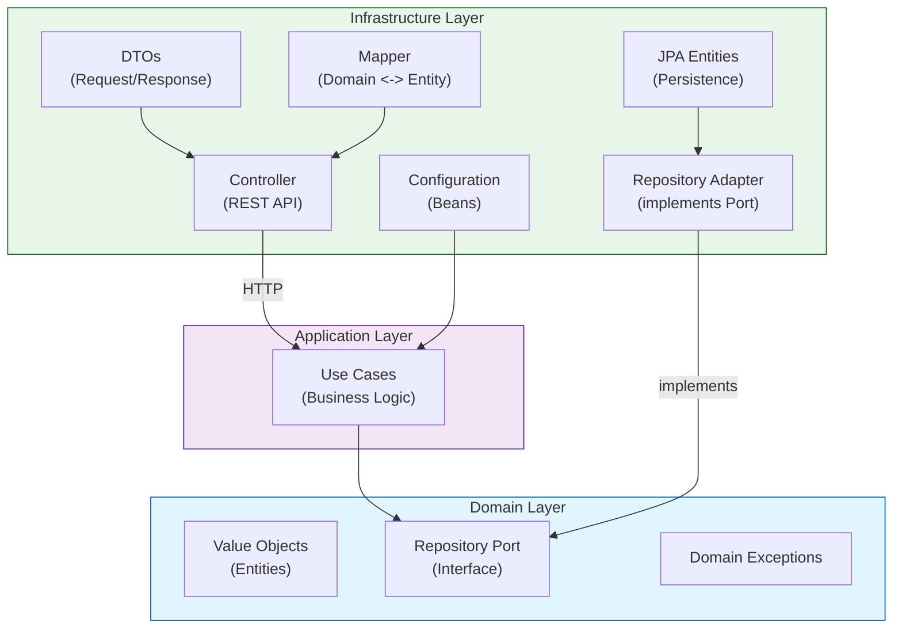

### Layer Responsibilities

| Layer | Purpose | Dependencies |
|---|---|---|
| **Domain** | Business rules, value objects, repository interfaces, exceptions. Zero external dependencies. | None |
| **Application** | Use cases that orchestrate business logic. Depends only on domain interfaces. | Domain |
| **Infrastructure** | HTTP controllers, JPA entities, mappers, adapters. Bridges domain to external systems. | Application, Domain |

### Design Principles

- **Dependency Inversion:** Domain defines repository interfaces (ports); infrastructure implements them (adapters).
- **Value Objects:** Every field in the domain model is wrapped in a typed value object (e.g., `CustomerEmail`, `CustomerId`), preventing primitive obsession and enforcing type safety.
- **Use Cases:** Each business operation is a single-use-case class (e.g., `CustomerSaveUseCase`), ensuring single responsibility.
- **No Leaking:** Infrastructure concerns (JPA annotations, HTTP) never appear in domain or application layers.

---

## Notification & Webhooks System

The system includes asynchronous notifications via Slack webhooks, GitHub PR webhook integration, and a retry queue for failed notifications.

### GitHub Webhook & Slack Integration Flow

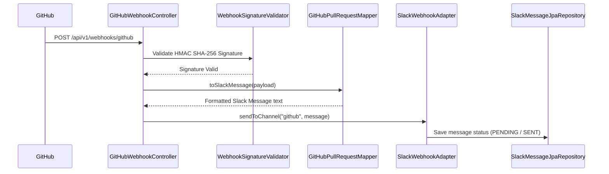

### Notification Endpoints & Schedulers

| Method | Endpoint | Description |
|---|---|---|
| POST | `/api/v1/webhooks/github` | Receive GitHub PR Webhooks |
| GET | `/api/v1/notifications/test` | Test Slack channel notifications |

- **NotificationRetryScheduler:** Periodically checks for failed/pending notifications and retries sending them to Slack based on configured exponential backoff.
- **HealthCheckScheduler:** Monitors system health and reports status.

## Seller Verification Flow

The system uses facial matching to verify seller identity.

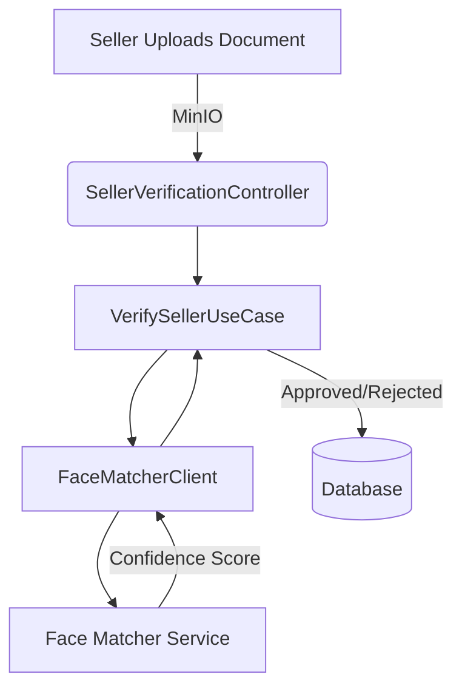

### Endpoints

| Method | Endpoint | Description |
|---|---|---|
| POST | `/api/v1/sellers/{id}/verification/document` | Upload Identity Document |
| POST | `/api/v1/sellers/{id}/verification/selfie` | Upload Selfie |
| POST | `/api/v1/sellers/{id}/verification/validate` | Trigger Verification |
| GET | `/api/v1/sellers/{id}/verification` | Check Status |

## Event-Driven Architecture

The system utilizes Spring Modulith to handle events between modules.

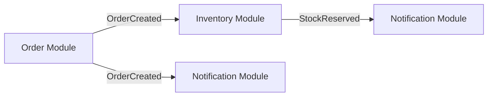

### Key Events

| Event | Origin | Listeners |
|---|---|---|
| OrderCreated | Order | Inventory, Notification, Seller |
| OrderStatusChanged | Order | Notification, Inventory, Seller |


### HTTP Request Flow (Seller)

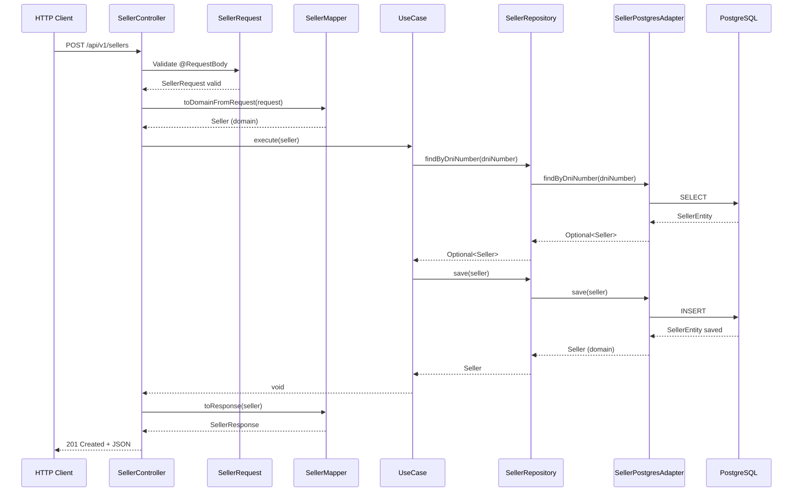

### Architecture by Layers (Seller)

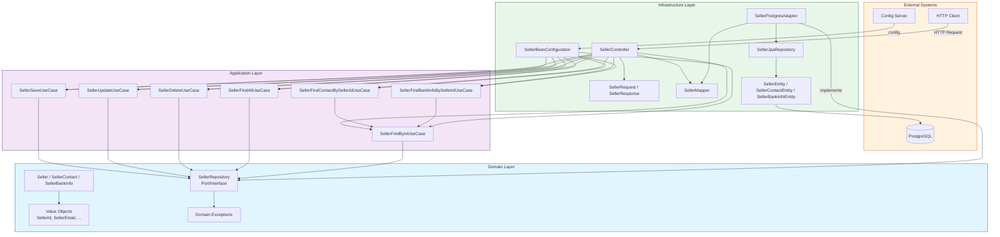

### Persistence Flow (Seller - Save/Update)

```mermaid
flowchart LR
    subgraph Entry["Entry"]
        Req[SellerRequest]
    end

    subgraph Transform["Transformation"]
        MapReq[Mapper.toDomainFromRequest]
        Domain[Seller domain]
        MapEnt[Mapper.toEntity]
        Ent[SellerEntity]
    end

    subgraph Persist["Persistence"]
        JPA[SellerJpaRepository.save]
        DB[(PostgreSQL)]
        Persisted[SellerEntity persisted]
    end

    subgraph Response["Response"]
        MapRes[Mapper.toResponse]
        Resp[SellerResponse]
    end

    Req --> MapReq
    MapReq --> Domain
    Domain --> MapEnt
    MapEnt --> Ent
    Ent --> JPA
    JPA --> DB
    DB --> Persisted
    Persisted --> MapRes
    MapRes --> Resp

    style Entry fill:#fff3e0,stroke:#e65100
    style Transform fill:#e1f5fe,stroke:#01579b
    style Persist fill:#e8f5e9,stroke:#1b5e20
    style Response fill:#f3e5f5,stroke:#4a148c
```

### Contact and Bank Info Query Flow

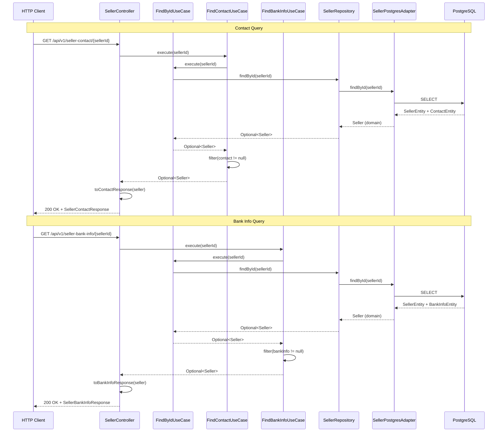

### Entity Relationship Diagram (Seller)

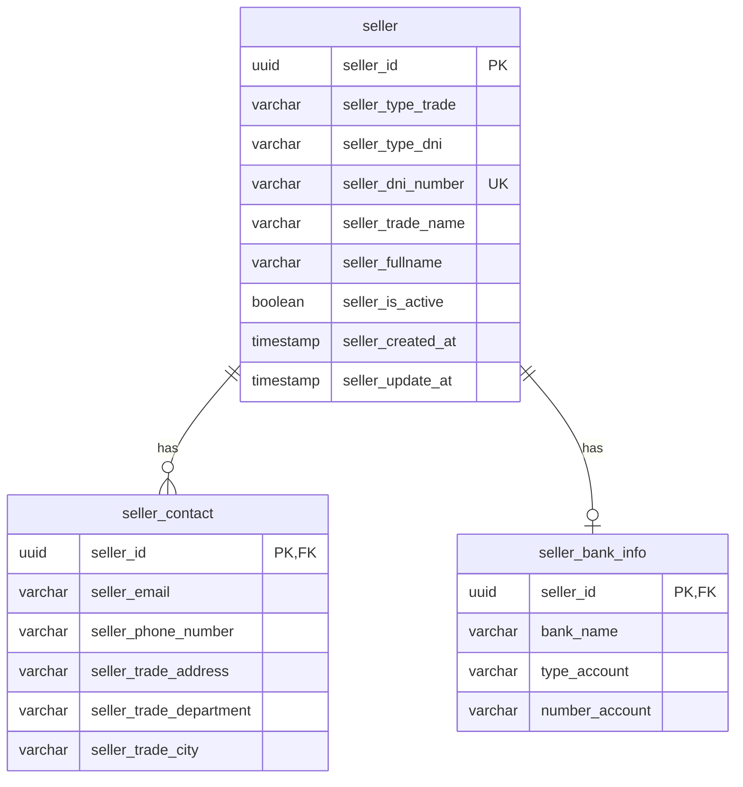

---

## Project Structure

```
src/main/java/com/eliteshop/colombia/
├── ColombiaApplication.java          # Application entry point
├── SecurityConfig.java               # Spring Security config (permissive)
│
└── customer/                         # Customer module
    ├── application/                  # Use cases
    │   ├── CustomerSaveUseCase.java
    │   ├── CustomerUpdateUseCase.java
    │   ├── CustomerDeleteUseCase.java
    │   ├── CustomerFindAllUseCase.java
    │   └── CustomerFindByIdUseCase.java
    │
    ├── domain/                       # Domain model
    │   ├── model/
    │   │   ├── Customer.java                  # Aggregate root
    │   │   ├── CustomerInfo.java              # Value object (DNI + address)
    │   │   ├── CustomerId.java                # UUID wrapper
    │   │   ├── CustomerFirstName.java         # String wrapper
    │   │   ├── CustomerLastName.java          # String wrapper
    │   │   ├── CustomerEmail.java             # String wrapper
    │   │   ├── CustomerPhoneNumber.java       # String wrapper
    │   │   ├── CustomerPassword.java          # String wrapper
    │   │   ├── CustomerProfileImage.java      # String wrapper
    │   │   ├── CustomerCreatedAt.java         # Timestamp wrapper
    │   │   ├── CustomerUpdatedAt.java         # Timestamp wrapper
    │   │   ├── CustomerDniType.java           # String wrapper
    │   │   ├── CustomerDniNumber.java         # String wrapper
    │   │   ├── CustomerAddress.java           # String wrapper
    │   │   ├── CustomerDepartment.java        # String wrapper
    │   │   ├── CustomerCity.java              # String wrapper
    │   │   ├── CustomerDniCreatedAt.java      # Timestamp wrapper
    │   │   └── CustomerDniUpdatedAt.java      # Timestamp wrapper
    │   ├── repository/
    │   │   └── CustomerRepository.java        # Port (interface)
    │   └── exception/
    │       ├── CustomerExistException.java    # HTTP 409
    │       └── CustomerNotExistException.java # HTTP 404
    │
    └── infrastructure/               # External adapters
        ├── config/
        │   └── CustomerBeanConfiguration.java
        ├── controller/
        │   ├── CustomerController.java
        │   └── dto/
        │       ├── CustomerRequest.java
        │       └── CustomerResponse.java
        ├── mapper/
        │   └── CustomerMapper.java
        ├── adapter/
        │   └── CustomerRepositoryAdapter.java
        └── persistence/
            ├── CustomerEntity.java
            ├── CustomerInfoEntity.java
            └── CustomerJpaRepository.java

└── seller/                           # Seller module
    ├── application/                  # Use cases
    │   ├── SellerSaveUseCase.java
    │   ├── SellerUpdateUseCase.java
    │   ├── SellerDeleteUseCase.java
    │   ├── SellerFindAllUseCase.java
    │   ├── SellerFindByIdUseCase.java
    │   ├── SellerFindByDniUseCase.java
    │   ├── SellerFindContactBySellerIdUseCase.java
    │   └── SellerFindBankInfoBySellerIdUseCase.java
    │
    ├── domain/                       # Domain model
    │   ├── model/
    │   │   ├── Seller.java                    # Aggregate root
    │   │   ├── SellerContact.java             # Value object (composite)
    │   │   ├── SellerBankInfo.java            # Value object (composite)
    │   │   ├── SellerId.java                  # UUID wrapper
    │   │   ├── SellerTypeTrade.java           # Enum (NATURAL, LEGAL)
    │   │   ├── SellerTypeDni.java             # Enum (CC, CE, PS, NIT)
    │   │   ├── SellerTypeBankAccount.java     # Enum (SAVINGS, CHECKING, WALLET)
    │   │   ├── SellerDniNumber.java           # String wrapper
    │   │   ├── SellerTradeName.java           # String wrapper
    │   │   ├── SellerFullname.java            # String wrapper
    │   │   ├── SellerIsActive.java            # Boolean wrapper
    │   │   ├── SellerCreatedAt.java           # Timestamp wrapper
    │   │   ├── SellerUpdatedAt.java           # Timestamp wrapper
    │   │   ├── SellerEmail.java               # String wrapper
    │   │   ├── SellerPhoneNumber.java         # String wrapper
    │   │   ├── SellerTradeAddress.java        # String wrapper
    │   │   ├── SellerTradeDepartment.java     # String wrapper
    │   │   ├── SellerTradeCity.java           # String wrapper
    │   │   ├── SellerBankName.java            # String wrapper
    │   │   └── SellerNumberAccount.java       # String wrapper
    │   ├── repository/
    │   │   └── SellerRepository.java          # Port (interface)
    │   └── exception/
    │       ├── SellerAlreadyExistsException.java   # HTTP 409
    │       ├── SellerNotFoundException.java        # HTTP 404
    │       ├── SellerInvalidEmailException.java    # HTTP 400
    │       ├── SellerInvalidPhoneNumberException.java
    │       ├── SellerInvalidDniNumberException.java
    │       ├── SellerInvalidTradeNameException.java
    │       ├── SellerInvalidFullnameException.java
    │       ├── SellerInvalidTradeAddressException.java
    │       ├── SellerInvalidTradeDepartmentException.java
    │       ├── SellerInvalidTradeCityException.java
    │       ├── SellerInvalidBankNameException.java
    │       └── SellerInvalidNumberAccountException.java
    │
    └── infrastructure/               # External adapters
        ├── config/
        │   └── SellerBeanConfiguration.java
        ├── controller/
        │   ├── SellerController.java
        │   └── dto/
        │           ├── SellerRequest.java
        │           ├── SellerResponse.java
        │           ├── SellerContactResponse.java
        │           └── SellerBankInfoResponse.java
        ├── mapper/
        │   └── SellerMapper.java
        ├── adapter/
        │   └── SellerPostgresAdapter.java
        └── persistence/
            ├── SellerEntity.java
            ├── SellerContactEntity.java
            ├── SellerBankInfoEntity.java
            └── SellerJpaRepository.java
```

---

## Modules

The database defines 12 tables organized into 6 business domains. Only the **Customer** module has code implementation.

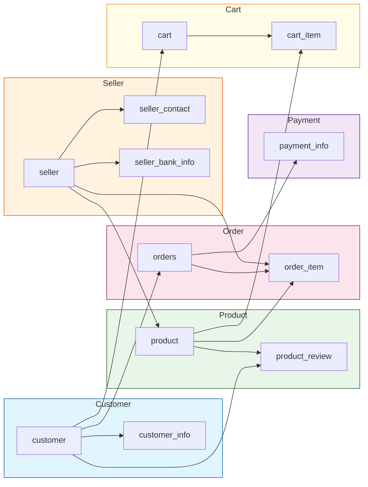

| Module | Tables | Code Status |
|---|---|---|
| **Customer** | `customer`, `customer_info` | Implemented |
| **Seller** | `seller`, `seller_contact`, `seller_bank_info` | Implemented |
| **Product** | `product`, `product_review` | Schema only |
| **Order** | `orders`, `order_item` | Schema only |
| **Payment** | `payment_info` | Schema only |
| **Cart** | `cart`, `cart_item` | Schema only |

---

## Database Schema

The database is **PostgreSQL 15**, managed by **Liquibase**. The initial migration (`001-create-initial-tables.yaml`) defines all 12 tables with foreign key constraints and unique constraints.

### Entity Relationship Diagram

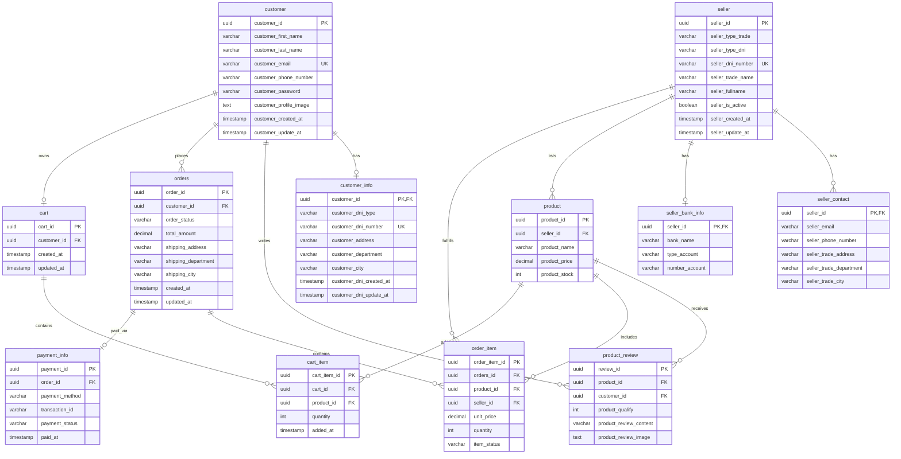

---

## API Endpoints

### Customer Module

| Method | Endpoint | Description | Status |
|---|---|---|---|
| `POST` | `/api/v1/customers` | Create a new customer | Implemented |
| `PUT` | `/api/v1/customers/{id}` | Update an existing customer | Implemented |
| `DELETE` | `/api/v1/customers/{id}` | Delete a customer | Implemented |
| `GET` | `/api/v1/customers` | Get all customers | Implemented |
| `GET` | `/api/v1/customers/{id}` | Get customer by ID | Implemented |

### Request Body (POST/PUT)

| Field | Type | Description |
|---|---|---|
| `firstName` | String | Customer's first name |
| `lastName` | String | Customer's last name |
| `email` | String | Customer's email address |
| `phoneNumber` | String | Customer's phone number |
| `password` | String | Customer's password |
| `profileImage` | String | Profile image URL (optional) |
| `dniType` | String | Document type (optional) |
| `dniNumber` | String | Document number (optional) |
| `address` | String | Address (optional) |
| `department` | String | Department/State (optional) |
| `city` | String | City (optional) |

### Validation Rules

| Field | Rules |
|---|---|
| `firstName` | Required, 1-100 chars |
| `lastName` | Required, 1-100 chars |
| `email` | Required, valid email format |
| `phoneNumber` | Required, 1-20 chars |
| `password` | Required, 8-100 chars |
| `dniType` | Optional, 1-20 chars |
| `dniNumber` | Optional, 1-20 chars |
| `address` | Optional, 1-150 chars |
| `department` | Optional, 1-50 chars |
| `city` | Optional, 1-60 chars |

### Error Responses

| HTTP Code | Exception | When |
|---|---|---|
| `409 CONFLICT` | `CustomerExistException` | Customer with same ID already exists |
| `404 NOT FOUND` | `CustomerNotExistException` | Customer not found for update/delete |

---

### Seller Module

| Method | Endpoint | Description | Status |
|---|---|---|---|
| `POST` | `/api/v1/sellers` | Create a new seller | Implemented |
| `PUT` | `/api/v1/sellers/{id}` | Update an existing seller | Implemented |
| `DELETE` | `/api/v1/sellers/{id}` | Delete a seller | Implemented |
| `GET` | `/api/v1/sellers` | Get all sellers | Implemented |
| `GET` | `/api/v1/sellers/{id}` | Get seller by ID | Implemented |
| `GET` | `/api/v1/seller-contact/{sellerId}` | Get seller contact info | Implemented |
| `GET` | `/api/v1/seller-bank-info/{sellerId}` | Get seller bank info | Implemented |

#### Request Body (POST/PUT)

| Field | Type | Description |
|---|---|---|
| `typeTrade` | String | Trade type: `NATURAL`, `LEGAL` |
| `typeDni` | String | Document type: `CC`, `CE`, `PS`, `NIT` |
| `dniNumber` | String | Document number (5-20 chars, unique) |
| `tradeName` | String | Business name (2-100 chars) |
| `fullname` | String | Full name (2-100 chars) |
| `email` | String | Email address |
| `phoneNumber` | String | Phone number (Colombian format) |
| `tradeAddress` | String | Business address (5-150 chars) |
| `tradeDepartment` | String | Department (Colombian) |
| `tradeCity` | String | City (2-60 chars) |
| `bankName` | String | Bank name (Colombian bank) |
| `typeBankAccount` | String | Account type: `SAVINGS`, `CHECKING`, `WALLET` |
| `numberAccount` | String | Account number (10-30 chars) |

#### Validation Rules

| Field | Rules |
|---|---|
| `typeTrade` | Required. Values: `NATURAL`, `LEGAL` |
| `typeDni` | Required. Values: `CC`, `CE`, `PS`, `NIT` |
| `dniNumber` | Required, 5-20 chars, unique |
| `tradeName` | Required, 2-100 chars |
| `fullname` | Required, 2-100 chars |
| `email` | Required, valid email format |
| `phoneNumber` | Required, Colombian format (10 digits, starts with 3) |
| `tradeAddress` | Required, 5-150 chars |
| `tradeDepartment` | Required, valid Colombian department |
| `tradeCity` | Required, 2-60 chars, valid city for the department |
| `bankName` | Required, valid Colombian bank |
| `typeBankAccount` | Required. Values: `SAVINGS`/`Ahorros`, `CHECKING`/`Corriente`, `WALLET`/`Digital` |
| `numberAccount` | Required, 10-30 chars |

#### Seller Response (GET)

| Field | Type | Description |
|---|---|---|
| `id` | UUID | Seller unique identifier |
| `typeTrade` | String | Trade type |
| `typeDni` | String | Document type |
| `dniNumber` | String | Document number |
| `tradeName` | String | Business name |
| `fullname` | String | Full name |
| `isActive` | Boolean | Active status |
| `createdAt` | Timestamp | Creation date |
| `updatedAt` | Timestamp | Last update date (nullable) |

#### Seller Contact Response (GET /seller-contact/{sellerId})

| Field | Type | Description |
|---|---|---|
| `sellerId` | UUID | Seller unique identifier |
| `tradeName` | String | Business name |
| `fullname` | String | Full name |
| `email` | String | Email address |
| `phoneNumber` | String | Phone number |
| `tradeAddress` | String | Business address |
| `tradeDepartment` | String | Department |
| `tradeCity` | String | City |

#### Seller Bank Info Response (GET /seller-bank-info/{sellerId})

| Field | Type | Description |
|---|---|---|
| `sellerId` | UUID | Seller unique identifier |
| `tradeName` | String | Business name |
| `fullname` | String | Full name |
| `bankName` | String | Bank name |
| `typeBankAccount` | String | Account type |
| `numberAccount` | String | Account number |

#### Error Responses

| HTTP Code | Exception | When |
|---|---|---|
| `409 CONFLICT` | `SellerAlreadyExistsException` | Seller with same DNI already exists |
| `404 NOT FOUND` | `SellerNotFoundException` | Seller not found |
| `400 BAD REQUEST` | Various `SellerInvalid*Exception` | Invalid field values |

---

## Getting Started

### Prerequisites

- Java 21
- Maven 3.9+
- Docker & Docker Compose (for local database)
- Spring Cloud Config Server running at `http://100.123.31.18:8888`

### Run Locally

```bash
# Start PostgreSQL via Docker Compose
docker compose up -d

# Run the application
./mvnw spring-boot:run -Dspring-boot.run.profiles=local
```

The application starts on **port 8080** by default.

### Run with Maven

```bash
# Compile
./mvnw compile

# Run tests
./mvnw test

# Format code
./mvnw spotless:apply

# Package
./mvnw package
```

---

## Configuration

### Profiles

| Profile | Purpose |
|---|---|
| `local` | Local development |
| `dev` | Development environment |
| `prod` | Production environment |

All profiles import configuration from the Spring Cloud Config Server at `http://100.123.31.18:8888`.

### Key Properties

| Property | Value | Description |
|---|---|---|
| `spring.application.name` | `colombia` | Application name |
| `spring.docker.compose.enabled` | `false` | Docker Compose disabled by default |
| `spring.config.import` | `optional:configserver:http://100.123.31.18:8888` | Config Server |

### Security

Spring Security is configured in `SecurityConfig.java` with CSRF disabled and all requests permitted. This is intended for development only. **Production deployment must configure proper authentication and authorization.**

---

## Development Guidelines

### Code Style

- **Google Java Format** enforced via Spotless Maven plugin
- Run `./mvnw spotless:apply` before committing

### Adding a New Module

Follow the existing Customer module pattern:

1. **Domain layer:** Create value objects, repository interface, exceptions
2. **Application layer:** Create use case classes (one per operation)
3. **Infrastructure layer:** Create JPA entities, repository adapter, mapper, controller, DTOs, bean configuration

### Naming Conventions

| Layer | Convention |
|---|---|
| Value Objects | `{Module}{Field}` (e.g., `CustomerEmail`) |
| Entities | `{Module}Entity` (e.g., `CustomerEntity`) |
| Use Cases | `{Module}{Action}UseCase` (e.g., `CustomerSaveUseCase`) |
| Adapters | `{Module}RepositoryAdapter` |
| Controllers | `{Module}Controller` |
| DTOs | `{Module}Request`, `{Module}Response` |

### Important Rules

- Domain layer must have **zero** infrastructure dependencies
- Use cases must not reference JPA entities or HTTP concepts
- Each use case class handles exactly one business operation
- Value objects wrap primitives to enforce type safety

---

## License

See [LICENSE](LICENSE) for details.
