# EliteShop Colombia Backend

Backend API for **EliteShop Colombia**, an e-commerce platform built with Spring Boot 4, Java 21, and Clean Architecture principles.

---

## Table of Contents

- [Executive Summary](#executive-summary)
- [Technical Summary](#technical-summary)
- [Architecture](#architecture)
- [Project Structure](#project-structure)
- [Modules](#modules)
- [Database Schema](#database-schema)
- [API Endpoints](#api-endpoints)
- [Getting Started](#getting-started)
- [Configuration](#configuration)
- [Development Guidelines](#development-guidelines)

- [Technical Debt](#technical-debt)

---


## Executive Summary

EliteShop Colombia is a Colombian e-commerce platform that connects sellers and customers. The backend provides REST APIs for managing customers, sellers, products, orders, payments, shopping carts, and product reviews. It is designed as a modular monolith with clear domain boundaries, enabling independent evolution of each business module.

**Current Status:** All modules fully implemented (domain, application, and infrastructure layers). The backend provides 357 passing tests covering unit, integration, and contract testing. Security is enforced via JWT with role-based access control (ROLE_CUSTOMER, ROLE_SELLER, ROLE_ADMIN) and ownership validation.

---

## Technical Summary

| Aspect | Detail |
|---|---|
| **Language** | Java 21 |
| **Framework** | Spring Boot 4.0.7 |
| **Architecture** | Clean Architecture + Hexagonal (Ports & Adapters) |
| **Modularity** | Spring Modulith 2.0.7 |
| **Database** | PostgreSQL 15 |
| **Migrations** | Liquibase |
| **Build Tool** | Maven |
| **Code Style** | Google Java Format (Spotless) |
| **Security** | Spring Security (permissive for development) |
| **Resilience** | Resilience4j Circuit Breaker |
| **Config** | Spring Cloud Config Server |
| **Observability** | Spring Modulith Observability + Actuator |
| **Email** | Spring Mail |

---

## Architecture

The project follows **Clean Architecture** with a strict layer separation inside each module. Each module is self-contained with its own domain, application, and infrastructure layers.

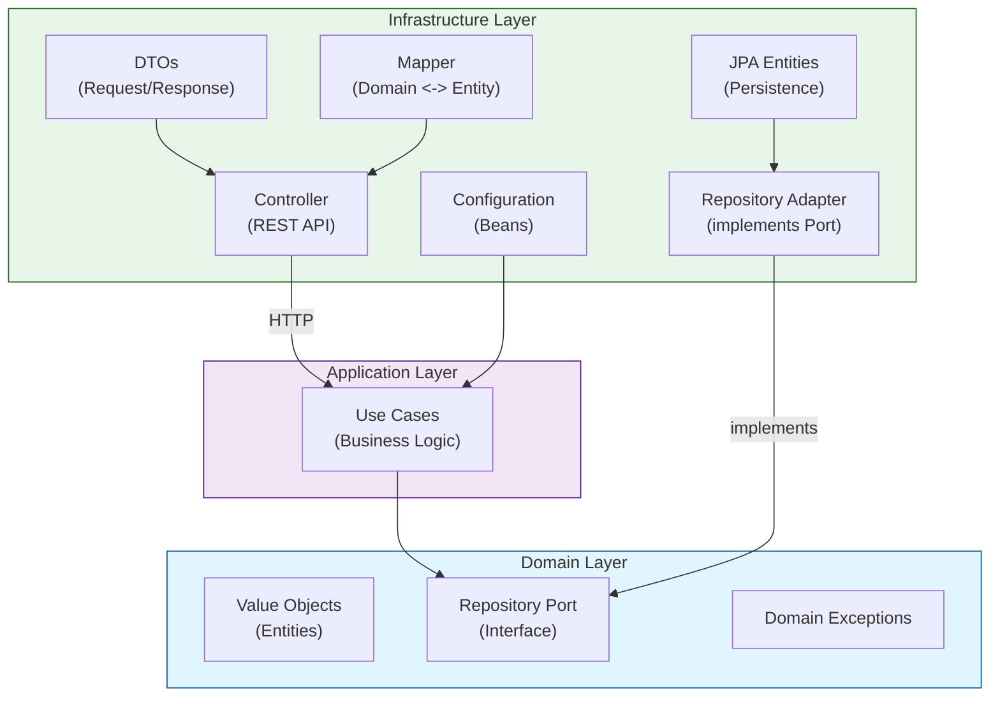

### Layer Responsibilities

| Layer | Purpose | Dependencies |
|---|---|---|
| **Domain** | Business rules, value objects, repository interfaces, exceptions. Zero external dependencies. | None |
| **Application** | Use cases that orchestrate business logic. Depends only on domain interfaces. | Domain |
| **Infrastructure** | HTTP controllers, JPA entities, mappers, adapters. Bridges domain to external systems. | Application, Domain |

### Design Principles

- **Dependency Inversion:** Domain defines repository interfaces (ports); infrastructure implements them (adapters).
- **Value Objects:** Every field in the domain model is wrapped in a typed value object (e.g., `CustomerEmail`, `CustomerId`), preventing primitive obsession and enforcing type safety.
- **Use Cases:** Each business operation is a single-use-case class (e.g., `CustomerSaveUseCase`), ensuring single responsibility.
- **No Leaking:** Infrastructure concerns (JPA annotations, HTTP) never appear in domain or application layers.

---

## Notification & Webhooks System

The system includes asynchronous notifications via Slack webhooks, GitHub PR webhook integration, and a retry queue for failed notifications.

### GitHub Webhook & Slack Integration Flow

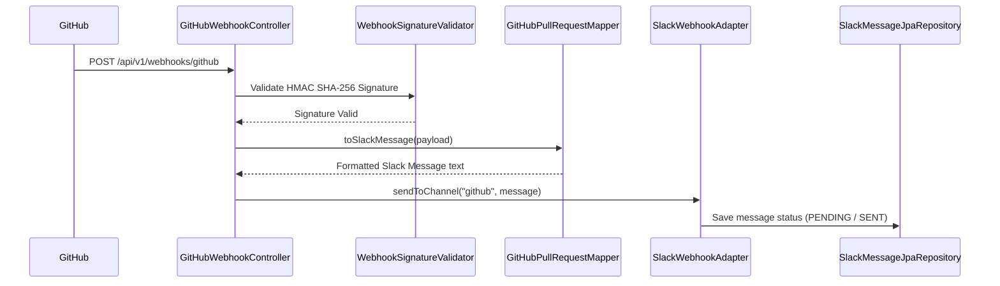

### Notification Endpoints & Schedulers

| Method | Endpoint | Description |
|---|---|---|
| POST | `/api/v1/webhooks/github` | Receive GitHub PR Webhooks |
| GET | `/api/v1/notifications/test` | Test Slack channel notifications |

- **NotificationRetryScheduler:** Periodically checks for failed/pending notifications and retries sending them to Slack based on configured exponential backoff.
- **HealthCheckScheduler:** Monitors system health and reports status.

## Seller Verification Flow

The system uses facial matching to verify seller identity.

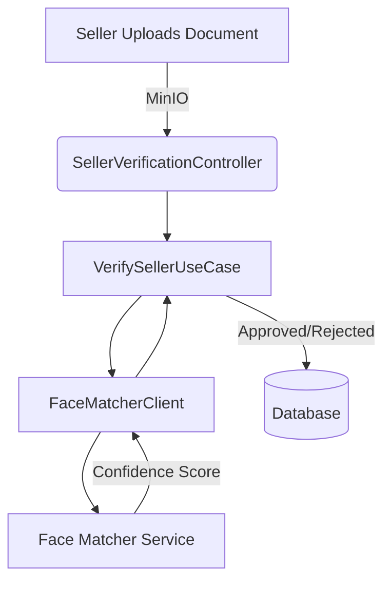

### Endpoints

| Method | Endpoint | Description |
|---|---|---|
| POST | `/api/v1/sellers/{id}/verification/document` | Upload Identity Document |
| POST | `/api/v1/sellers/{id}/verification/selfie` | Upload Selfie |
| POST | `/api/v1/sellers/{id}/verification/validate` | Trigger Verification |
| GET | `/api/v1/sellers/{id}/verification` | Check Status |

## Event-Driven Architecture

The system utilizes Spring Modulith to handle events between modules.

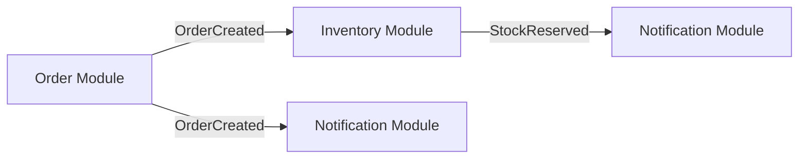

### Key Events

| Event | Origin | Listeners |
|---|---|---|
| OrderCreated | Order | Inventory, Notification, Seller |
| OrderStatusChanged | Order | Notification, Inventory, Seller |


### HTTP Request Flow (Seller)

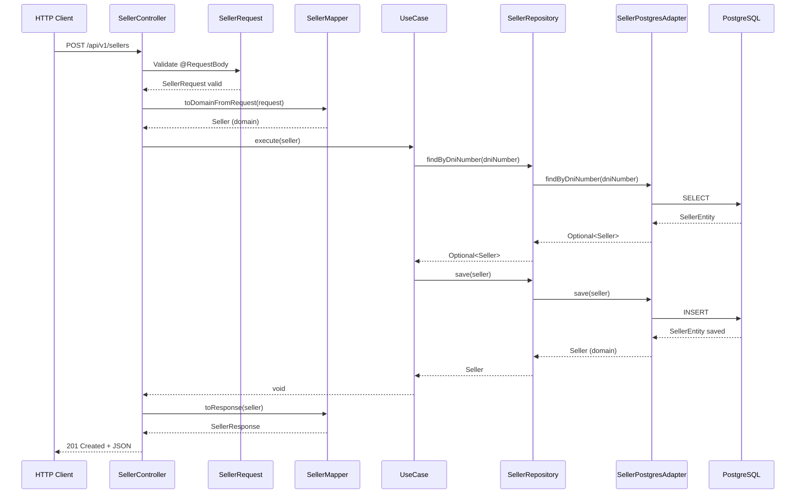

### Architecture by Layers (Seller)

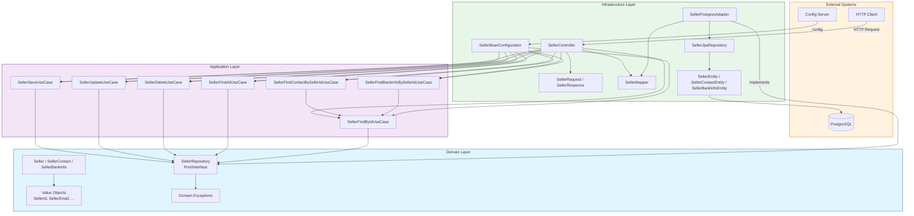

### Persistence Flow (Seller - Save/Update)

```mermaid
flowchart LR
    subgraph Entry["Entry"]
        Req[SellerRequest]
    end

    subgraph Transform["Transformation"]
        MapReq[Mapper.toDomainFromRequest]
        Domain[Seller domain]
        MapEnt[Mapper.toEntity]
        Ent[SellerEntity]
    end

    subgraph Persist["Persistence"]
        JPA[SellerJpaRepository.save]
        DB[(PostgreSQL)]
        Persisted[SellerEntity persisted]
    end

    subgraph Response["Response"]
        MapRes[Mapper.toResponse]
        Resp[SellerResponse]
    end

    Req --> MapReq
    MapReq --> Domain
    Domain --> MapEnt
    MapEnt --> Ent
    Ent --> JPA
    JPA --> DB
    DB --> Persisted
    Persisted --> MapRes
    MapRes --> Resp

    style Entry fill:#fff3e0,stroke:#e65100
    style Transform fill:#e1f5fe,stroke:#01579b
    style Persist fill:#e8f5e9,stroke:#1b5e20
    style Response fill:#f3e5f5,stroke:#4a148c
```

### Contact and Bank Info Query Flow

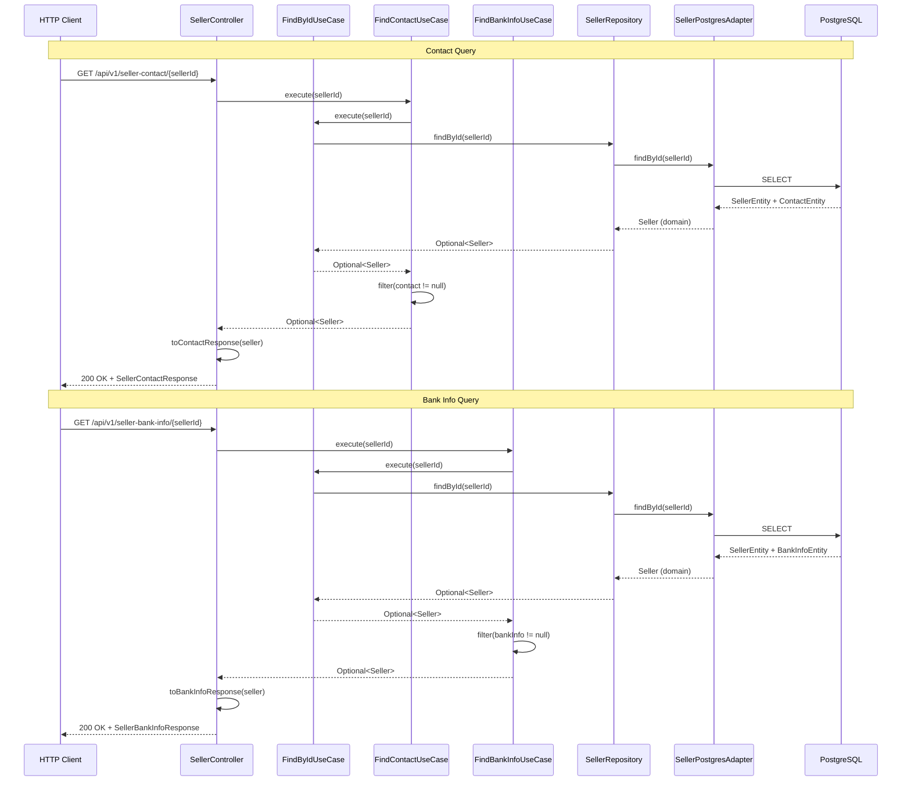

### Entity Relationship Diagram (Seller)

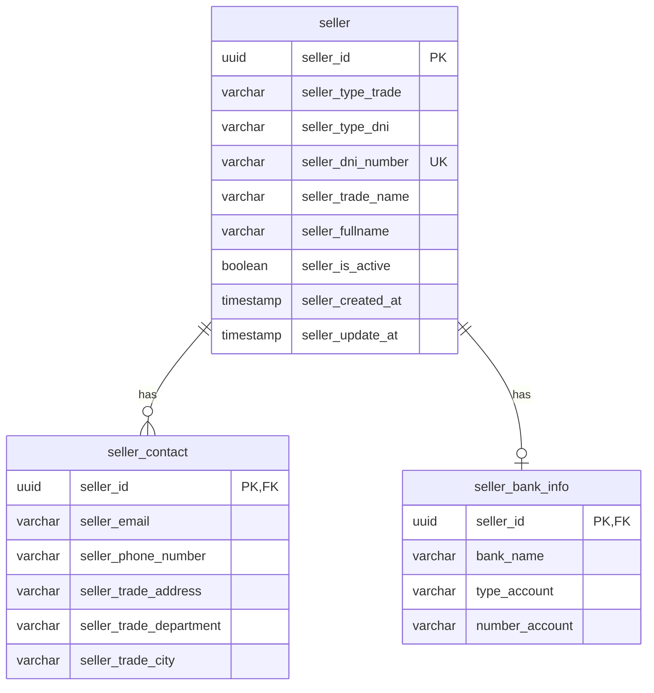

---

## Project Structure

```
src/main/java/com/eliteshop/colombia/
├── ColombiaApplication.java          # Application entry point
├── SecurityConfig.java               # Spring Security config (permissive)
│
└── customer/                         # Customer module
    ├── application/                  # Use cases
    │   ├── CustomerSaveUseCase.java
    │   ├── CustomerUpdateUseCase.java
    │   ├── CustomerDeleteUseCase.java
    │   ├── CustomerFindAllUseCase.java
    │   └── CustomerFindByIdUseCase.java
    │
    ├── domain/                       # Domain model
    │   ├── model/
    │   │   ├── Customer.java                  # Aggregate root
    │   │   ├── CustomerInfo.java              # Value object (DNI + address)
    │   │   ├── CustomerId.java                # UUID wrapper
    │   │   ├── CustomerFirstName.java         # String wrapper
    │   │   ├── CustomerLastName.java          # String wrapper
    │   │   ├── CustomerEmail.java             # String wrapper
    │   │   ├── CustomerPhoneNumber.java       # String wrapper
    │   │   ├── CustomerPassword.java          # String wrapper
    │   │   ├── CustomerProfileImage.java      # String wrapper
    │   │   ├── CustomerCreatedAt.java         # Timestamp wrapper
    │   │   ├── CustomerUpdatedAt.java         # Timestamp wrapper
    │   │   ├── CustomerDniType.java           # String wrapper
    │   │   ├── CustomerDniNumber.java         # String wrapper
    │   │   ├── CustomerAddress.java           # String wrapper
    │   │   ├── CustomerDepartment.java        # String wrapper
    │   │   ├── CustomerCity.java              # String wrapper
    │   │   ├── CustomerDniCreatedAt.java      # Timestamp wrapper
    │   │   └── CustomerDniUpdatedAt.java      # Timestamp wrapper
    │   ├── repository/
    │   │   └── CustomerRepository.java        # Port (interface)
    │   └── exception/
    │       ├── CustomerExistException.java    # HTTP 409
    │       └── CustomerNotExistException.java # HTTP 404
    │
    └── infrastructure/               # External adapters
        ├── config/
        │   └── CustomerBeanConfiguration.java
        ├── controller/
        │   ├── CustomerController.java
        │   └── dto/
        │       ├── CustomerRequest.java
        │       └── CustomerResponse.java
        ├── mapper/
        │   └── CustomerMapper.java
        ├── adapter/
        │   └── CustomerRepositoryAdapter.java
        └── persistence/
            ├── CustomerEntity.java
            ├── CustomerInfoEntity.java
            └── CustomerJpaRepository.java

└── seller/                           # Seller module
    ├── application/                  # Use cases
    │   ├── SellerSaveUseCase.java
    │   ├── SellerUpdateUseCase.java
    │   ├── SellerDeleteUseCase.java
    │   ├── SellerFindAllUseCase.java
    │   ├── SellerFindByIdUseCase.java
    │   ├── SellerFindByDniUseCase.java
    │   ├── SellerFindContactBySellerIdUseCase.java
    │   └── SellerFindBankInfoBySellerIdUseCase.java
    │
    ├── domain/                       # Domain model
    │   ├── model/
    │   │   ├── Seller.java                    # Aggregate root
    │   │   ├── SellerContact.java             # Value object (composite)
    │   │   ├── SellerBankInfo.java            # Value object (composite)
    │   │   ├── SellerId.java                  # UUID wrapper
    │   │   ├── SellerTypeTrade.java           # Enum (NATURAL, LEGAL)
    │   │   ├── SellerTypeDni.java             # Enum (CC, CE, PS, NIT)
    │   │   ├── SellerTypeBankAccount.java     # Enum (SAVINGS, CHECKING, WALLET)
    │   │   ├── SellerDniNumber.java           # String wrapper
    │   │   ├── SellerTradeName.java           # String wrapper
    │   │   ├── SellerFullname.java            # String wrapper
    │   │   ├── SellerIsActive.java            # Boolean wrapper
    │   │   ├── SellerCreatedAt.java           # Timestamp wrapper
    │   │   ├── SellerUpdatedAt.java           # Timestamp wrapper
    │   │   ├── SellerEmail.java               # String wrapper
    │   │   ├── SellerPhoneNumber.java         # String wrapper
    │   │   ├── SellerTradeAddress.java        # String wrapper
    │   │   ├── SellerTradeDepartment.java     # String wrapper
    │   │   ├── SellerTradeCity.java           # String wrapper
    │   │   ├── SellerBankName.java            # String wrapper
    │   │   └── SellerNumberAccount.java       # String wrapper
    │   ├── repository/
    │   │   └── SellerRepository.java          # Port (interface)
    │   └── exception/
    │       ├── SellerAlreadyExistsException.java   # HTTP 409
    │       ├── SellerNotFoundException.java        # HTTP 404
    │       ├── SellerInvalidEmailException.java    # HTTP 400
    │       ├── SellerInvalidPhoneNumberException.java
    │       ├── SellerInvalidDniNumberException.java
    │       ├── SellerInvalidTradeNameException.java
    │       ├── SellerInvalidFullnameException.java
    │       ├── SellerInvalidTradeAddressException.java
    │       ├── SellerInvalidTradeDepartmentException.java
    │       ├── SellerInvalidTradeCityException.java
    │       ├── SellerInvalidBankNameException.java
    │       └── SellerInvalidNumberAccountException.java
    │
    └── infrastructure/               # External adapters
        ├── config/
        │   └── SellerBeanConfiguration.java
        ├── controller/
        │   ├── SellerController.java
        │   └── dto/
        │           ├── SellerRequest.java
        │           ├── SellerResponse.java
        │           ├── SellerContactResponse.java
        │           └── SellerBankInfoResponse.java
        ├── mapper/
        │   └── SellerMapper.java
        ├── adapter/
        │   └── SellerPostgresAdapter.java
        └── persistence/
            ├── SellerEntity.java
            ├── SellerContactEntity.java
            ├── SellerBankInfoEntity.java
            └── SellerJpaRepository.java
```

---

## Modules

The database defines 12 tables organized into 6 business domains. Only the **Customer** module has code implementation.

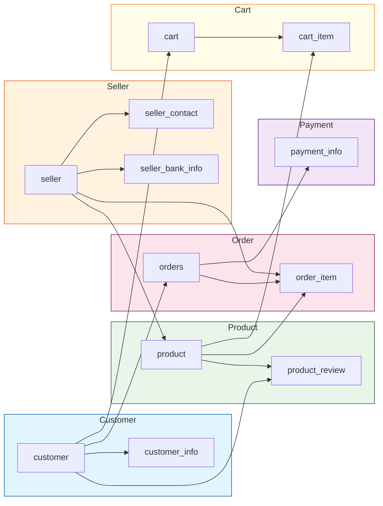

 | Module | Tables | Code Status |
 |---|---|---|
 | **Customer** | `customer`, `customer_info` | Implemented |
 | **Seller** | `seller`, `seller_contact`, `seller_bank_info`, `seller_verification` | Implemented |
 | **Product** | `product`, `product_image` | Implemented |
 | **Order** | `orders`, `order_item`, `tracking_events` | Implemented |
 | **Payment** | `payment_info`, `customer_payment_method` | Implemented |
 | **Cart** | `cart`, `cart_item` | Implemented |
 | **Review** | `product_review`, `review_image` | Implemented |
 | **Checkout** | (orchestrates Order + Payment + Cart) | Implemented |
 | **Admin** | (manages all modules) | Implemented |
 | **Shared/Notification** | `slack_message_queue` | Implemented |

---

## Database Schema

The database is **PostgreSQL 15**, managed by **Liquibase**. The initial migration (`001-create-initial-tables.yaml`) defines all 12 tables with foreign key constraints and unique constraints.

### Entity Relationship Diagram

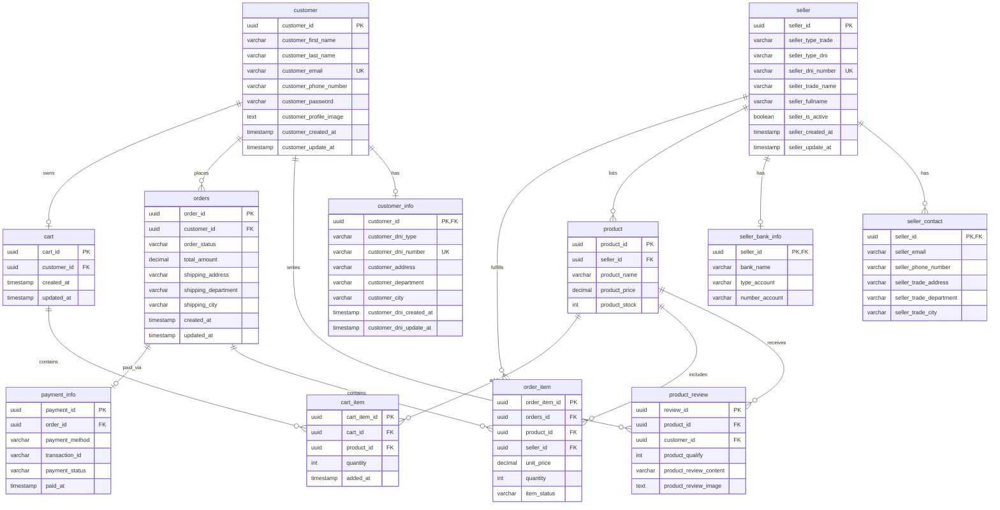

---

## API Endpoints

### Customer Module

| Method | Endpoint | Description | Status |
|---|---|---|---|
| `POST` | `/api/v1/customers` | Create a new customer | Implemented |
| `PUT` | `/api/v1/customers/{id}` | Update an existing customer | Implemented |
| `DELETE` | `/api/v1/customers/{id}` | Delete a customer | Implemented |
| `GET` | `/api/v1/customers` | Get all customers | Implemented |
| `GET` | `/api/v1/customers/{id}` | Get customer by ID | Implemented |

### Request Body (POST/PUT)

| Field | Type | Description |
|---|---|---|
| `firstName` | String | Customer's first name |
| `lastName` | String | Customer's last name |
| `email` | String | Customer's email address |
| `phoneNumber` | String | Customer's phone number |
| `password` | String | Customer's password |
| `profileImage` | String | Profile image URL (optional) |
| `dniType` | String | Document type (optional) |
| `dniNumber` | String | Document number (optional) |
| `address` | String | Address (optional) |
| `department` | String | Department/State (optional) |
| `city` | String | City (optional) |

### Validation Rules

| Field | Rules |
|---|---|
| `firstName` | Required, 1-100 chars |
| `lastName` | Required, 1-100 chars |
| `email` | Required, valid email format |
| `phoneNumber` | Required, 1-20 chars |
| `password` | Required, 8-100 chars |
| `dniType` | Optional, 1-20 chars |
| `dniNumber` | Optional, 1-20 chars |
| `address` | Optional, 1-150 chars |
| `department` | Optional, 1-50 chars |
| `city` | Optional, 1-60 chars |

### Error Responses

| HTTP Code | Exception | When |
|---|---|---|
| `409 CONFLICT` | `CustomerExistException` | Customer with same ID already exists |
| `404 NOT FOUND` | `CustomerNotExistException` | Customer not found for update/delete |

---

### Seller Module

| Method | Endpoint | Description | Status |
|---|---|---|---|
| `POST` | `/api/v1/sellers` | Create a new seller | Implemented |
| `PUT` | `/api/v1/sellers/{id}` | Update an existing seller | Implemented |
| `DELETE` | `/api/v1/sellers/{id}` | Delete a seller | Implemented |
| `GET` | `/api/v1/sellers` | Get all sellers | Implemented |
| `GET` | `/api/v1/sellers/{id}` | Get seller by ID | Implemented |
| `GET` | `/api/v1/seller-contact/{sellerId}` | Get seller contact info | Implemented |
| `GET` | `/api/v1/seller-bank-info/{sellerId}` | Get seller bank info | Implemented |

#### Request Body (POST/PUT)

| Field | Type | Description |
|---|---|---|
| `typeTrade` | String | Trade type: `NATURAL`, `LEGAL` |
| `typeDni` | String | Document type: `CC`, `CE`, `PS`, `NIT` |
| `dniNumber` | String | Document number (5-20 chars, unique) |
| `tradeName` | String | Business name (2-100 chars) |
| `fullname` | String | Full name (2-100 chars) |
| `email` | String | Email address |
| `phoneNumber` | String | Phone number (Colombian format) |
| `tradeAddress` | String | Business address (5-150 chars) |
| `tradeDepartment` | String | Department (Colombian) |
| `tradeCity` | String | City (2-60 chars) |
| `bankName` | String | Bank name (Colombian bank) |
| `typeBankAccount` | String | Account type: `SAVINGS`, `CHECKING`, `WALLET` |
| `numberAccount` | String | Account number (10-30 chars) |

#### Validation Rules

| Field | Rules |
|---|---|
| `typeTrade` | Required. Values: `NATURAL`, `LEGAL` |
| `typeDni` | Required. Values: `CC`, `CE`, `PS`, `NIT` |
| `dniNumber` | Required, 5-20 chars, unique |
| `tradeName` | Required, 2-100 chars |
| `fullname` | Required, 2-100 chars |
| `email` | Required, valid email format |
| `phoneNumber` | Required, Colombian format (10 digits, starts with 3) |
| `tradeAddress` | Required, 5-150 chars |
| `tradeDepartment` | Required, valid Colombian department |
| `tradeCity` | Required, 2-60 chars, valid city for the department |
| `bankName` | Required, valid Colombian bank |
| `typeBankAccount` | Required. Values: `SAVINGS`/`Ahorros`, `CHECKING`/`Corriente`, `WALLET`/`Digital` |
| `numberAccount` | Required, 10-30 chars |

#### Seller Response (GET)

| Field | Type | Description |
|---|---|---|
| `id` | UUID | Seller unique identifier |
| `typeTrade` | String | Trade type |
| `typeDni` | String | Document type |
| `dniNumber` | String | Document number |
| `tradeName` | String | Business name |
| `fullname` | String | Full name |
| `isActive` | Boolean | Active status |
| `createdAt` | Timestamp | Creation date |
| `updatedAt` | Timestamp | Last update date (nullable) |

#### Seller Contact Response (GET /seller-contact/{sellerId})

| Field | Type | Description |
|---|---|---|
| `sellerId` | UUID | Seller unique identifier |
| `tradeName` | String | Business name |
| `fullname` | String | Full name |
| `email` | String | Email address |
| `phoneNumber` | String | Phone number |
| `tradeAddress` | String | Business address |
| `tradeDepartment` | String | Department |
| `tradeCity` | String | City |

#### Seller Bank Info Response (GET /seller-bank-info/{sellerId})

| Field | Type | Description |
|---|---|---|
| `sellerId` | UUID | Seller unique identifier |
| `tradeName` | String | Business name |
| `fullname` | String | Full name |
| `bankName` | String | Bank name |
| `typeBankAccount` | String | Account type |
| `numberAccount` | String | Account number |

#### Error Responses

| HTTP Code | Exception | When |
|---|---|---|
| `409 CONFLICT` | `SellerAlreadyExistsException` | Seller with same DNI already exists |
| `404 NOT FOUND` | `SellerNotFoundException` | Seller not found |
| `400 BAD REQUEST` | Various `SellerInvalid*Exception` | Invalid field values |

---

## Getting Started

### Prerequisites

| Dependency | Version | Notes |
|---|---|---|
| **Java** | 21+ | Required. Verify with `java -version` |
| **Docker** | 24+ | Required for PostgreSQL |
| **Docker Compose** | v2+ | Required for container orchestration |

### Step 1 — Clone the Repository

```bash
git clone https://github.com/your-org/EliteShopColombiaBackend.git
cd EliteShopColombiaBackend
```

### Step 2 — Start the Stack (PostgreSQL + Backend)

```bash
docker compose up -d
```

This command starts:

| Service | Container | Port | Description |
|---|---|---|---|
| **postgres** | `eliteshop-postgres` | `5432` | PostgreSQL 15 with `uuid-ossp` extension pre-installed |
| **backend** | `eliteshop-backend` | `8080` | Spring Boot application with `local` profile |

The backend waits for PostgreSQL to be healthy before starting. Liquibase runs automatically and creates/migrates the schema.

### Step 3 — Verify the Application

```bash
# Health check
curl http://localhost:8080/actuator/health

# Swagger UI
open http://localhost:8080/swagger-ui/index.html

# Create a test customer
curl -X POST http://localhost:8080/api/v1/customers \
  -H "Content-Type: application/json" \
  -d '{
    "firstName": "Juan",
    "lastName": "Perez",
    "email": "juan@example.com",
    "phoneNumber": "3001234567",
    "password": "Password123"
  }'
```

### Running Without Docker Compose

If you prefer to run services individually:

```bash
# 1. Start PostgreSQL manually (must create uuid-ossp extension first)
docker run -d \
  --name eliteshop-postgres \
  -e POSTGRES_DB=eliteshop \
  -e POSTGRES_USER=eliteshop \
  -e POSTGRES_PASSWORD=eliteshop \
  -p 5432:5432 \
  postgres:15-alpine

# 2. Create the uuid-ossp extension (required by migration 017)
docker exec eliteshop-postgres psql -U eliteshop -d eliteshop -c 'CREATE EXTENSION IF NOT EXISTS "uuid-ossp";'

# 3. Run the application with local profile
./mvnw spring-boot:run -Dspring-boot.run.profiles=local
```

### Configuration — Local Profile

The `local` profile (`application-local.yml`) includes **all required properties** with dummy values so the app starts without a Config Server. The 8 mandatory properties are:

| Property | Value (local) | Why required |
|---|---|---|
| `jwt.secret` | Base64 dummy key | `@NotBlank` in `JwtProperties` |
| `minio.endpoint` | `http://localhost:9000` | `@NotBlank` in `MinIOProperties` |
| `minio.access-key` | `minioadmin` | `@NotBlank` in `MinIOProperties` |
| `minio.secret-key` | `minioadmin` | `@NotBlank` in `MinIOProperties` |
| `face-matcher.url` | `http://localhost:8081` | `@NotBlank` in `FaceMatcherProperties` |
| `payments.epayco.public-key` | `test-public-key` | `@NotBlank` in `EpaycoProperties` |
| `payments.epayco.private-key` | `test-private-key` | `@NotBlank` in `EpaycoProperties` |
| `payments.epayco.apify-base-url` | `https://api.epayco.co` | `@NotBlank` in `EpaycoProperties`

> **Note:** The `local` profile imports Config Server as `optional:`. If a Config Server is available, it overrides these values. Otherwise, the local values are used.

### (Optional) Start Supporting Services

<details>
<summary><strong>MinIO — Object Storage</strong></summary>

```bash
docker run -d \
  --name eliteshop-minio \
  -p 9000:9000 \
  -p 9001:9001 \
  -e MINIO_ROOT_USER=minioadmin \
  -e MINIO_ROOT_PASSWORD=minioadmin \
  minio/minio server /data --console-address ":9001"
```

Create the required buckets via the web console at `http://localhost:9001`:
- `verification-sellers`
- `product-images`
- `review-images`
- `customer-avatars`
- `business-avatars`
</details>

### Development Commands

```bash
# Compile
./mvnw compile

# Run all tests (357 tests)
./mvnw test

# Run a specific test class
./mvnw test -Dtest=CustomerSaveUseCaseTest

# Format code (Google Java Format — must pass before commit)
./mvnw spotless:apply

# Check formatting
./mvnw spotless:check

# Package
./mvnw package

# Start app locally (without Docker)
./mvnw spring-boot:run -Dspring-boot.run.profiles=local
```

### Environment Variables

An `.env.example` file is provided. **You do NOT need it for local development** — all properties are pre-configured in `application-local.yml`. Only create a `.env` file if you need to override values with real credentials for external services (MinIO, ePayco, Slack, etc.).

---

## Configuration

### Profiles

| Profile | Purpose |
|---|---|
| `local` | Local development |
| `dev` | Development environment |
| `prod` | Production environment |

All profiles import configuration from the Spring Cloud Config Server at `http://100.123.31.18:8888`.

### Key Properties

| Property | Value | Description |
|---|---|---|
| `spring.application.name` | `colombia` | Application name |
| `spring.docker.compose.enabled` | `false` | Docker Compose disabled by default |
| `spring.config.import` | `optional:configserver:http://100.123.31.18:8888` | Config Server |

### Security

JWT-based authentication with role-based access control. Security is configured in `SecurityConfig.java` with endpoint-level authorization rules. Tokens include `userId`, `email`, `role`, `sellerId` claims. The Gateway sets `gateway.userId` and `gateway.sellerId` as request attributes via `JwtAuthFilter`.

### Error Contract

All error responses follow the `ErrorResponse` DTO format:

```json
{
  "timestamp": "2026-08-24T21:00:00Z",
  "status": 404,
  "error": "Producto no encontrado",
  "code": "PRODUCT_NOT_FOUND"
}
```

Validation errors include a `fieldErrors` map with per-field messages.

### Async Configuration

Async processing is configured via `AsyncConfiguration` with a `ThreadPoolTaskExecutor` (core=4, max=8, queue=50). Used for notification dispatch and seller verification processing.

---

## Development Guidelines

### Code Style

- **Google Java Format** enforced via Spotless Maven plugin
- Run `./mvnw spotless:apply` before committing

### Adding a New Module

Follow the existing Customer module pattern:

1. **Domain layer:** Create value objects, repository interface, exceptions
2. **Application layer:** Create use case classes (one per operation)
3. **Infrastructure layer:** Create JPA entities, repository adapter, mapper, controller, DTOs, bean configuration

### Naming Conventions

| Layer | Convention |
|---|---|
| Value Objects | `{Module}{Field}` (e.g., `CustomerEmail`) |
| Entities | `{Module}Entity` (e.g., `CustomerEntity`) |
| Use Cases | `{Module}{Action}UseCase` (e.g., `CustomerSaveUseCase`) |
| Adapters | `{Module}RepositoryAdapter` |
| Controllers | `{Module}Controller` |
| DTOs | `{Module}Request`, `{Module}Response` |

### Important Rules

- Domain layer must have **zero** infrastructure dependencies
- Use cases must not reference JPA entities or HTTP concepts
- Each use case class handles exactly one business operation
- Value objects wrap primitives to enforce type safety


## Technical Debt

> **Last reviewed:** 2026-08-26 | **Severity scale:** CRITICAL / HIGH / MEDIUM / LOW
>
> Auto-detected via code analysis. Each item includes file paths, module, and recommended fix.

### Summary

| Severity | Count | Key Areas |
|---|---|---|
| **CRITICAL** | 8 | Missing `@Transactional` on checkout, mutable domain models, N+1 queries, zero tests in 2 modules, no rate limiting |
| **HIGH** | 16 | Infrastructure leakage in domain, no CORS, controllers with 20+ dependencies, no input sanitization, missing `@Valid` |
| **MEDIUM** | 22 | No `equals`/`hashCode` on VOs, raw primitives in domain, missing DTO validation, duplicated code |
| **LOW** | 12 | Inconsistent naming, missing Javadoc, test endpoint exposed |

---

### CRITICAL — Must Fix Before Production

| # | Issue | Module | File(s) | Recommended Fix |
|---|---|---|---|---|
| C1 | **CheckoutUseCase has no `@Transactional`** — order, items, payment, stock, and cart deletion are not atomic. A failure mid-way leaves the database inconsistent. | Checkout | `CheckoutUseCase.java` | Add `@Transactional` to `execute()`. Separate async payment call from DB writes. |
| C2 | **CheckoutUseCase has no compensating transactions** — if stock reduction fails after payment is charged, money is taken but inventory is not updated. No rollback or saga exists. | Checkout | `CheckoutUseCase.java` | Implement Saga pattern with compensating actions for each step. |
| C3 | **Payment model is a mutable data bag** — uses `@Data @Builder @NoArgsConstructor` with raw `UUID`, `String`, `BigDecimal` fields. No value objects, no validation, no immutability. | Payment | `Payment.java` | Refactor to immutable aggregate with value objects (like Seller module). |
| C4 | **ProductPostgresAdapter N+1 query** — every `findAll()` loads ALL products, then issues a separate query for images per product. 100 products = 101 queries. | Product | `ProductPostgresAdapter.java` | Use `@BatchSize` on image collection or `JOIN FETCH` in JPQL. |
| C5 | **No rate limiting on auth endpoints** — `/login`, `/register`, `/refresh` are wide open. Enables brute-force attacks and account enumeration. | Auth | `SecurityConfig.java` | Add Resilience4j rate limiter (10 req/min on login, 5 req/min on register). |
| C6 | **cart module has ZERO tests** — 26 source files including critical checkout flow components (`AddToCartUseCase`, `RemoveFromCartUseCase`, `CartController`). | Cart | `src/main/java/.../cart/` | Add unit tests for use cases, MockMvc tests for controller, `@DataJpaTest` for adapter. |
| C7 | **review module has ZERO tests** — 30 source files including `ReviewSaveUseCase`, `ReviewDeleteUseCase`, `ReviewController`, MinIO adapter. | Review | `src/main/java/.../review/` | Same as above. |
| C8 | **CSRF disabled globally + No CORS config** — CSRF is unconditionally disabled. No CORS configuration exists anywhere. If frontend is on a different origin, developers will add `*` wildcard. | Security | `SecurityConfig.java` | Document JWT-only (no cookies) assumption. Add explicit CORS with specific origins. |

---

### HIGH — Should Fix Soon

| # | Issue | Module | File(s) | Recommended Fix |
|---|---|---|---|---|
| H1 | **OrderController God Object** — 22 injected dependencies (use cases, repos, mapper, auth). Contains business logic (`requireOrderAccess`), inline mapping, and a deprecated constructor for tests. | Order | `OrderController.java` | Decompose into `OrderCrudController`, `OrderStatusController`, `OrderTrackingController`. |
| H2 | **CustomerController merge logic** — 60 lines of field-level patch/merge logic in the controller instead of a use case. | Customer | `CustomerController.java` | Extract to `CustomerUpdateUseCase`. |
| H3 | **ProductController uses repository directly** — `ProductImageRepository` injected into controller. 58 lines of non-HTTP logic (MinIO upload, URL construction). | Product | `ProductController.java` | Inject only use cases. Extract image handling to `ProductImageUseCase`. |
| H4 | **No `equals()`/`hashCode()` on any value object** — ~70 VOs across all modules. Two `CustomerId` instances wrapping the same UUID are NOT equal. | All | `*/domain/model/*.java` | Add `@Value` (Lombok) or manual `equals`/`hashCode` based on the wrapped value. |
| H5 | **`@Setter` on 25 value objects destroys immutability** — customer (14 VOs), order (8 VOs), seller (1 VO) all generate mutable setters. | Customer, Order, Seller | `*Id.java`, `*Email.java`, etc. | Remove `@Setter`. Use `@Value` or `@Getter` only. |
| H6 | **`java.sql.Timestamp` in domain layer** — 10 timestamp VOs use JDBC type instead of `java.time.Instant`. Domain should not depend on persistence framework. | Customer, Order, Seller | `*CreatedAt.java`, `*UpdatedAt.java` | Replace with `java.time.Instant`. Add `@Converter` in adapter layer. |
| H7 | **Spring `@ResponseStatus` in domain exceptions** — 20+ exception classes use `org.springframework.web.bind.annotation`. Domain layer must have zero infrastructure dependencies. | All | `*/domain/exception/*.java` | Remove `@ResponseStatus`. Map exceptions to HTTP status in `GlobalExceptionHandler` only. |
| H8 | **Raw `UUID`/`String` in repository port signatures** — `OrderRepository`, `CartRepository`, `PaymentRepository`, etc. accept raw types instead of value objects. | All | `*/domain/repository/*.java` | Use `CustomerId`, `OrderId`, `SellerId` value objects in port methods. |
| H9 | **No validation in customer module VOs** — `CustomerEmail`, `CustomerPhoneNumber`, `CustomerPassword`, etc. accept any string with zero validation. Seller module has excellent validation; customer has none. | Customer | `CustomerEmail.java`, `CustomerPhoneNumber.java`, etc. | Add regex, length, and format validation matching Seller module pattern. |
| H10 | **No password complexity validation** — Register endpoint accepts `aaaaaaaa` (8 chars, no complexity). | Auth | `RegisterRequest.java` | Add custom validator: 1 uppercase + 1 lowercase + 1 digit + min 8 chars. |
| H11 | **No input sanitization** — user-provided text (`ProductRequest.name`, `ReviewRequest.content`, `OrderRequest.shippingAddress`, etc.) stored and returned without XSS sanitization. | All | `*/controller/dto/*.java` | Add server-side HTML sanitization or enforce frontend escaping. |
| H12 | **Cart stock TOCTOU race condition** — stock check at cart-add time is a read-then-act with no locking. Between check and save, another request can reduce stock. | Cart | `AddToCartUseCase.java` | Partially mitigated by checkout's atomic `WHERE stock >= quantity`. Consider pessimistic locking for cart operations. |
| H13 | **Hardcoded Config Server IP** — `100.123.31.18:8888` hardcoded in `application-dev.yml`, `application-prod.yml`, `application-local.yml`. Same IP for dev and prod. | Config | `application-*.yml` | Externalize via env var: `${CONFIG_SERVER_URL}`. |
| H14 | **Missing `@Valid` on SellerController.update** — uses manual `validator.validate()` instead of `@Valid @RequestBody`. Inconsistent with all other controllers. | Seller | `SellerController.java` | Add `@Valid` to `@RequestBody`. |
| H15 | **WebhookController uses `new ObjectMapper()`** — bypasses Spring-managed Jackson config. Same in `GitHubWebhookController`. | Payment, Shared | `WebhookController.java`, `GitHubWebhookController.java` | Inject Spring's `ObjectMapper` bean. |
| H16 | **GlobalExceptionHandler leaks internal messages** — `IllegalStateException` and `IllegalArgumentException` handlers expose `ex.getMessage()` to clients. | Shared | `GlobalExceptionHandler.java` | Use generic messages: "Solicitud invalida". |

---

### MEDIUM — Should Plan for Fix

| # | Issue | Module | File(s) | Recommended Fix |
|---|---|---|---|---|
| M1 | **4 inconsistent value object patterns** — some use `@Value`, some `@RequiredArgsConstructor @Getter`, some manual constructor, some with rich validation. | All | `*/domain/model/*.java` | Standardize on `@Value` for simple VOs, manual with validation for complex ones. |
| M2 | **No common domain exception base class** — 20+ exceptions extend `RuntimeException` directly. No way to catch all domain exceptions generically. | All | `*/domain/exception/*.java` | Create `DomainException` base with subtypes: `NotFoundException`, `ConflictException`, `ValidationException`. |
| M3 | **Raw String fields in Order aggregate** — `trackingNumber`, `shippingCarrier`, `shippingLabelUrl` bypass the value object pattern. | Order | `Order.java` | Create `OrderTrackingNumber`, `OrderShippingCarrier`, `OrderShippingLabelUrl` VOs. |
| M4 | **No DTO validation on checkout/payment fields** — `CheckoutRequest.cvv`, `cardNumber`, `expiryMonth` have no `@Size`/`@Pattern` constraints. | Checkout, Payment | `CheckoutRequest.java`, `RetryPaymentRequest.java` | Add `@NotNull`, `@Size`, `@Pattern` annotations. |
| M5 | **Missing `@Size` on OrderRequest strings** — `shippingAddress`, `shippingDepartment`, `shippingCity` accept unlimited length. | Order | `OrderRequest.java` | Add `@Size(max = 150)` etc. |
| M6 | **ReviewRequest has customerId in request body** — field exists and is `@NotNull` but controller overrides it. Misleading API contract. | Review | `ReviewRequest.java` | Remove `customerId` from DTO. |
| M7 | **No pagination on review list endpoint** — `GET /reviews/product/{productId}` returns all reviews. Popular products with thousands of reviews will cause memory issues. | Review | `ReviewController.java` | Add `Pageable` parameter. |
| M8 | **No max page size enforcement** — paginated endpoints accept `size=999999`. DoS vector. | All | `OrderController.java`, `SellerController.java`, etc. | Add `@Max(100)` or server-side cap. |
| M9 | **Cart unsafe ArrayList downcast** — `addItem()`, `removeItem()`, `clear()` cast `this.items` to `ArrayList`. Fragile if constructor changes List implementation. | Cart | `Cart.java` | Use `new ArrayList<>(items)` in constructor, or proper mutable access. |
| M10 | **Cart use cases throw `IllegalStateException`/`IllegalArgumentException`** — instead of domain exceptions (`CartItemNotFoundException`, `InsufficientStockException`). | Cart | `AddToCartUseCase.java`, `UpdateCartItemUseCase.java` | Use domain exceptions. |
| M11 | **OrderStatusChangedEvent uses raw Strings** — `previousStatus` and `newStatus` are `String` when `OrderStatus` enum exists. | Order | `OrderStatusChangedEvent.java` | Use `OrderStatus` enum. |
| M12 | **Dev and prod profiles are identical** — both `application-dev.yml` and `application-prod.yml` have the same 5 lines. No environment separation. | Config | `application-dev.yml`, `application-prod.yml` | Add logging levels, actuator restrictions, pool tuning for prod. |
| M13 | **No base `application.yml`** — `spring.application.name` duplicated across all profiles. | Config | `src/main/resources/` | Create `application.yml` with shared properties. |
| M14 | **Migration 017 depends on uuid-ossp created in 021** — ordering violation. Fresh DB will fail on migration 017. | DB | `017-create-tracking-events.yaml`, `021-cleanup-and-extensions.yaml` | Move `CREATE EXTENSION` to migration 016 or earlier. |
| M15 | **Migration 012 DROP TABLE destroys data** — `DROP TABLE IF EXISTS cart_item CASCADE; cart CASCADE; order_item CASCADE;` in production = data loss. | DB | `012-create-cart-orderitem-payment-method.yaml` | Use `liquibase precondition` to check data before destructive operations. |
| M16 | **Missing `@Transactional` on 7 use cases** — `CancelOrderUseCase`, `RefundOrderUseCase`, `DisputeOrderUseCase`, `OrderSaveUseCase`, `ProductSaveUseCase`, `ReviewSaveUseCase`, cart use cases. | Order, Product, Review, Cart | Various `*UseCase.java` | Add `@Transactional` where read-then-write patterns exist. |
| M17 | **Image upload hardcodes `image/jpeg` content type** — regardless of actual file type. No magic byte validation. | Product, Review | `ProductMinIOAdapter.java`, `ReviewMinIOAdapter.java` | Validate from `MultipartFile.getContentType()`. |
| M18 | **No image file size limits** — MinIO upload accepts unlimited size (`stream(stream, -1, 10485760)`). | Product, Review | `ProductMinIOAdapter.java`, `ReviewMinIOAdapter.java` | Add explicit size check before upload. |
| M19 | **Duplicated avatar validation logic** — identical code in `CustomerController`, `SellerController`, `SellerVerificationController`. | Customer, Seller | 3 controller files | Extract to `shared/infrastructure/util/FileValidator.java`. |
| M20 | **OrderMapper calls repository directly** — `toResponseWithItems` queries `orderItemRepository` inside the mapper. Mappers should be pure functions. | Order | `OrderMapper.java` | Inject order items from the use case, not the mapper. |
| M21 | **All mappers are hand-written** — ~939 lines of boilerplate across 7 mappers. | All | `*/infrastructure/mapper/*.java` | Adopt MapStruct for compile-time mapping generation. |
| M22 | **@Async + @Transactional on no-op listener** — `OrderCreatedProductListener` has both annotations but only logs. | Product | `OrderCreatedProductListener.java` | Remove `@Transactional`. |

---

### LOW — Should Fix When Convenient

| # | Issue | Module | File(s) | Recommended Fix |
|---|---|---|---|---|
| L1 | **Inconsistent exception naming** — `CustomerNotExistException` vs `SellerNotFoundException` vs `ProductNotFoundException`. | All | `*/domain/exception/*.java` | Standardize on `*NotFoundException`. |
| L2 | **SellerVerificationRepository in wrong package** — placed inside `domain.model.verification` instead of `domain.repository`. | Seller | `SellerVerificationRepository.java` | Move to `seller.domain.repository`. |
| L3 | **Inconsistent repository package naming** — payment uses `domain.port`, others use `domain.repository`. | Payment | `payment.domain.port` | Rename to `payment.domain.repository`. |
| L4 | **BCrypt strength at default 10** — acceptable but 12 recommended for production e-commerce. | Auth | `SecurityConfig.java` | `new BCryptPasswordEncoder(12)`. |
| L5 | **Test endpoint exposed in all environments** — `GET /api/v1/webhooks/test-slack` is permitAll. | Shared | `SlackTestController.java` | Restrict to `dev` profile only. |
| L6 | **Missing Javadoc on all DTOs** — no `@Schema` (OpenAPI) or Javadoc annotations on 31 DTO files. | All | `*/dto/*.java` | Add `@Schema` annotations for Swagger UI. |
| L7 | **Docker compose uses `expose` not `ports`** — backend unreachable from host. | Infra | `docker-compose.yml` | Change to `ports: ["8080:8080"]`. |
| L8 | **Docker compose missing health checks and supporting services** — no PostgreSQL, MinIO, Config Server defined. | Infra | `docker-compose.yml` | Add full stack definition or document external dependencies. |
| L9 | **Migration test profile orphaned** — `application-migration-test.yml` exists but no test uses `@ActiveProfiles("migration-test")`. | Test | `application-migration-test.yml` | Wire `LiquibaseMigrationTest` to use this profile. |
| L10 | **GlobalExceptionHandlerTest only tests ErrorResponse POJO** — does not verify actual HTTP responses. | Test | `GlobalExceptionHandlerTest.java` | Add MockMvc test verifying exception → HTTP status mapping. |
| L11 | **No `@EnableConfigurationProperties` for GatewayProperties** — uses `@Component` instead of standard pattern. | Payment | `GatewayProperties.java` | Use `@EnableConfigurationProperties` on a config class. |
| L12 | **ErrorContract timestamp missing on validation errors** — builder path in `GlobalExceptionHandler` does not set timestamp. | Shared | `GlobalExceptionHandler.java` | Add `timestamp(Instant.now())` to all builder usages. |

---

### Positive Observations

Despite the debt above, several areas are well-implemented:

- **Order state machine** — complete `VALID_TRANSITIONS` map with optimistic locking via `updateStatusIfCurrent` WHERE clause.
- **Webhook signature validation** — HMAC-SHA256 with constant-time comparison (`MessageDigest.isEqual`).
- **Payment idempotency** — `ConfirmPaymentUseCase` skips already-APPROVED payments.
- **Review purchase verification** — only verified buyers can leave reviews.
- **Stock reduction** — atomic SQL `WHERE p.stock >= :quantity` prevents overselling at DB level.
- **Password hashing** — BCrypt before storage, password never included in response DTOs.
- **JWT secrets externalized** — `@ConfigurationProperties` with `@NotBlank`, not hardcoded in source.
- **Ownership validation** — `AuthorizationService` with consistent cross-tenant access prevention.
- **Concurrency tests** — `StockConcurrencyTest` and `DisputeOrderConcurrencyReproductionTest` with proper thread synchronization.
- **Clean Architecture adherence** — domain layer has zero Spring/JPA imports in most modules (except noted exceptions).

---

### Recommended Priority Order

1. **C1+C2** — Add `@Transactional` + compensating transactions to `CheckoutUseCase` (data integrity)
2. **C5** — Add rate limiting to auth endpoints (security)
3. **C4** — Fix N+1 in `ProductPostgresAdapter` (performance)
4. **C6+C7** — Add tests for cart and review modules (reliability)
5. **C3** — Refactor `Payment` to immutable domain model (consistency)
6. **H1-H3** — Decompose controllers, extract business logic (maintainability)
7. **H4+H5** — Add `equals`/`hashCode` to VOs, remove `@Setter` (correctness)
8. **H6+H7** — Remove infrastructure leakage from domain (architecture)
9. **H9-H11** — Add validation and sanitization (security)
10. **M14+M15** — Fix migration ordering and destructive DROP (data safety)


---

## Deployment

### Prerequisites

- Java 21+
- PostgreSQL 15+
- MinIO instance for object storage
- Config Server (optional, disabled by default in profiles)
- Environment variables configured (see `.env.example`)

### Environment Variables

Copy `.env.example` to `.env` and fill in the values. All sensitive configuration is externalized:

```bash
cp .env.example .env
```

Key variables:

| Variable | Description | Example |
|---|---|---|
| `SPRING_DATASOURCE_URL` | PostgreSQL JDBC URL | `jdbc:postgresql://localhost:5432/colombia` |
| `JWT_SECRET` | HMAC-SHA256 secret (min 32 bytes) | `[your-secret]` |
| `MINIO_ENDPOINT` | MinIO server URL | `http://localhost:9000` |
| `MINIO_ACCESS_KEY` | MinIO access key | `[your-key]` |
| `MINIO_SECRET_KEY` | MinIO secret key | `[your-secret]` |

### Running Locally

```bash
# Start PostgreSQL and MinIO (e.g., via Docker Compose)
docker compose up -d

# Run the application
./mvnw spring-boot:run

# Or with a specific profile
./mvnw spring-boot:run -Dspring-boot.run.profiles=local
```

### Production Deployment

```bash
# Build the JAR
./mvnw clean package -DskipTests

# Run with production profile
java -jar target/colombia-*.jar --spring.profiles.active=prod
```

### Health Checks

- **Actuator Health**: `GET /actuator/health`
- **Actuator Info**: `GET /actuator/info`
- **Swagger UI**: `GET /swagger-ui/index.html`
- **OpenAPI Spec**: `GET /v3/api-docs`

---

## License

See [LICENSE](LICENSE) for details.

