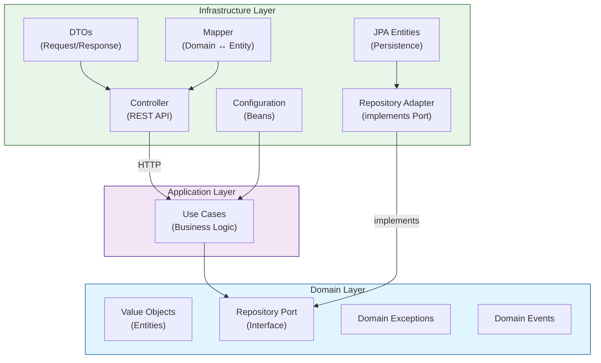
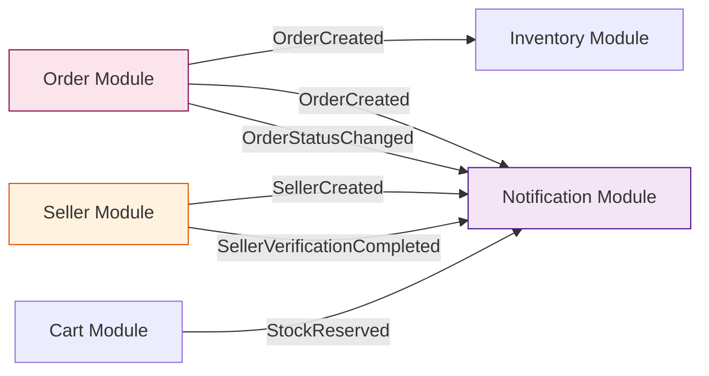
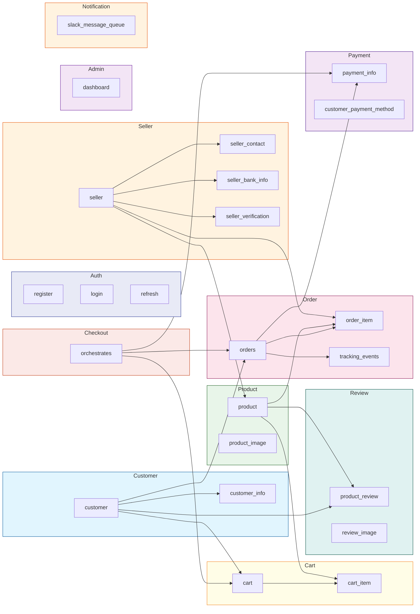

# EliteShop Colombia Backend

Backend API for **EliteShop Colombia**, a Colombian e-commerce platform connecting sellers and customers. Built with **Java 21**, **Spring Boot 4.0.7**, **Clean Architecture + Hexagonal (Ports & Adapters)**, and **Spring Modulith** for modular monolith enforcement.

---

## Table of Contents

- [Executive Summary](#executive-summary)
- [Technical Summary](#technical-summary)
- [Architecture](#architecture)
- [Project Structure](#project-structure)
- [Modules](#modules)
- [Database Schema](#database-schema)
- [API Endpoints](#api-endpoints)
- [Getting Started](#getting-started)
- [Configuration](#configuration)
- [Testing](#testing)
- [Deployment](#deployment)
- [Development Guidelines](#development-guidelines)
- [Technical Debt](#technical-debt)
- [License](#license)

---

## Executive Summary

EliteShop Colombia is a Colombian e-commerce platform designed to empower both **large-scale sellers and small businesses/microenterprises** across Colombia. The platform provides an accessible, robust, and scalable marketplace where any commerce — from established brands to local microbusinesses — can sell their products online with professional tools for inventory management, payments, order tracking, and customer engagement.

The backend provides REST APIs for managing **customers, sellers, products, orders, payments, shopping carts, product reviews, and checkout**. It is designed as a **modular monolith** with clear domain boundaries, enabling independent evolution of each business module.

**Key capabilities:**

- **11 business modules** fully implemented (domain, application, and infrastructure layers)
- **67 test files** covering unit, integration, and contract testing
- **JWT-based authentication** with role-based access control (`ROLE_CUSTOMER`, `ROLE_SELLER`, `ROLE_ADMIN`) and ownership validation
- **Seller identity verification** via facial matching (Face Matching) with MinIO storage
- **Asynchronous notifications** via Slack webhooks and GitHub PR webhook integration
- **Payment integration** with ePayco (Colombian payment gateway) including tokenized cards and idempotency
- **Checkout orchestration** coordinating Order + Payment + Cart with stock validation
- **Object storage** via MinIO for product images, review images, customer avatars, seller avatars, and verification documents
- **Spring Cloud Config** for centralized configuration management
- **Resilience4j Circuit Breaker** for fault tolerance
- **OpenAPI/Swagger UI** documentation

---

## Technical Summary

| Aspect | Detail |
|---|---|
| **Language** | Java 21 |
| **Framework** | Spring Boot 4.0.7 |
| **Architecture** | Clean Architecture + Hexagonal (Ports & Adapters) |
| **Modularity** | Spring Modulith 2.0.7 |
| **Database** | PostgreSQL 15 |
| **Migrations** | Liquibase |
| **Object Storage** | MinIO 8.5.17 |
| **Build Tool** | Maven |
| **Code Style** | Google Java Format (Spotless 2.43.0) |
| **Security** | Spring Security + JJWT 0.12.6 (JWT Bearer) |
| **Resilience** | Resilience4j Circuit Breaker |
| **Config** | Spring Cloud Config Server 2025.1.2 |
| **Observability** | Spring Modulith Observability + Actuator |
| **Email** | Spring Mail |
| **API Docs** | SpringDoc OpenAPI 2.8.6 |
| **Payment Gateway** | ePayco (Colombia) |
| **Utilities** | Lombok 1.18.42 |

---

## Architecture

The project follows **Clean Architecture** with a strict layer separation inside each module. Each module is self-contained with its own domain, application, and infrastructure layers.


```mermaid
graph TB
    subgraph Infrastructure["Infrastructure Layer"]
        Controller["Controller<br/>(REST API)"]
        DTO["DTOs<br/>(Request/Response)"]
        Mapper["Mapper<br/>(Domain ↔ Entity)"]
        Adapter["Repository Adapter<br/>(implements Port)"]
        Entity["JPA Entities<br/>(Persistence)"]
        Config["Configuration<br/>(Beans)"]
    end

    subgraph Application["Application Layer"]
        UseCase["Use Cases<br/>(Business Logic)"]
    end

    subgraph Domain["Domain Layer"]
        Model["Value Objects<br/>(Entities)"]
        Port["Repository Port<br/>(Interface)"]
        Exception["Domain Exceptions"]
        Event["Domain Events"]
    end

    Controller -->|HTTP| UseCase
    DTO --> Controller
    Mapper --> Controller
    UseCase --> Port
    Adapter -->|implements| Port
    Entity --> Adapter
    Config --> UseCase

    style Domain fill:#e1f5fe,stroke:#01579b
    style Application fill:#f3e5f5,stroke:#4a148c
    style Infrastructure fill:#e8f5e9,stroke:#1b5e20
```

### Layer Responsibilities

| Layer | Purpose | Dependencies |
|---|---|---|
| **Domain** | Business rules, value objects, repository interfaces, exceptions, domain events. Zero external dependencies. | None |
| **Application** | Use cases that orchestrate business logic. Depends only on domain interfaces. | Domain |
| **Infrastructure** | HTTP controllers, JPA entities, mappers, adapters, configuration. Bridges domain to external systems. | Application, Domain |

### Design Principles

- **Dependency Inversion:** Domain defines repository interfaces (ports); infrastructure implements them (adapters).
- **Value Objects:** Every field in the domain model is wrapped in a typed value object (e.g., `CustomerEmail`, `CustomerId`), preventing primitive obsession and enforcing type safety.
- **Use Cases:** Each business operation is a single-use-case class (e.g., `CustomerSaveUseCase`), ensuring single responsibility.
- **No Leaking:** Infrastructure concerns (JPA annotations, HTTP) never appear in domain or application layers.
- **Domain Events:** Cross-module communication via Spring Modulith application events (e.g., `OrderCreatedEvent`).

### Event-Driven Architecture


```mermaid
graph LR
    A[Order Module] -- OrderCreated --> B[Inventory Module]
    A -- OrderCreated --> C[Notification Module]
    A -- OrderStatusChanged --> C
    D[Seller Module] -- SellerCreated --> C
    D -- SellerVerificationCompleted --> C
    E[Cart Module] -- StockReserved --> C

    style A fill:#fce4ec,stroke:#880e4f
    style D fill:#fff3e0,stroke:#e65100
    style C fill:#f3e5f5,stroke:#4a148c
```

| Event | Origin | Listeners |
|---|---|---|
| `OrderCreated` | Order | Inventory, Notification, Seller |
| `OrderStatusChanged` | Order | Notification, Inventory, Seller |
| `SellerCreated` | Seller | Notification |
| `SellerVerificationCompleted` | Seller | Notification |

---

## Project Structure

```
src/main/java/com/eliteshop/colombia/
├── ColombiaApplication.java              # Entry point (@EnableScheduling, @EnableMethodSecurity)
├── SecurityConfig.java                   # Spring Security config (JWT Bearer, RBAC)
│
├── auth/                                 # Authentication module
│   ├── application/                      # RegisterUseCase, LoginUseCase, RefreshUseCase
│   ├── domain/                           # InvalidTokenException, InvalidCredentialsException
│   └── infrastructure/                   # AuthController, JWT provider, JwtAuthFilter
│
├── admin/                                # Administration module
│   ├── application/                      # AdminRegisterUseCase
│   └── infrastructure/                   # AdminController (dashboard, seller management)
│
├── customer/                             # Customer module
│   ├── application/                      # 6 use cases (CRUD + avatar)
│   ├── domain/                           # 19 value objects, repository, 4 exceptions
│   └── infrastructure/                   # CustomerController, DTOs, mapper, JPA adapter
│
├── seller/                               # Seller module
│   ├── application/                      # 11 use cases (CRUD + avatar + verification)
│   ├── domain/                           # 22 value objects + 14 verification VOs, repository, 13 exceptions, 2 events
│   └── infrastructure/                   # SellerController, SellerVerificationController, DTOs, mapper, JPA adapter
│
├── product/                              # Product module
│   ├── application/                      # 5 use cases (CRUD)
│   ├── domain/                           # 11 value objects, 2 repositories, 3 exceptions
│   └── infrastructure/                   # ProductController, DTOs, mapper, JPA adapter, MinIO adapter
│
├── order/                                # Order module
│   ├── application/                      # 21 use cases (CRUD + status transitions + tracking + search)
│   ├── domain/                           # 18 value objects + 4 tracking VOs, 3 repositories, 4 exceptions, 2 events
│   └── infrastructure/                   # 3 controllers (Management, Seller, Status), DTOs, mapper, JPA adapter
│
├── payment/                              # Payment module
│   ├── application/                      # 8 use cases (checkout session, confirm, retry, payment methods)
│   ├── domain/                           # Payment model, status enum, 10 payment method VOs, 3 ports, 3 exceptions
│   └── infrastructure/                   # PaymentController, PaymentMethodController, WebhookController, ePayco adapter
│
├── cart/                                 # Shopping Cart module
│   ├── application/                      # 5 use cases (add, update, remove, get, clear)
│   ├── domain/                           # 8 value objects, repository, 3 exceptions
│   └── infrastructure/                   # CartController, DTOs, mapper, JPA adapter
│
├── checkout/                             # Checkout orchestration module
│   ├── application/                      # CheckoutUseCase (orchestrates Order + Payment + Cart)
│   └── domain/                           # 6 exceptions (stock, empty cart, own store, payment failed)
│
├── review/                               # Product Review module
│   ├── application/                      # 5 use cases (CRUD + find by product)
│   ├── domain/                           # 10 value objects, 2 repositories, 2 exceptions
│   └── infrastructure/                   # ReviewController, DTOs, mapper, JPA adapter, MinIO adapter
│
└── shared/                               # Shared/cross-cutting module
    ├── config/                           # AsyncConfiguration (thread pool), ErrorConfig
    ├── domain/                           # LocationValidationService, PageResult
    ├── exception/                        # GlobalExceptionHandler (33+ exception mappings)
    ├── infrastructure/                   # LocationController, ErrorResponse DTO
    └── notification/                     # Slack notifications subsystem
        ├── application/                  # SendNotificationUseCase, RetryPendingNotificationsUseCase
        ├── domain/                       # SlackMessage model, NotificationPort, SlackMessageRepository
        └── infrastructure/              # SlackWebhookAdapter, NotificationRetryScheduler, HealthCheckScheduler
                                            GitHubWebhookController, GitHubPullRequestMapper
                                            SlackTestController, SlackMessageJpaRepository
```

---

## Modules

The system is organized into **11 business modules** with a shared cross-cutting module.


```mermaid
graph LR
    subgraph Auth["Auth"]
        A[register]
        AL[login]
        R[refresh]
    end

    subgraph Customer["Customer"]
        C[customer]
        CI[customer_info]
    end

    subgraph Seller["Seller"]
        S[seller]
        SC[seller_contact]
        SB[seller_bank_info]
        SV[seller_verification]
    end

    subgraph Product["Product"]
        P[product]
        PI[product_image]
    end

    subgraph Order["Order"]
        O[orders]
        OI[order_item]
        TE[tracking_events]
    end

    subgraph Payment["Payment"]
        PAY[payment_info]
        CPM[customer_payment_method]
    end

    subgraph Cart["Cart"]
        CA[cart]
        CIT[cart_item]
    end

    subgraph Review["Review"]
        REV[product_review]
        RI[review_image]
    end

    subgraph Checkout["Checkout"]
        CO[orchestrates]
    end

    subgraph Admin["Admin"]
        AD[dashboard]
    end

    subgraph Notification["Notification"]
        N[slack_message_queue]
    end

    C --> CI
    S --> SC
    S --> SB
    S --> SV
    S --> P
    C --> REV
    P --> REV
    C --> O
    O --> OI
    O --> TE
    P --> OI
    S --> OI
    O --> PAY
    C --> CA
    CA --> CIT
    P --> CIT
    CO --> O
    CO --> PAY
    CO --> CA

    style Auth fill:#e8eaf6,stroke:#283593
    style Customer fill:#e1f5fe,stroke:#01579b
    style Seller fill:#fff3e0,stroke:#e65100
    style Product fill:#e8f5e9,stroke:#1b5e20
    style Order fill:#fce4ec,stroke:#880e4f
    style Payment fill:#f3e5f5,stroke:#4a148c
    style Cart fill:#fffde7,stroke:#f57f17
    style Review fill:#e0f2f1,stroke:#004d40
    style Checkout fill:#fbe9e7,stroke:#bf360c
    style Admin fill:#f3e5f5,stroke:#6a1b9a
    style Notification fill:#fff3e0,stroke:#e65100
```

| Module | Tables | Use Cases | Status |
|---|---|---|---|
| **Auth** | — | 3 (Register, Login, Refresh) | Implemented |
| **Admin** | — | 1 (AdminRegister) | Implemented |
| **Customer** | `customer`, `customer_info` | 6 (CRUD + Avatar) | Implemented |
| **Seller** | `seller`, `seller_contact`, `seller_bank_info`, `seller_verification` | 11 (CRUD + Avatar + Verification) | Implemented |
| **Product** | `product`, `product_image` | 5 (CRUD) | Implemented |
| **Order** | `orders`, `order_item`, `tracking_events` | 21 (CRUD + Status + Tracking + Search) | Implemented |
| **Payment** | `payment_info`, `customer_payment_method` | 8 (Checkout Session, Confirm, Retry, Methods) | Implemented |
| **Cart** | `cart`, `cart_item` | 5 (Add, Update, Remove, Get, Clear) | Implemented |
| **Checkout** | (orchestrates Order + Payment + Cart) | 1 (CheckoutUseCase) | Implemented |
| **Review** | `product_review`, `review_image` | 5 (CRUD + FindByProduct) | Implemented |
| **Notification** | `slack_message_queue` | 2 (Send, Retry) | Implemented |

---

## Database Schema

The database is **PostgreSQL 15**, managed by **Liquibase**. Migrations are located in `src/main/resources/db/migrations/`.

### Entity Relationship Diagram


```mermaid
erDiagram
    customer ||--o| customer_info : has
    customer ||--o{ product_review : writes
    customer ||--o{ orders : places
    customer ||--o| cart : owns
    customer ||--o{ customer_payment_method : stores
    seller ||--o{ seller_contact : has
    seller ||--o| seller_bank_info : has
    seller ||--o| seller_verification : undergoes
    seller ||--o{ product : lists
    seller ||--o{ order_item : fulfills
    product ||--o{ product_review : receives
    product ||--o{ product_image : has
    product ||--o{ order_item : includes
    product ||--o{ cart_item : added_to
    orders ||--o{ order_item : contains
    orders ||--o| payment_info : paid_via
    orders ||--o{ tracking_event : tracked_by
    cart ||--o{ cart_item : contains
    product_review ||--o{ review_image : has

    customer {
        uuid customer_id PK
        varchar customer_first_name
        varchar customer_last_name
        varchar customer_email UK
        varchar customer_phone_number
        varchar customer_password
        text customer_profile_image
        varchar customer_role
        timestamp customer_created_at
        timestamp customer_update_at
    }

    customer_info {
        uuid customer_id PK, FK
        varchar customer_dni_type
        varchar customer_dni_number UK
        varchar customer_address
        varchar customer_department
        varchar customer_city
        timestamp customer_dni_created_at
        timestamp customer_dni_update_at
    }

    seller {
        uuid seller_id PK
        varchar seller_type_trade
        varchar seller_type_dni
        varchar seller_dni_number UK
        varchar seller_trade_name
        varchar seller_fullname
        boolean seller_is_active
        boolean seller_is_verified
        text seller_profile_image
        timestamp seller_created_at
        timestamp seller_update_at
    }

    seller_contact {
        uuid seller_id PK, FK
        varchar seller_email
        varchar seller_phone_number
        varchar seller_trade_address
        varchar seller_trade_department
        varchar seller_trade_city
    }

    seller_bank_info {
        uuid seller_id PK, FK
        varchar bank_name
        varchar type_account
        varchar number_account
    }

    seller_verification {
        uuid verification_id PK
        uuid seller_id FK
        varchar verification_type
        varchar verification_status
        varchar document_type
        varchar document_number
        varchar document_minio_key
        varchar selfie_minio_key
        decimal confidence_score
        varchar rejection_reason
        timestamp created_at
        timestamp updated_at
    }

    product {
        uuid product_id PK
        uuid seller_id FK
        varchar product_name
        varchar product_description
        decimal product_price
        int product_stock
        varchar product_category
        timestamp created_at
        timestamp updated_at
    }

    product_image {
        uuid image_id PK
        uuid product_id FK
        varchar image_url
        int image_order
        timestamp created_at
    }

    product_review {
        uuid review_id PK
        uuid product_id FK
        uuid customer_id FK
        int product_qualify
        varchar product_review_content
        timestamp created_at
        timestamp updated_at
    }

    review_image {
        uuid image_id PK
        uuid review_id FK
        varchar image_url
        int image_order
        timestamp created_at
    }

    orders {
        uuid order_id PK
        uuid customer_id FK
        varchar order_status
        decimal total_amount
        varchar shipping_address
        varchar shipping_department
        varchar shipping_city
        varchar tracking_number
        varchar shipping_carrier
        varchar shipping_label_url
        timestamp created_at
        timestamp updated_at
    }

    order_item {
        uuid order_item_id PK
        uuid orders_id FK
        uuid product_id FK
        uuid seller_id FK
        decimal unit_price
        int quantity
        varchar item_status
    }

    tracking_event {
        uuid tracking_event_id PK
        uuid order_id FK
        varchar status
        varchar description
        varchar location
        timestamp event_date
        timestamp created_at
    }

    payment_info {
        uuid payment_id PK
        uuid order_id FK
        varchar payment_method
        varchar transaction_id
        varchar payment_status
        varchar epayco_reference
        timestamp paid_at
        timestamp created_at
    }

    customer_payment_method {
        uuid payment_method_id PK
        uuid customer_id FK
        varchar last4
        varchar brand
        int expiry_month
        int expiry_year
        varchar doc_type
        varchar doc_number
        varchar epayco_token
        varchar epayco_customer_id
        boolean is_default
        timestamp created_at
    }

    cart {
        uuid cart_id PK
        uuid customer_id FK
        timestamp created_at
        timestamp updated_at
    }

    cart_item {
        uuid cart_item_id PK
        uuid cart_id FK
        uuid product_id FK
        int quantity
        decimal unit_price
        timestamp added_at
    }
```

---

## API Endpoints

### Authentication

| Method | Endpoint | Description | Auth |
|---|---|---|---|
| `POST` | `/api/v1/auth/register` | Register a new customer | Public |
| `POST` | `/api/v1/auth/login` | Login and get JWT | Public |
| `POST` | `/api/v1/auth/refresh` | Refresh JWT token | Public |

### Admin

| Method | Endpoint | Description | Auth |
|---|---|---|---|
| `POST` | `/api/v1/admin/register` | Register admin user | Admin |
| `GET` | `/api/v1/admin/dashboard` | Get admin dashboard | Admin |
| `GET` | `/api/v1/admin/customers` | List all customers | Admin |
| `GET` | `/api/v1/admin/sellers` | List all sellers | Admin |
| `GET` | `/api/v1/admin/sellers/{id}` | Get seller details | Admin |
| `PATCH` | `/api/v1/admin/sellers/{id}/status` | Activate/deactivate seller | Admin |
| `GET` | `/api/v1/admin/orders` | List all orders | Admin |

### Customer

| Method | Endpoint | Description | Auth |
|---|---|---|---|
| `POST` | `/api/v1/customers` | Create customer (via register) | Public |
| `PUT` | `/api/v1/customers/{id}` | Update customer | Customer (owner) |
| `DELETE` | `/api/v1/customers/{id}` | Delete customer | Customer (owner) |
| `GET` | `/api/v1/customers` | Get all customers | Admin |
| `GET` | `/api/v1/customers/{id}` | Get customer by ID | Customer (owner) |
| `POST` | `/api/v1/customers/{id}/avatar` | Upload avatar | Customer (owner) |
| `PUT` | `/api/v1/customers/{id}/avatar` | Replace avatar | Customer (owner) |
| `DELETE` | `/api/v1/customers/{id}/avatar` | Delete avatar | Customer (owner) |
| `GET` | `/api/v1/customers/{id}/avatar` | Get avatar URL | Public |

### Seller

| Method | Endpoint | Description | Auth |
|---|---|---|---|
| `POST` | `/api/v1/sellers` | Create seller | Public |
| `PUT` | `/api/v1/sellers/{id}` | Update seller | Seller (owner) |
| `DELETE` | `/api/v1/sellers/{id}` | Delete seller | Seller (owner) |
| `GET` | `/api/v1/sellers` | Get all sellers | Public |
| `GET` | `/api/v1/sellers/{id}` | Get seller by ID | Public |
| `GET` | `/api/v1/seller-contact/{sellerId}` | Get seller contact info | Public |
| `GET` | `/api/v1/seller-info/{sellerId}` | Get seller bank info | Public |
| `POST` | `/api/v1/sellers/{id}/avatar` | Upload avatar | Seller (owner) |
| `PUT` | `/api/v1/sellers/{id}/avatar` | Replace avatar | Seller (owner) |
| `DELETE` | `/api/v1/sellers/{id}/avatar` | Delete avatar | Seller (owner) |
| `GET` | `/api/v1/sellers/{id}/avatar` | Get avatar URL | Public |

### Seller Verification

| Method | Endpoint | Description | Auth |
|---|---|---|---|
| `POST` | `/api/v1/sellers/{sellerId}/verification/document` | Upload identity document | Seller (owner) |
| `POST` | `/api/v1/sellers/{sellerId}/verification/selfie` | Upload selfie | Seller (owner) |
| `POST` | `/api/v1/sellers/{sellerId}/verification/validate` | Trigger facial matching | Seller (owner) |
| `GET` | `/api/v1/sellers/{sellerId}/verification` | Check verification status | Seller (owner) |

### Product

| Method | Endpoint | Description | Auth |
|---|---|---|---|
| `POST` | `/api/v1/products` | Create product | Seller |
| `PUT` | `/api/v1/products/{id}` | Update product | Seller (owner) |
| `DELETE` | `/api/v1/products/{id}` | Delete product | Seller (owner) |
| `GET` | `/api/v1/products` | Get all products (paginated) | Public |
| `GET` | `/api/v1/products/{id}` | Get product by ID | Public |
| `GET` | `/api/v1/products/images` | Get product images | Public |

### Order

| Method | Endpoint | Description | Auth |
|---|---|---|---|
| `POST` | `/api/v1/orders` | Create order | Customer |
| `PUT` | `/api/v1/orders/{id}` | Update order | Customer (owner) |
| `DELETE` | `/api/v1/orders/{id}` | Delete order | Customer (owner) |
| `GET` | `/api/v1/orders` | Get all orders | Admin |
| `GET` | `/api/v1/orders/{id}` | Get order by ID | Customer/Seller (owner) |
| `GET` | `/api/v1/orders/customer/{customerId}` | Get orders by customer | Customer (owner) |

### Order Status Management

| Method | Endpoint | Description | Auth |
|---|---|---|---|
| `GET` | `/api/v1/orders/{id}/tracking` | Get tracking events | Customer/Seller |
| `POST` | `/api/v1/orders/{id}/tracking` | Add tracking event | Seller |
| `PATCH` | `/api/v1/orders/{id}/tracking` | Update tracking | Seller |
| `PATCH` | `/api/v1/orders/{id}/cancel` | Cancel order | Customer (owner) |
| `PATCH` | `/api/v1/orders/{id}/confirm-delivery` | Confirm delivery | Customer (owner) |
| `PATCH` | `/api/v1/orders/{id}/prepare` | Mark as preparing | Seller |
| `PATCH` | `/api/v1/orders/{id}/ship` | Mark as shipped | Seller |
| `PATCH` | `/api/v1/orders/{id}/out-for-delivery` | Mark out for delivery | Seller |
| `PATCH` | `/api/v1/orders/{id}/complete` | Mark as completed | Seller |
| `PATCH` | `/api/v1/orders/{id}/dispute` | Open dispute | Customer (owner) |
| `PATCH` | `/api/v1/orders/{id}/refund` | Process refund | Seller |

### Order Seller Views

| Method | Endpoint | Description | Auth |
|---|---|---|---|
| `GET` | `/api/v1/orders/seller/{sellerId}` | Get seller's orders | Seller (owner) |
| `GET` | `/api/v1/orders/seller/{sellerId}/summary` | Get seller order summary | Seller (owner) |
| `GET` | `/api/v1/orders/seller/{sellerId}/search` | Search seller orders | Seller (owner) |
| `GET` | `/api/v1/orders/seller/{sellerId}/status-counts` | Get status counts | Seller (owner) |

### Payment

| Method | Endpoint | Description | Auth |
|---|---|---|---|
| `POST` | `/api/v1/payments/checkout-session` | Create checkout session | Customer |
| `POST` | `/api/v1/payments/confirm/{refId}` | Confirm payment | Customer |
| `GET` | `/api/v1/payments/{invoice}` | Get payment by invoice | Customer (owner) |
| `POST` | `/api/v1/payments/orders/{orderId}/retry` | Retry failed payment | Customer (owner) |

### Payment Methods

| Method | Endpoint | Description | Auth |
|---|---|---|---|
| `GET` | `/api/v1/payment-methods` | List saved cards | Customer |
| `POST` | `/api/v1/payment-methods` | Save new card | Customer |
| `DELETE` | `/api/v1/payment-methods/{id}` | Delete saved card | Customer (owner) |
| `PUT` | `/api/v1/payment-methods/{id}/default` | Set as default | Customer (owner) |

### Cart

| Method | Endpoint | Description | Auth |
|---|---|---|---|
| `GET` | `/api/v1/cart` | Get current cart | Customer |
| `POST` | `/api/v1/cart/items` | Add item to cart | Customer |
| `PUT` | `/api/v1/cart/items/{itemId}` | Update cart item quantity | Customer (owner) |
| `DELETE` | `/api/v1/cart/items/{itemId}` | Remove item from cart | Customer (owner) |
| `DELETE` | `/api/v1/cart` | Clear entire cart | Customer |

### Checkout

| Method | Endpoint | Description | Auth |
|---|---|---|---|
| `POST` | `/api/v1/checkout` | Process checkout | Customer |

### Review

| Method | Endpoint | Description | Auth |
|---|---|---|---|
| `POST` | `/api/v1/reviews` | Create review | Customer (verified buyer) |
| `DELETE` | `/api/v1/reviews/{id}` | Delete review | Customer (owner) |
| `GET` | `/api/v1/reviews` | Get all reviews | Public |
| `GET` | `/api/v1/reviews/{id}` | Get review by ID | Public |
| `GET` | `/api/v1/reviews/product/{productId}` | Get reviews by product | Public |

### Locations

| Method | Endpoint | Description | Auth |
|---|---|---|---|
| `GET` | `/api/v1/locations/departments` | List Colombian departments | Public |
| `GET` | `/api/v1/locations/departments/{id}/cities` | List cities by department | Public |

### Webhooks

| Method | Endpoint | Description | Auth |
|---|---|---|---|
| `POST` | `/webhooks/epayco` | ePayco payment webhook | Signature validation |
| `POST` | `/api/v1/webhooks/github` | GitHub PR webhook | HMAC-SHA256 validation |
| `GET` | `/api/v1/webhooks/test-slack` | Test Slack notification | Dev profile only |

---

## Getting Started

### Prerequisites

- Java 21+
- Maven 3.9+
- Docker & Docker Compose (for local database and MinIO)
- PostgreSQL 15+
- MinIO (for object storage)
- Spring Cloud Config Server (optional, can be disabled)

### Quick Start

```bash
# 1. Clone the repository
git clone https://github.com/your-org/EliteShopColombiaBackend.git
cd EliteShopColombiaBackend

# 2. Copy environment variables
cp .env.example .env
# Edit .env with your actual values

# 3. Start infrastructure (PostgreSQL + MinIO)
docker compose up -d

# 4. Run the application
./mvnw spring-boot:run -Dspring-boot.run.profiles=local
```

The application starts on **port 8080** by default.

### Build Commands

```bash
# Compile
./mvnw compile

# Run all tests
./mvnw test

# Run a specific test class
./mvnw test -Dtest=CustomerControllerTest

# Format code (Google Java Format)
./mvnw spotless:apply

# Check formatting
./mvnw spotless:check

# Package as JAR
./mvnw clean package -DskipTests

# Run the application
./mvnw spring-boot:run
```

---

## Configuration

### Profiles

| Profile | Purpose |
|---|---|
| `local` | Local development (Docker Compose) |
| `dev` | Development environment |
| `prod` | Production environment |
| `test` | Unit/Integration tests (H2 in-memory) |
| `migration-test` | Liquibase migration tests |

### Environment Variables

All sensitive configuration is externalized via environment variables. Copy `.env.example` to `.env` and fill in the values. **Never commit `.env` to version control.**

| Category | Variable | Description |
|---|---|---|
| **Spring** | `SPRING_PROFILES_ACTIVE` | Active profile (`local`, `dev`, `prod`) |
| **Config Server** | `CONFIG_SERVER_URI` | Spring Cloud Config Server URL |
| **Database** | `SPRING_DATASOURCE_URL` | PostgreSQL JDBC URL |
| **Database** | `SPRING_DATASOURCE_USERNAME` | Database username |
| **Database** | `SPRING_DATASOURCE_PASSWORD` | Database password |
| **JWT** | `JWT_SECRET` | HMAC-SHA256 secret (min 32 bytes, Base64) |
| **JWT** | `JWT_EXPIRATION` | Token expiration in ms (default: 86400000 = 24h) |
| **JWT** | `JWT_ISSUER` | Token issuer claim |
| **MinIO** | `MINIO_ENDPOINT` | MinIO server URL |
| **MinIO** | `MINIO_ACCESS_KEY` | MinIO access key |
| **MinIO** | `MINIO_SECRET_KEY` | MinIO secret key |
| **ePayco** | `PAYMENTS_EPAYCO_PUBLIC_KEY` | ePayco public key |
| **ePayco** | `PAYMENTS_EPAYCO_PRIVATE_KEY` | ePayco private key |
| **ePayco** | `PAYMENTS_EPAYCO_APIFY_BASE_URL` | ePayco API base URL |
| **ePayco** | `PAYMENTS_EPAYCO_ENVIRONMENT` | `production` or `test` |
| **Face Matcher** | `FACE_MATCHER_URL` | Identity verification service URL |
| **Gateway** | `GATEWAY_URL` | API Gateway URL |
| **Gateway** | `GATEWAY_SECRET` | Gateway webhook secret |
| **GitHub** | `GITHUB_WEBHOOK_SECRET` | GitHub webhook HMAC secret |
| **GitHub** | `GITHUB_WEBHOOK_ENABLED` | Enable GitHub webhooks |
| **Slack** | `SLACK_ENABLED` | Enable Slack notifications |
| **Slack** | `SLACK_WEBHOOK_URL` | Slack incoming webhook URL |
| **Mail** | `SPRING_MAIL_HOST` | SMTP host |
| **Mail** | `SPRING_MAIL_PORT` | SMTP port |
| **Mail** | `SPRING_MAIL_USERNAME` | SMTP username |
| **Mail** | `SPRING_MAIL_PASSWORD` | SMTP password |

### Security

JWT-based authentication with role-based access control:

- **CSRF:** Disabled (stateless JWT Bearer token authentication)
- **Session Management:** STATELESS
- **Password Encoding:** BCrypt
- **JWT Filter:** `JwtAuthFilter` intercepts requests before `UsernamePasswordAuthenticationFilter`
- **Roles:** `ROLE_CUSTOMER`, `ROLE_SELLER`, `ROLE_ADMIN`
- **Ownership Validation:** `AuthorizationService` enforces cross-tenant access prevention

**Public endpoints** (no authentication required): seller/customer registration, product catalog, reviews, locations, health checks, Swagger UI.

### Error Contract

All error responses follow the `ErrorResponse` DTO format:

```json
{
  "timestamp": "2026-08-24T21:00:00Z",
  "status": 404,
  "error": "Product not found",
  "code": "PRODUCT_NOT_FOUND"
}
```

Validation errors include a `fieldErrors` map with per-field messages:

```json
{
  "timestamp": "2026-08-24T21:00:00Z",
  "status": 400,
  "error": "Validation failed",
  "code": "VALIDATION_FAILED",
  "fieldErrors": {
    "email": "Must be a valid email address",
    "password": "Must be at least 8 characters"
  }
}
```

### Async Configuration

Async processing is configured via `AsyncConfiguration` with a `ThreadPoolTaskExecutor`:
- **Core pool size:** 4
- **Max pool size:** 8
- **Queue capacity:** 50

Used for notification dispatch, seller verification processing, and webhook handling.

---

## Testing

### Test Framework

- **JUnit 5** for test execution
- **Mockito** for mocking
- **AssertJ** for fluent assertions
- **MockMvc** (standalone) for controller tests
- **Spring Test** for integration tests
- **H2** in-memory database for test profiles

### Running Tests

```bash
# Run all tests (288 tests)
./mvnw test

# Run tests for a specific module
./mvnw test -Dtest="com.eliteshop.colombia.customer.*"

# Run a single test class
./mvnw test -Dtest=CustomerControllerTest

# Run with migration-test profile
./mvnw test -Dspring.profiles.active=migration-test
```

### Test Profiles

| Profile | Purpose |
|---|---|
| `test` | H2 in-memory, Liquibase disabled, Config Server disabled |
| `migration-test` | H2 + Liquibase enabled (migration validation) |

### Key Test Areas

- **Auth/JWT** — Token generation, validation, expiration, role extraction
- **Ownership Validation** — Cross-tenant access prevention for Orders, Payments, Reviews
- **Checkout Flow** — End-to-end checkout orchestration
- **Payment Idempotency** — `ConfirmPaymentUseCase` skips already-APPROVED payments
- **Stock Concurrency** — `StockConcurrencyTest` with proper thread synchronization
- **Webhooks + HMAC** — Signature validation for ePayco and GitHub webhooks
- **SecurityConfig** — Endpoint authorization rules verification
- **Config Server Failure** — Graceful degradation when Config Server is unavailable
- **Liquibase Migrations** — Schema migration validation
- **Async Config** — Thread pool behavior verification
- **Error Contract** — `ErrorResponse` format consistency

---

## Deployment

### Prerequisites

- Java 21+
- PostgreSQL 15+
- MinIO instance for object storage
- Config Server (optional, can be disabled)
- Environment variables configured (see `.env.example`)

### Running Locally

```bash
# Start PostgreSQL and MinIO via Docker Compose
docker compose up -d

# Run the application
./mvnw spring-boot:run

# Or with a specific profile
./mvnw spring-boot:run -Dspring-boot.run.profiles=local
```

### Production Deployment

```bash
# Build the JAR
./mvnw clean package -DskipTests

# Run with production profile
java -jar target/colombia-*.jar --spring.profiles.active=prod
```

### Docker Deployment

```bash
# Build and run via Docker Compose
docker compose up -d --build
```

### Health Checks

| Endpoint | Description |
|---|---|
| `GET /actuator/health` | Application health status |
| `GET /actuator/info` | Application info |
| `GET /health` | Simple health check |
| `GET /swagger-ui/index.html` | Swagger UI documentation |
| `GET /v3/api-docs` | OpenAPI specification |

### Production Hardening Recommendations

1. **Rate Limiting:** Add Resilience4j rate limiter on auth endpoints (`/login`, `/register`, `/refresh`) — 10 req/min on login, 5 req/min on register.
2. **CORS Configuration:** Add explicit CORS with specific origins instead of wildcard.
3. **HTTPS:** Terminate TLS at the load balancer/reverse proxy.
4. **Secrets Management:** Use a vault (HashiCorp Vault, AWS Secrets Manager) instead of environment variables for production.
5. **Logging:** Ensure no PII (tokens, passwords, card numbers) appears in application logs.
6. **Actuator:** Restrict actuator endpoints to internal network only.
7. **Database Connection Pool:** Tune HikariCP pool settings for production load.

---

## Development Guidelines

### Code Style

- **Google Java Format** enforced via Spotless Maven plugin
- Run `./mvnw spotless:apply` before committing
- Run `./mvnw spotless:check` to verify formatting

### Adding a New Module

Follow the existing module pattern (e.g., Customer module):

1. **Domain layer:** Create value objects, repository interface (port), exceptions, domain events
2. **Application layer:** Create use case classes (one per operation)
3. **Infrastructure layer:** Create JPA entities, repository adapter (implements port), mapper, controller, DTOs, bean configuration

### Naming Conventions

| Layer | Convention | Example |
|---|---|---|
| Value Objects | `{Module}{Field}` | `CustomerEmail`, `OrderId` |
| Entities | `{Module}Entity` | `CustomerEntity`, `OrderEntity` |
| Use Cases | `{Module}{Action}UseCase` | `CustomerSaveUseCase` |
| Adapters | `{Module}RepositoryAdapter` | `CustomerRepositoryAdapter` |
| Controllers | `{Module}Controller` | `CustomerController` |
| DTOs | `{Module}Request`, `{Module}Response` | `CustomerRequest`, `CustomerResponse` |
| Repositories (JPA) | `{Module}JpaRepository` | `CustomerJpaRepository` |
| Exceptions | `{Module}{Type}Exception` | `CustomerNotFoundException` |
| Events | `{Module}{Action}Event` | `OrderCreatedEvent` |

### Important Rules

- Domain layer must have **zero** infrastructure dependencies (no Spring, JPA, HTTP annotations)
- Use cases must not reference JPA entities or HTTP concepts
- Each use case class handles exactly one business operation
- Value objects wrap primitives to enforce type safety
- Use `@Transactional` on use cases that perform read-then-write operations
- Never expose internal error messages to clients (use `ErrorResponse` contract)

---

## Technical Debt

> **Last reviewed:** 2026-08-26 | **Severity scale:** CRITICAL / HIGH / MEDIUM / LOW
>
> Auto-detected via code analysis. Each item includes file paths, module, and recommended fix.

### Summary

| Severity | Count | Key Areas |
|---|---|---|
| **CRITICAL** | 8 | Missing `@Transactional` on checkout, mutable domain models, N+1 queries, zero tests in 2 modules, no rate limiting |
| **HIGH** | 16 | Infrastructure leakage in domain, no CORS, controllers with 20+ dependencies, no input sanitization, missing `@Valid` |
| **MEDIUM** | 22 | No `equals`/`hashCode` on VOs, raw primitives in domain, missing DTO validation, duplicated code |
| **LOW** | 12 | Inconsistent naming, missing Javadoc, test endpoint exposed |

### Recommended Priority Order

1. **C1+C2** — Add `@Transactional` + compensating transactions to `CheckoutUseCase` (data integrity)
2. **C5** — Add rate limiting to auth endpoints (security)
3. **C4** — Fix N+1 in `ProductPostgresAdapter` (performance)
4. **C6+C7** — Add tests for cart and review modules (reliability)
5. **C3** — Refactor `Payment` to immutable domain model (consistency)
6. **H1-H3** — Decompose controllers, extract business logic (maintainability)
7. **H4+H5** — Add `equals`/`hashCode` to VOs, remove `@Setter` (correctness)
8. **H6+H7** — Remove infrastructure leakage from domain (architecture)
9. **H9-H11** — Add validation and sanitization (security)
10. **M14+M15** — Fix migration ordering and destructive DROP (data safety)

For detailed descriptions of each item, see the full Technical Debt section in the [Spanish README](README_SPANISH.md).

---

## License

See [LICENSE](LICENSE) for details.
