# EliteShop Colombia Backend

API Backend para **EliteShop Colombia**, una plataforma de comercio electronico construida con Spring Boot 4, Java 21 y principios de Arquitectura Limpia.

---

## Tabla de Contenidos

- [Resumen Ejecutivo](#resumen-ejecutivo)
- [Resumen Tecnico](#resumen-tecnico)
- [Arquitectura](#arquitectura)
- [Estructura del Proyecto](#estructura-del-proyecto)
- [Modulos](#modulos)
- [Esquema de Base de Datos](#esquema-de-base-de-datos)
- [Endpoints de la API](#endpoints-de-la-api)
- [Primeros Pasos](#primeros-pasos)
- [Configuracion](#configuracion)
- [Directrices de Desarrollo](#directrices-de-desarrollo)

---

## Resumen Ejecutivo

EliteShop Colombia es una plataforma de comercio electronico colombiana que conecta vendedores y clientes. El backend provee APIs REST para gestionar clientes, vendedores, productos, pedidos, pagos, carritos de compras y resenas de productos. Esta disenado como un monolito modular con limites de dominio claros, permitiendo la evolucion independiente de cada modulo de negocio.

**Estado Actual:** En desarrollo temprano. Los modulos de **Cliente** y **Vendedor** han sido implementados completamente (capas de dominio, aplicacion e infraestructura). El esquema de base de datos define 12 tablas que cubren todo el dominio de negocio, pero los modulos restantes (producto, pedido, carrito, pago) aun no estan implementados en codigo.

---

## Resumen Tecnico

| Aspecto | Detalle |
|---|---|
| **Lenguaje** | Java 21 |
| **Framework** | Spring Boot 4.0.7 |
| **Arquitectura** | Arquitectura Limpia + Hexagonal (Puertos y Adaptadores) |
| **Modularidad** | Spring Modulith 2.0.7 |
| **Base de Datos** | PostgreSQL 15 |
| **Migraciones** | Liquibase |
| **Herramienta de Build** | Maven |
| **Estilo de Codigo** | Google Java Format (Spotless) |
| **Seguridad** | Spring Security (permisivo para desarrollo) |
| **Resiliencia** | Resilience4j Circuit Breaker |
| **Configuracion** | Spring Cloud Config Server |
| **Observabilidad** | Spring Modulith Observability + Actuator |
| **Correo** | Spring Mail |

---

## Arquitectura

El proyecto sigue **Arquitectura Limpia** con una separacion estricta de capas dentro de cada modulo. Cada modulo es autocontenido con sus propias capas de dominio, aplicacion e infraestructura.

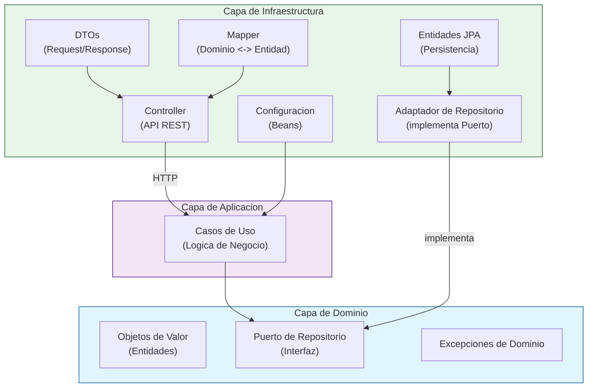

### Responsabilidades de las Capas

| Capa | Proposito | Dependencias |
|---|---|---|
| **Dominio** | Reglas de negocio, objetos de valor, interfaces de repositorio, excepciones. Cero dependencias externas. | Ninguna |
| **Aplicacion** | Casos de uso que orquestan la logica de negocio. Depende solo de interfaces del dominio. | Dominio |
| **Infraestructura** | Controllers HTTP, entidades JPA, mappers, adaptadores. Conecta el dominio con sistemas externos. | Aplicacion, Dominio |

### Principios de Diseno

- **Inversion de Dependencias:** El dominio define las interfaces de repositorio (puertos); la infraestructura las implementa (adaptadores).
- **Objetos de Valor:** Cada campo del modelo de dominio esta envuelto en un objeto de valor tipado (ej: `CustomerEmail`, `CustomerId`), previniendo la obsesion con primitivos y forzando seguridad de tipos.
- **Casos de Uso:** Cada operacion de negocio es una clase de un solo caso de uso (ej: `CustomerSaveUseCase`), garantizando responsabilidad unica.
- **Sin Filtraciones:** Las preocupaciones de infraestructura (anotaciones JPA, HTTP) nunca aparecen en las capas de dominio o aplicacion.

### Flujo de una Peticion HTTP

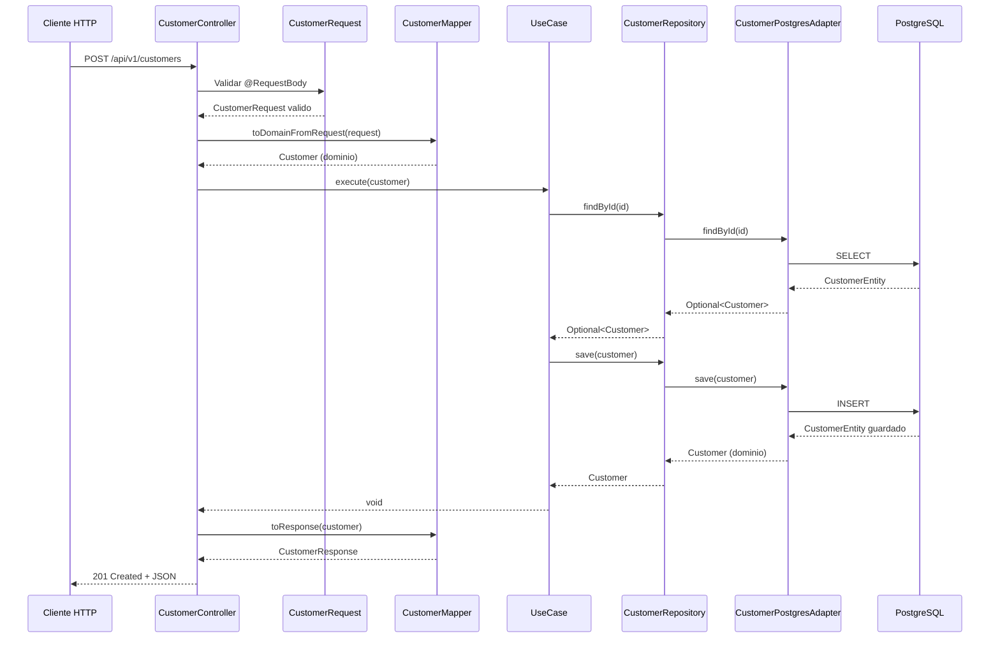

### Flujo de Arquitectura por Capas

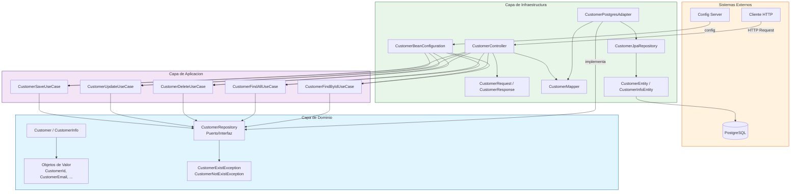

### Flujo de Persistencia (Save/Update)

```mermaid
flowchart LR
    subgraph Entry["Entrada"]
        Req[CustomerRequest]
    end

    subgraph Transform["Transformacion"]
        MapReq[Mapper.toDomainFromRequest]
        Domain[Customer dominio]
        MapEnt[Mapper.toEntity]
        Ent[CustomerEntity]
    end

    subgraph Persist["Persistencia"]
        JPA[CustomerJpaRepository.save]
        DB[(PostgreSQL)]
        Persisted[CustomerEntity persistido]
    end

    subgraph Response["Salida"]
        MapRes[Mapper.toResponse]
        Resp[CustomerResponse]
    end

    Req --> MapReq
    MapReq --> Domain
    Domain --> MapEnt
    MapEnt --> Ent
    Ent --> JPA
    JPA --> DB
    DB --> Persisted
    Persisted --> MapRes
    MapRes --> Resp

    style Entry fill:#fff3e0,stroke:#e65100
    style Transform fill:#e1f5fe,stroke:#01579b
    style Persist fill:#e8f5e9,stroke:#1b5e20
    style Response fill:#f3e5f5,stroke:#4a148c
```

### Flujo de Paginacion

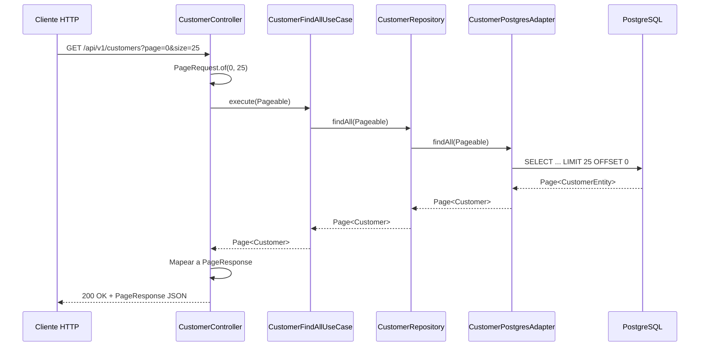

### Flujo de una Peticion HTTP (Seller)

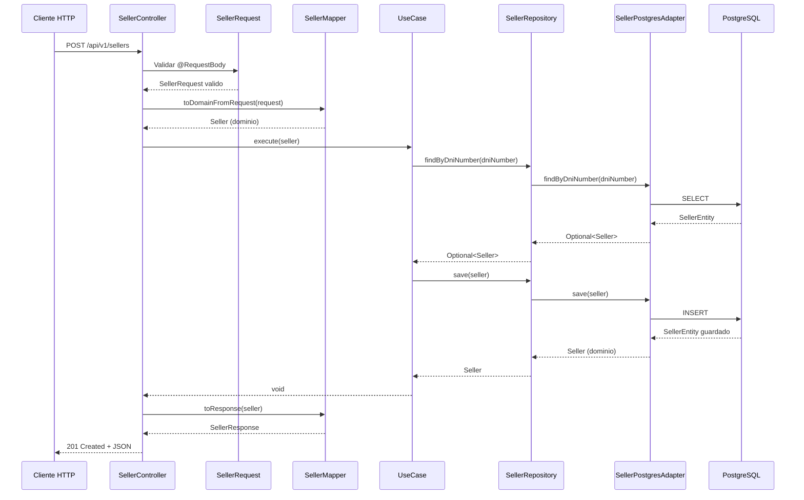

### Flujo de Arquitectura por Capas (Seller)

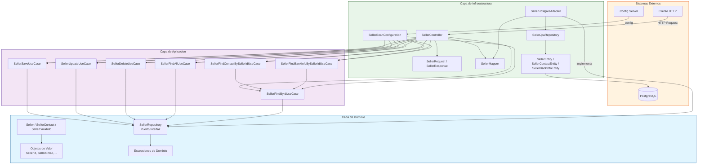

### Flujo de Persistencia (Seller - Save/Update)

```mermaid
flowchart LR
    subgraph Entry["Entrada"]
        Req[SellerRequest]
    end

    subgraph Transform["Transformacion"]
        MapReq[Mapper.toDomainFromRequest]
        Domain[Seller dominio]
        MapEnt[Mapper.toEntity]
        Ent[SellerEntity]
    end

    subgraph Persist["Persistencia"]
        JPA[SellerJpaRepository.save]
        DB[(PostgreSQL)]
        Persisted[SellerEntity persistido]
    end

    subgraph Response["Salida"]
        MapRes[Mapper.toResponse]
        Resp[SellerResponse]
    end

    Req --> MapReq
    MapReq --> Domain
    Domain --> MapEnt
    MapEnt --> Ent
    Ent --> JPA
    JPA --> DB
    DB --> Persisted
    Persisted --> MapRes
    MapRes --> Resp

    style Entry fill:#fff3e0,stroke:#e65100
    style Transform fill:#e1f5fe,stroke:#01579b
    style Persist fill:#e8f5e9,stroke:#1b5e20
    style Response fill:#f3e5f5,stroke:#4a148c
```

### Flujo de Consulta de Contacto y Bank Info

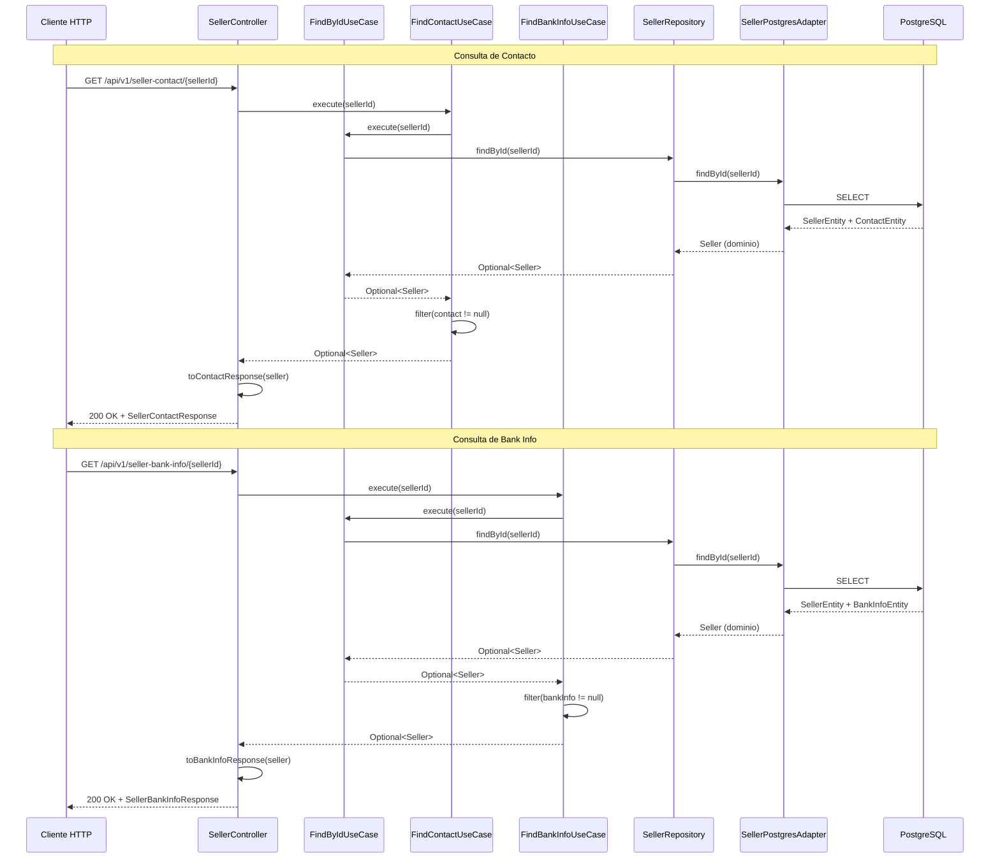

### Diagrama de Relacion de Entidades (Seller)

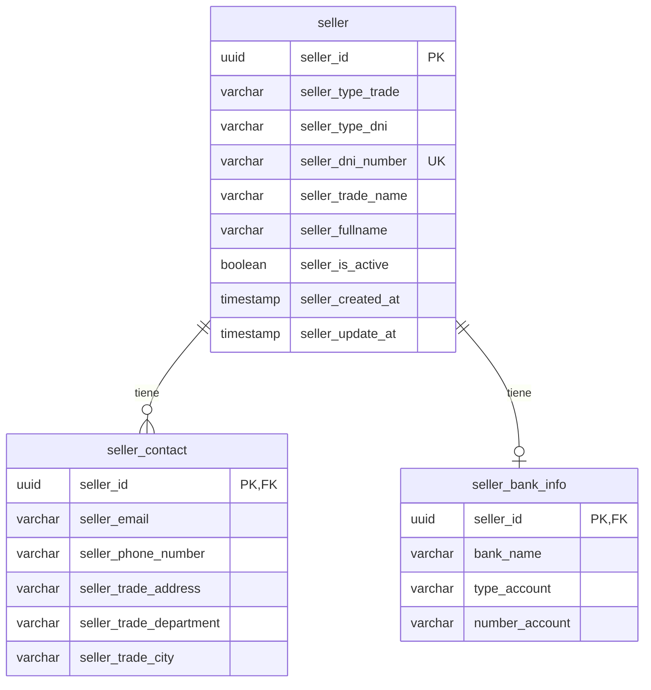

---

## Estructura del Proyecto

```
src/main/java/com/eliteshop/colombia/
├── ColombiaApplication.java          # Punto de entrada de la aplicacion
├── SecurityConfig.java               # Configuracion de Spring Security (permisiva)
│
└── customer/                         # Modulo de Cliente
    ├── application/                  # Casos de uso
    │   ├── CustomerSaveUseCase.java
    │   ├── CustomerUpdateUseCase.java
    │   ├── CustomerDeleteUseCase.java
    │   ├── CustomerFindAllUseCase.java
    │   └── CustomerFindByIdUseCase.java
    │
    ├── domain/                       # Modelo de dominio
    │   ├── model/
    │   │   ├── Customer.java                  # Raiz del agregado
    │   │   ├── CustomerInfo.java              # Objeto de valor (DNI + direccion)
    │   │   ├── CustomerId.java                # Envoltorio UUID
    │   │   ├── CustomerFirstName.java         # Envoltorio String
    │   │   ├── CustomerLastName.java          # Envoltorio String
    │   │   ├── CustomerEmail.java             # Envoltorio String
    │   │   ├── CustomerPhoneNumber.java       # Envoltorio String
    │   │   ├── CustomerPassword.java          # Envoltorio String
    │   │   ├── CustomerProfileImage.java      # Envoltorio String
    │   │   ├── CustomerCreatedAt.java         # Envoltorio Timestamp
    │   │   ├── CustomerUpdatedAt.java         # Envoltorio Timestamp
    │   │   ├── CustomerDniType.java           # Envoltorio String
    │   │   ├── CustomerDniNumber.java         # Envoltorio String
    │   │   ├── CustomerAddress.java           # Envoltorio String
    │   │   ├── CustomerDepartment.java        # Envoltorio String
    │   │   ├── CustomerCity.java              # Envoltorio String
    │   │   ├── CustomerDniCreatedAt.java      # Envoltorio Timestamp
    │   │   └── CustomerDniUpdatedAt.java      # Envoltorio Timestamp
    │   ├── repository/
    │   │   └── CustomerRepository.java        # Puerto (interfaz)
    │   └── exception/
    │       ├── CustomerExistException.java    # HTTP 409
    │       └── CustomerNotExistException.java # HTTP 404
    │
    └── infrastructure/               # Adaptadores externos
        ├── config/
        │   └── CustomerBeanConfiguration.java
        ├── controller/
        │   ├── CustomerController.java
        │   └── dto/
        │           ├── CustomerRequest.java
        │           ├── CustomerResponse.java
        │           └── PageResponse.java
        ├── mapper/
        │   └── CustomerMapper.java
        ├── adapter/
        │   └── CustomerPostgresAdapter.java
        └── persistence/
            ├── CustomerEntity.java
            ├── CustomerInfoEntity.java
            └── CustomerJpaRepository.java

└── seller/                           # Modulo de Vendedor
    ├── application/                  # Casos de uso
    │   ├── SellerSaveUseCase.java
    │   ├── SellerUpdateUseCase.java
    │   ├── SellerDeleteUseCase.java
    │   ├── SellerFindAllUseCase.java
    │   ├── SellerFindByIdUseCase.java
    │   ├── SellerFindByDniUseCase.java
    │   ├── SellerFindContactBySellerIdUseCase.java
    │   └── SellerFindBankInfoBySellerIdUseCase.java
    │
    ├── domain/                       # Modelo de dominio
    │   ├── model/
    │   │   ├── Seller.java                    # Raiz del agregado
    │   │   ├── SellerContact.java             # Objeto de valor (compuesto)
    │   │   ├── SellerBankInfo.java            # Objeto de valor (compuesto)
    │   │   ├── SellerId.java                  # Envoltorio UUID
    │   │   ├── SellerTypeTrade.java           # Enum (NATURAL, LEGAL)
    │   │   ├── SellerTypeDni.java             # Enum (CC, CE, PS, NIT)
    │   │   ├── SellerTypeBankAccount.java     # Enum (SAVINGS, CHECKING, WALLET)
    │   │   ├── SellerDniNumber.java           # Envoltorio String
    │   │   ├── SellerTradeName.java           # Envoltorio String
    │   │   ├── SellerFullname.java            # Envoltorio String
    │   │   ├── SellerIsActive.java            # Envoltorio Boolean
    │   │   ├── SellerCreatedAt.java           # Envoltorio Timestamp
    │   │   ├── SellerUpdatedAt.java           # Envoltorio Timestamp
    │   │   ├── SellerEmail.java               # Envoltorio String
    │   │   ├── SellerPhoneNumber.java         # Envoltorio String
    │   │   ├── SellerTradeAddress.java        # Envoltorio String
    │   │   ├── SellerTradeDepartment.java     # Envoltorio String
    │   │   ├── SellerTradeCity.java           # Envoltorio String
    │   │   ├── SellerBankName.java            # Envoltorio String
    │   │   └── SellerNumberAccount.java       # Envoltorio String
    │   ├── repository/
    │   │   └── SellerRepository.java          # Puerto (interfaz)
    │   └── exception/
    │       ├── SellerAlreadyExistsException.java   # HTTP 409
    │       ├── SellerNotFoundException.java        # HTTP 404
    │       ├── SellerInvalidEmailException.java    # HTTP 400
    │       ├── SellerInvalidPhoneNumberException.java
    │       ├── SellerInvalidDniNumberException.java
    │       ├── SellerInvalidTradeNameException.java
    │       ├── SellerInvalidFullnameException.java
    │       ├── SellerInvalidTradeAddressException.java
    │       ├── SellerInvalidTradeDepartmentException.java
    │       ├── SellerInvalidTradeCityException.java
    │       ├── SellerInvalidBankNameException.java
    │       └── SellerInvalidNumberAccountException.java
    │
    └── infrastructure/               # Adaptadores externos
        ├── config/
        │   └── SellerBeanConfiguration.java
        ├── controller/
        │   ├── SellerController.java
        │   └── dto/
        │           ├── SellerRequest.java
        │           ├── SellerResponse.java
        │           ├── SellerContactResponse.java
        │           └── SellerBankInfoResponse.java
        ├── mapper/
        │   └── SellerMapper.java
        ├── adapter/
        │   └── SellerPostgresAdapter.java
        └── persistence/
            ├── SellerEntity.java
            ├── SellerContactEntity.java
            ├── SellerBankInfoEntity.java
            └── SellerJpaRepository.java
```

---

## Modulos

La base de datos define 12 tablas organizadas en 6 dominios de negocio. Solo el modulo de **Cliente** tiene implementacion en codigo.

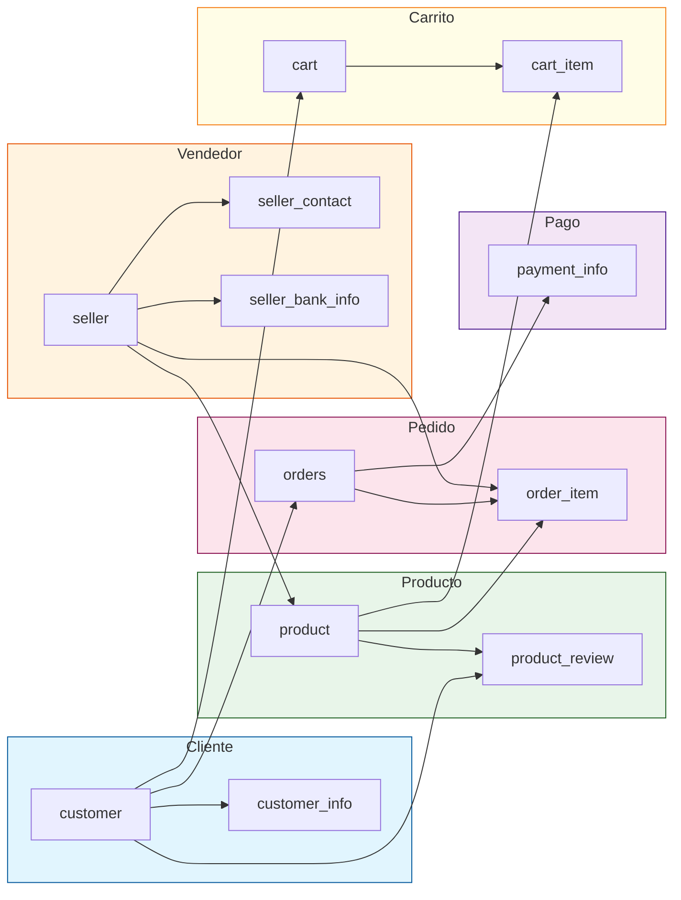

| Modulo | Tablas | Estado del Codigo |
|---|---|---|
| **Cliente** | `customer`, `customer_info` | Implementado |
| **Vendedor** | `seller`, `seller_contact`, `seller_bank_info` | Implementado |
| **Producto** | `product`, `product_review` | Solo esquema |
| **Pedido** | `orders`, `order_item` | Solo esquema |
| **Pago** | `payment_info` | Solo esquema |
| **Carrito** | `cart`, `cart_item` | Solo esquema |

---

## Esquema de Base de Datos

La base de datos es **PostgreSQL 15**, gestionada por **Liquibase**. La migracion inicial (`001-create-initial-tables.yaml`) define las 12 tablas con restricciones de clave foranea y restricciones unicas.

### Diagrama de Relacion de Entidades

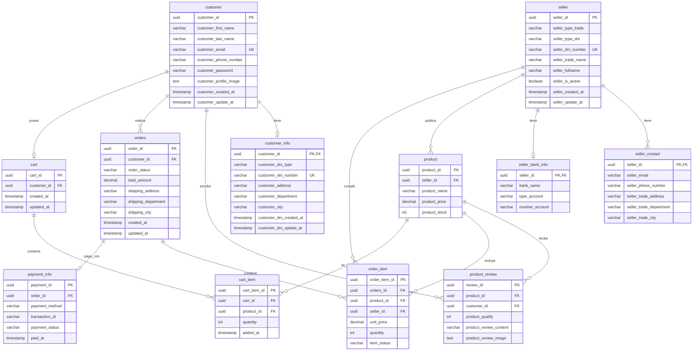

---

## Endpoints de la API

### Modulo de Cliente

| Metodo | Endpoint | Descripcion | Estado |
|---|---|---|---|
| `POST` | `/api/v1/customers` | Crear un nuevo cliente | Implementado |
| `PUT` | `/api/v1/customers/{id}` | Actualizar un cliente existente | Implementado |
| `DELETE` | `/api/v1/customers/{id}` | Eliminar un cliente | Implementado |
| `GET` | `/api/v1/customers?page=0&size=25` | Obtener clientes paginados | Implementado |
| `GET` | `/api/v1/customers/{id}` | Obtener cliente por ID | Implementado |

### Parametros de Paginacion

| Parametro | Tipo | Default | Descripcion |
|---|---|---|---|
| `page` | int | `0` | Numero de pagina (inicia en 0) |
| `size` | int | `25` | Cantidad de registros por pagina |

### Respuesta Paginada

| Campo | Tipo | Descripcion |
|---|---|---|
| `content` | Array | Lista de clientes |
| `page` | int | Pagina actual |
| `size` | int | Registros por pagina |
| `totalElements` | long | Total de registros |
| `totalPages` | int | Total de paginas |
| `first` | boolean | Es primera pagina |
| `last` | boolean | Es ultima pagina |

### Cuerpo de la Peticion (POST/PUT)

| Campo | Tipo | Descripcion |
|---|---|---|
| `firstName` | String | Nombre del cliente |
| `lastName` | String | Apellido del cliente |
| `email` | String | Correo electronico del cliente |
| `phoneNumber` | String | Numero de telefono del cliente |
| `password` | String | Contrasena del cliente |
| `profileImage` | String | URL de imagen de perfil (opcional) |
| `dniType` | String | Tipo de documento (opcional) |
| `dniNumber` | String | Numero de documento (opcional) |
| `address` | String | Direccion (opcional) |
| `department` | String | Departamento (opcional) |
| `city` | String | Ciudad (opcional) |

### Reglas de Validacion

| Campo | Reglas |
|---|---|
| `firstName` | Obligatorio, 1-100 caracteres |
| `lastName` | Obligatorio, 1-100 caracteres |
| `email` | Obligatorio, formato de email valido |
| `phoneNumber` | Obligatorio, 1-20 caracteres |
| `password` | Obligatorio, 8-100 caracteres |
| `dniType` | Opcional, 1-20 caracteres |
| `dniNumber` | Opcional, 1-20 caracteres |
| `address` | Opcional, 1-150 caracteres |
| `department` | Opcional, 1-50 caracteres |
| `city` | Opcional, 1-60 caracteres |

### Respuestas de Error

| Codigo HTTP | Excepcion | Cuando |
|---|---|---|
| `409 CONFLICT` | `CustomerExistException` | Ya existe un cliente con el mismo ID |
| `404 NOT FOUND` | `CustomerNotExistException` | Cliente no encontrado para actualizacion/eliminacion |

---

### Modulo de Vendedor

| Metodo | Endpoint | Descripcion | Estado |
|---|---|---|---|
| `POST` | `/api/v1/sellers` | Crear un nuevo vendedor | Implementado |
| `PUT` | `/api/v1/sellers/{id}` | Actualizar un vendedor existente | Implementado |
| `DELETE` | `/api/v1/sellers/{id}` | Eliminar un vendedor | Implementado |
| `GET` | `/api/v1/sellers` | Obtener todos los vendedores | Implementado |
| `GET` | `/api/v1/sellers/{id}` | Obtener vendedor por ID | Implementado |
| `GET` | `/api/v1/seller-contact/{sellerId}` | Obtener informacion de contacto del vendedor | Implementado |
| `GET` | `/api/v1/seller-bank-info/{sellerId}` | Obtener informacion bancaria del vendedor | Implementado |

#### Cuerpo de la Peticion (POST/PUT)

| Campo | Tipo | Descripcion |
|---|---|---|
| `typeTrade` | String | Tipo de comercio: `NATURAL`, `LEGAL` |
| `typeDni` | String | Tipo de documento: `CC`, `CE`, `PS`, `NIT` |
| `dniNumber` | String | Numero de documento (5-20 caracteres, unico) |
| `tradeName` | String | Nombre comercial (2-100 caracteres) |
| `fullname` | String | Nombre completo (2-100 caracteres) |
| `email` | String | Correo electronico |
| `phoneNumber` | String | Numero de telefono (formato colombiano) |
| `tradeAddress` | String | Direccion comercial (5-150 caracteres) |
| `tradeDepartment` | String | Departamento (colombiano) |
| `tradeCity` | String | Ciudad (2-60 caracteres) |
| `bankName` | String | Nombre del banco (banco colombiano) |
| `typeBankAccount` | String | Tipo de cuenta: `SAVINGS`, `CHECKING`, `WALLET` |
| `numberAccount` | String | Numero de cuenta (10-30 caracteres) |

#### Reglas de Validacion

| Campo | Reglas |
|---|---|
| `typeTrade` | Obligatorio. Valores: `NATURAL`, `LEGAL` |
| `typeDni` | Obligatorio. Valores: `CC`, `CE`, `PS`, `NIT` |
| `dniNumber` | Obligatorio, 5-20 caracteres, unico |
| `tradeName` | Obligatorio, 2-100 caracteres |
| `fullname` | Obligatorio, 2-100 caracteres |
| `email` | Obligatorio, formato de email valido |
| `phoneNumber` | Obligatorio, formato colombiano (10 digitos, empieza con 3) |
| `tradeAddress` | Obligatorio, 5-150 caracteres |
| `tradeDepartment` | Obligatorio, departamento colombiano valido |
| `tradeCity` | Obligatorio, 2-60 caracteres, ciudad valida para el departamento |
| `bankName` | Obligatorio, banco colombiano valido |
| `typeBankAccount` | Obligatorio. Valores: `SAVINGS`/`Ahorros`, `CHECKING`/`Corriente`, `WALLET`/`Digital` |
| `numberAccount` | Obligatorio, 10-30 caracteres |

#### Respuesta del Vendedor (GET)

| Campo | Tipo | Descripcion |
|---|---|---|
| `id` | UUID | Identificador unico del vendedor |
| `typeTrade` | String | Tipo de comercio |
| `typeDni` | String | Tipo de documento |
| `dniNumber` | String | Numero de documento |
| `tradeName` | String | Nombre comercial |
| `fullname` | String | Nombre completo |
| `isActive` | Boolean | Estado activo |
| `createdAt` | Timestamp | Fecha de creacion |
| `updatedAt` | Timestamp | Fecha de ultima actualizacion (nulable) |

#### Respuesta de Contacto del Vendedor (GET /seller-contact/{sellerId})

| Campo | Tipo | Descripcion |
|---|---|---|
| `sellerId` | UUID | Identificador unico del vendedor |
| `tradeName` | String | Nombre comercial |
| `fullname` | String | Nombre completo |
| `email` | String | Correo electronico |
| `phoneNumber` | String | Numero de telefono |
| `tradeAddress` | String | Direccion comercial |
| `tradeDepartment` | String | Departamento |
| `tradeCity` | String | Ciudad |

#### Respuesta de Informacion Bancaria del Vendedor (GET /seller-bank-info/{sellerId})

| Campo | Tipo | Descripcion |
|---|---|---|
| `sellerId` | UUID | Identificador unico del vendedor |
| `tradeName` | String | Nombre comercial |
| `fullname` | String | Nombre completo |
| `bankName` | String | Nombre del banco |
| `typeBankAccount` | String | Tipo de cuenta |
| `numberAccount` | String | Numero de cuenta |

#### Respuestas de Error

| Codigo HTTP | Excepcion | Cuando |
|---|---|---|
| `409 CONFLICT` | `SellerAlreadyExistsException` | Ya existe un vendedor con el mismo DNI |
| `404 NOT FOUND` | `SellerNotFoundException` | Vendedor no encontrado |
| `400 BAD REQUEST` | Various `SellerInvalid*Exception` | Valores de campo invalidos |

---

## Primeros Pasos

### Prerequisitos

- Java 21
- Maven 3.9+
- Docker y Docker Compose (para base de datos local)
- Spring Cloud Config Server ejecutandose en `http://100.123.31.18:8888`

### Ejecutar Localmente

```bash
# Iniciar PostgreSQL via Docker Compose
docker compose up -d

# Ejecutar la aplicacion
./mvnw spring-boot:run -Dspring-boot.run.profiles=local
```

La aplicacion inicia en el **puerto 8080** por defecto.

### Ejecutar con Maven

```bash
# Compilar
./mvnw compile

# Ejecutar pruebas
./mvnw test

# Formatear codigo
./mvnw spotless:apply

# Empaquetar
./mvnw package
```

---

## Configuracion

### Perfiles

| Perfil | Proposito |
|---|---|
| `local` | Desarrollo local |
| `dev` | Entorno de desarrollo |
| `prod` | Entorno de produccion |

Todos los perfiles importan configuracion desde el Spring Cloud Config Server en `http://100.123.31.18:8888`.

### Propiedades Principales

| Propiedad | Valor | Descripcion |
|---|---|---|
| `spring.application.name` | `colombia` | Nombre de la aplicacion |
| `spring.docker.compose.enabled` | `false` | Docker Compose deshabilitado por defecto |
| `spring.config.import` | `optional:configserver:http://100.123.31.18:8888` | Config Server |

### Seguridad

Spring Security esta configurado en `SecurityConfig.java` con CSRF deshabilitado y todas las peticiones permitidas. Esto es solo para desarrollo. **El despliegue en produccion debe configurar autenticacion y autorizacion adecuadas.**

---

## Directrices de Desarrollo

### Estilo de Codigo

- **Google Java Format** aplicado via el plugin Spotless de Maven
- Ejecutar `./mvnw spotless:apply` antes de commitear

### Agregar un Nuevo Modulo

Seguir el patron existente del modulo de Cliente:

1. **Capa de dominio:** Crear objetos de valor, interfaz de repositorio, excepciones
2. **Capa de aplicacion:** Crear clases de casos de uso (una por operacion)
3. **Capa de infraestructura:** Crear entidades JPA, adaptador de repositorio, mapper, controller, DTOs, configuracion de beans

### Convenciones de Nomenclatura

| Capa | Convencion |
|---|---|
| Objetos de Valor | `{Modulo}{Campo}` (ej: `CustomerEmail`) |
| Entidades | `{Modulo}Entity` (ej: `CustomerEntity`) |
| Casos de Uso | `{Modulo}{Accion}UseCase` (ej: `CustomerSaveUseCase`) |
| Adaptadores | `{Modulo}PostgresAdapter` |
| Controllers | `{Modulo}Controller` |
| DTOs | `{Modulo}Request`, `{Modulo}Response`, `PageResponse` |

### Reglas Importantes

- La capa de dominio debe tener **cero** dependencias de infraestructura
- Los casos de uso no deben referenciar entidades JPA ni conceptos HTTP
- Cada clase de caso de uso maneja exactamente una operacion de negocio
- Los objetos de valor envuelven primitivos para forzar seguridad de tipos

---

## Licencia

Ver [LICENSE](LICENSE) para mas detalles.
