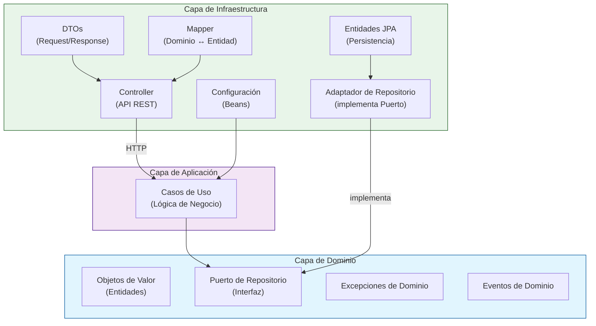
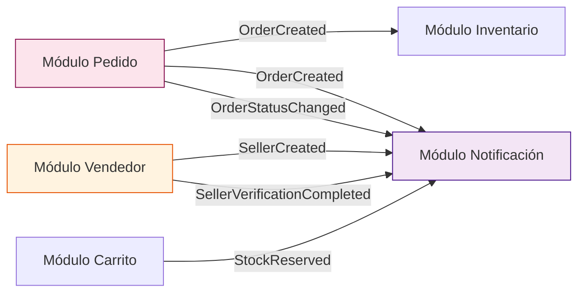
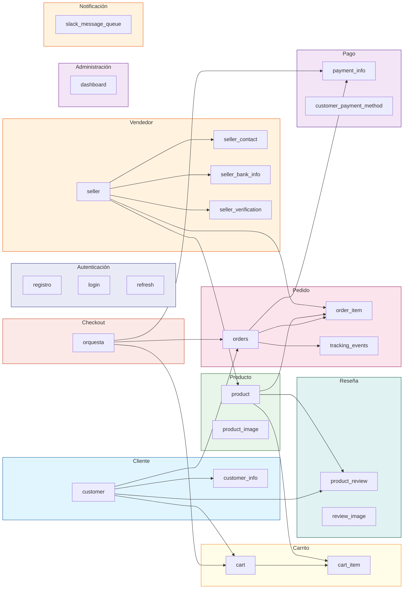

# EliteShop Colombia Backend

API Backend para **EliteShop Colombia**, una plataforma de comercio electrónico colombiana que conecta vendedores y clientes. Construido con **Java 21**, **Spring Boot 4.0.7**, **Arquitectura Limpia + Hexagonal (Puertos y Adaptadores)**, y **Spring Modulith** para la aplicación del monolito modular.

---

## Tabla de Contenidos

- [Resumen Ejecutivo](#resumen-ejecutivo)
- [Resumen Técnico](#resumen-técnico)
- [Arquitectura](#arquitectura)
- [Estructura del Proyecto](#estructura-del-proyecto)
- [Módulos](#módulos)
- [Esquema de Base de Datos](#esquema-de-base-de-datos)
- [Endpoints de la API](#endpoints-de-la-api)
- [Primeros Pasos](#primeros-pasos)
- [Configuración](#configuración)
- [Testing](#testing)
- [Despliegue](#despliegue)
- [Directrices de Desarrollo](#directrices-de-desarrollo)
- [Deuda Técnica](#deuda-técnica)
- [Licencia](#licencia)

---

## Resumen Ejecutivo

EliteShop Colombia es una plataforma de comercio electrónico colombiana diseñada para empoderar tanto a **vendedores a gran escala como a pequeños comercios y microempresas** en todo Colombia. La plataforma ofrece un marketplace accesible, robusto y escalable donde cualquier comercio — desde marcas establecidas hasta microempresas locales — puede vender sus productos en línea con herramientas profesionales para gestión de inventario, pagos, seguimiento de pedidos y fidelización de clientes.

El backend provee APIs REST para gestionar **clientes, vendedores, productos, pedidos, pagos, carritos de compras, reseñas de productos y checkout**. Está diseñado como un **monolito modular** con límites de dominio claros, permitiendo la evolución independiente de cada módulo de negocio.

**Capacidades principales:**

- **11 módulos de negocio** implementados completamente (capas de dominio, aplicación e infraestructura)
- **67 archivos de test** cubriendo testing unitario, de integración y de contrato
- **Autenticación basada en JWT** con control de acceso basado en roles (`ROLE_CUSTOMER`, `ROLE_SELLER`, `ROLE_ADMIN`) y validación de propiedad
- **Verificación de identidad de vendedores** mediante coincidencia facial (Face Matching) con almacenamiento en MinIO
- **Notificaciones asíncronas** vía webhooks de Slack e integración con webhooks de PRs de GitHub
- **Integración de pagos** con ePayco (pasarela de pagos colombiana) incluyendo tarjetas tokenizadas e idempotencia
- **Orquestación de checkout** coordinando Pedido + Pago + Carrito con validación de stock
- **Almacenamiento de objetos** vía MinIO para imágenes de productos, reseñas, avatares de clientes y vendedores, y documentos de verificación
- **Spring Cloud Config** para gestión centralizada de configuración
- **Resilience4j Circuit Breaker** para tolerancia a fallos
- **Documentación OpenAPI/Swagger UI**

---

## Resumen Técnico

| Aspecto | Detalle |
|---|---|
| **Lenguaje** | Java 21 |
| **Framework** | Spring Boot 4.0.7 |
| **Arquitectura** | Arquitectura Limpia + Hexagonal (Puertos y Adaptadores) |
| **Modularidad** | Spring Modulith 2.0.7 |
| **Base de Datos** | PostgreSQL 15 |
| **Migraciones** | Liquibase |
| **Almacenamiento de Objetos** | MinIO 8.5.17 |
| **Herramienta de Build** | Maven |
| **Estilo de Código** | Google Java Format (Spotless 2.43.0) |
| **Seguridad** | Spring Security + JJWT 0.12.6 (JWT Bearer) |
| **Resiliencia** | Resilience4j Circuit Breaker |
| **Configuración** | Spring Cloud Config Server 2025.1.2 |
| **Observabilidad** | Spring Modulith Observability + Actuator |
| **Correo** | Spring Mail |
| **Documentación API** | SpringDoc OpenAPI 2.8.6 |
| **Pasarela de Pagos** | ePayco (Colombia) |
| **Utilidades** | Lombok 1.18.42 |

---

## Arquitectura

El proyecto sigue **Arquitectura Limpia** con una separación estricta de capas dentro de cada módulo. Cada módulo es autocontenido con sus propias capas de dominio, aplicación e infraestructura.


```mermaid
graph TB
    subgraph Infrastructure["Capa de Infraestructura"]
        Controller["Controller<br/>(API REST)"]
        DTO["DTOs<br/>(Request/Response)"]
        Mapper["Mapper<br/>(Dominio ↔ Entidad)"]
        Adapter["Adaptador de Repositorio<br/>(implementa Puerto)"]
        Entity["Entidades JPA<br/>(Persistencia)"]
        Config["Configuración<br/>(Beans)"]
    end

    subgraph Application["Capa de Aplicación"]
        UseCase["Casos de Uso<br/>(Lógica de Negocio)"]
    end

    subgraph Domain["Capa de Dominio"]
        Model["Objetos de Valor<br/>(Entidades)"]
        Port["Puerto de Repositorio<br/>(Interfaz)"]
        Exception["Excepciones de Dominio"]
        Event["Eventos de Dominio"]
    end

    Controller -->|HTTP| UseCase
    DTO --> Controller
    Mapper --> Controller
    UseCase --> Port
    Adapter -->|implementa| Port
    Entity --> Adapter
    Config --> UseCase

    style Domain fill:#e1f5fe,stroke:#01579b
    style Application fill:#f3e5f5,stroke:#4a148c
    style Infrastructure fill:#e8f5e9,stroke:#1b5e20
```

### Responsabilidades de las Capas

| Capa | Propósito | Dependencias |
|---|---|---|
| **Dominio** | Reglas de negocio, objetos de valor, interfaces de repositorio, excepciones, eventos de dominio. Cero dependencias externas. | Ninguna |
| **Aplicación** | Casos de uso que orquestan la lógica de negocio. Depende solo de interfaces del dominio. | Dominio |
| **Infraestructura** | Controllers HTTP, entidades JPA, mappers, adaptadores, configuración. Conecta el dominio con sistemas externos. | Aplicación, Dominio |

### Principios de Diseño

- **Inversión de Dependencias:** El dominio define las interfaces de repositorio (puertos); la infraestructura las implementa (adaptadores).
- **Objetos de Valor:** Cada campo del modelo de dominio está envuelto en un objeto de valor tipado (ej: `CustomerEmail`, `CustomerId`), previniendo la obsesión con primitivos y forzando seguridad de tipos.
- **Casos de Uso:** Cada operación de negocio es una clase de un solo caso de uso (ej: `CustomerSaveUseCase`), garantizando responsabilidad única.
- **Sin Filtraciones:** Las preocupaciones de infraestructura (anotaciones JPA, HTTP) nunca aparecen en las capas de dominio o aplicación.
- **Eventos de Dominio:** Comunicación entre módulos vía eventos de aplicación de Spring Modulith (ej: `OrderCreatedEvent`).

### Arquitectura Dirigida por Eventos


```mermaid
graph LR
    A[Módulo Pedido] -- OrderCreated --> B[Módulo Inventario]
    A -- OrderCreated --> C[Módulo Notificación]
    A -- OrderStatusChanged --> C
    D[Módulo Vendedor] -- SellerCreated --> C
    D -- SellerVerificationCompleted --> C
    E[Módulo Carrito] -- StockReserved --> C

    style A fill:#fce4ec,stroke:#880e4f
    style D fill:#fff3e0,stroke:#e65100
    style C fill:#f3e5f5,stroke:#4a148c
```

| Evento | Origen | Escuchas |
|---|---|---|
| `OrderCreated` | Pedido | Inventario, Notificación, Vendedor |
| `OrderStatusChanged` | Pedido | Notificación, Inventario, Vendedor |
| `SellerCreated` | Vendedor | Notificación |
| `SellerVerificationCompleted` | Vendedor | Notificación |

---

## Estructura del Proyecto

```
src/main/java/com/eliteshop/colombia/
├── ColombiaApplication.java              # Punto de entrada (@EnableScheduling, @EnableMethodSecurity)
├── SecurityConfig.java                   # Configuración de Spring Security (JWT Bearer, RBAC)
│
├── auth/                                 # Módulo de autenticación
│   ├── application/                      # RegisterUseCase, LoginUseCase, RefreshUseCase
│   ├── domain/                           # InvalidTokenException, InvalidCredentialsException
│   └── infrastructure/                   # AuthController, JWT provider, JwtAuthFilter
│
├── admin/                                # Módulo de administración
│   ├── application/                      # AdminRegisterUseCase
│   └── infrastructure/                   # AdminController (dashboard, gestión de vendedores)
│
├── customer/                             # Módulo de Cliente
│   ├── application/                      # 6 casos de uso (CRUD + avatar)
│   ├── domain/                           # 19 objetos de valor, repositorio, 4 excepciones
│   └── infrastructure/                   # CustomerController, DTOs, mapper, adaptador JPA
│
├── seller/                               # Módulo de Vendedor
│   ├── application/                      # 11 casos de uso (CRUD + avatar + verificación)
│   ├── domain/                           # 22 objetos de valor + 14 VOs de verificación, repositorio, 13 excepciones, 2 eventos
│   └── infrastructure/                   # SellerController, SellerVerificationController, DTOs, mapper, adaptador JPA
│
├── product/                              # Módulo de Producto
│   ├── application/                      # 5 casos de uso (CRUD)
│   ├── domain/                           # 11 objetos de valor, 2 repositorios, 3 excepciones
│   └── infrastructure/                   # ProductController, DTOs, mapper, adaptador JPA, adaptador MinIO
│
├── order/                                # Módulo de Pedido
│   ├── application/                      # 21 casos de uso (CRUD + transiciones de estado + tracking + búsqueda)
│   ├── domain/                           # 18 objetos de valor + 4 VOs de tracking, 3 repositorios, 4 excepciones, 2 eventos
│   └── infrastructure/                   # 3 controllers (Management, Seller, Status), DTOs, mapper, adaptador JPA
│
├── payment/                              # Módulo de Pago
│   ├── application/                      # 8 casos de uso (sesión de checkout, confirmar, reintentar, métodos de pago)
│   ├── domain/                           # Modelo Payment, enum de estado, 10 VOs de método de pago, 3 puertos, 3 excepciones
│   └── infrastructure/                   # PaymentController, PaymentMethodController, WebhookController, adaptador ePayco
│
├── cart/                                 # Módulo de Carrito
│   ├── application/                      # 5 casos de uso (agregar, actualizar, eliminar, obtener, limpiar)
│   ├── domain/                           # 8 objetos de valor, repositorio, 3 excepciones
│   └── infrastructure/                   # CartController, DTOs, mapper, adaptador JPA
│
├── checkout/                             # Módulo de orquestación de checkout
│   ├── application/                      # CheckoutUseCase (orquesta Pedido + Pago + Carrito)
│   └── domain/                           # 6 excepciones (stock, carrito vacío, propio producto, pago fallido)
│
├── review/                               # Módulo de Reseñas
│   ├── application/                      # 5 casos de uso (CRUD + buscar por producto)
│   ├── domain/                           # 10 objetos de valor, 2 repositorios, 2 excepciones
│   └── infrastructure/                   # ReviewController, DTOs, mapper, adaptador JPA, adaptador MinIO
│
└── shared/                               # Módulo compartido/transversal
    ├── config/                           # AsyncConfiguration (pool de hilos), ErrorConfig
    ├── domain/                           # LocationValidationService, PageResult
    ├── exception/                        # GlobalExceptionHandler (33+ mapeos de excepciones)
    ├── infrastructure/                   # LocationController, DTO ErrorResponse
    └── notification/                     # Subsistema de notificaciones Slack
        ├── application/                  # SendNotificationUseCase, RetryPendingNotificationsUseCase
        ├── domain/                       # Modelo SlackMessage, NotificationPort, SlackMessageRepository
        └── infrastructure/              # SlackWebhookAdapter, NotificationRetryScheduler, HealthCheckScheduler
                                            GitHubWebhookController, GitHubPullRequestMapper
                                            SlackTestController, SlackMessageJpaRepository
```

---

## Módulos

El sistema está organizado en **11 módulos de negocio** con un módulo compartido transversal.


```mermaid
graph LR
    subgraph Auth["Autenticación"]
        A[registro]
        AL[login]
        R[refresh]
    end

    subgraph Customer["Cliente"]
        C[customer]
        CI[customer_info]
    end

    subgraph Seller["Vendedor"]
        S[seller]
        SC[seller_contact]
        SB[seller_bank_info]
        SV[seller_verification]
    end

    subgraph Product["Producto"]
        P[product]
        PI[product_image]
    end

    subgraph Order["Pedido"]
        O[orders]
        OI[order_item]
        TE[tracking_events]
    end

    subgraph Payment["Pago"]
        PAY[payment_info]
        CPM[customer_payment_method]
    end

    subgraph Cart["Carrito"]
        CA[cart]
        CIT[cart_item]
    end

    subgraph Review["Reseña"]
        REV[product_review]
        RI[review_image]
    end

    subgraph Checkout["Checkout"]
        CO[orquesta]
    end

    subgraph Admin["Administración"]
        AD[dashboard]
    end

    subgraph Notification["Notificación"]
        N[slack_message_queue]
    end

    C --> CI
    S --> SC
    S --> SB
    S --> SV
    S --> P
    C --> REV
    P --> REV
    C --> O
    O --> OI
    O --> TE
    P --> OI
    S --> OI
    O --> PAY
    C --> CA
    CA --> CIT
    P --> CIT
    CO --> O
    CO --> PAY
    CO --> CA

    style Auth fill:#e8eaf6,stroke:#283593
    style Customer fill:#e1f5fe,stroke:#01579b
    style Seller fill:#fff3e0,stroke:#e65100
    style Product fill:#e8f5e9,stroke:#1b5e20
    style Order fill:#fce4ec,stroke:#880e4f
    style Payment fill:#f3e5f5,stroke:#4a148c
    style Cart fill:#fffde7,stroke:#f57f17
    style Review fill:#e0f2f1,stroke:#004d40
    style Checkout fill:#fbe9e7,stroke:#bf360c
    style Admin fill:#f3e5f5,stroke:#6a1b9a
    style Notification fill:#fff3e0,stroke:#e65100
```

| Módulo | Tablas | Casos de Uso | Estado |
|---|---|---|---|
| **Auth** | — | 3 (Registro, Login, Refresh) | Implementado |
| **Admin** | — | 1 (AdminRegister) | Implementado |
| **Cliente** | `customer`, `customer_info` | 6 (CRUD + Avatar) | Implementado |
| **Vendedor** | `seller`, `seller_contact`, `seller_bank_info`, `seller_verification` | 11 (CRUD + Avatar + Verificación) | Implementado |
| **Producto** | `product`, `product_image` | 5 (CRUD) | Implementado |
| **Pedido** | `orders`, `order_item`, `tracking_events` | 21 (CRUD + Estado + Tracking + Búsqueda) | Implementado |
| **Pago** | `payment_info`, `customer_payment_method` | 8 (Sesión Checkout, Confirmar, Reintentar, Métodos) | Implementado |
| **Carrito** | `cart`, `cart_item` | 5 (Agregar, Actualizar, Eliminar, Obtener, Limpiar) | Implementado |
| **Checkout** | (orquesta Pedido + Pago + Carrito) | 1 (CheckoutUseCase) | Implementado |
| **Reseña** | `product_review`, `review_image` | 5 (CRUD + BuscarPorProducto) | Implementado |
| **Notificación** | `slack_message_queue` | 2 (Enviar, Reintentar) | Implementado |

---

## Esquema de Base de Datos

La base de datos es **PostgreSQL 15**, gestionada por **Liquibase**. Las migraciones se encuentran en `src/main/resources/db/migrations/`.

### Diagrama de Relación de Entidades


```mermaid
erDiagram
    customer ||--o| customer_info : tiene
    customer ||--o{ product_review : escribe
    customer ||--o{ orders : realiza
    customer ||--o| cart : posee
    customer ||--o{ customer_payment_method : almacena
    seller ||--o{ seller_contact : tiene
    seller ||--o| seller_bank_info : tiene
    seller ||--o| seller_verification : se_somete_a
    seller ||--o{ product : publica
    seller ||--o{ order_item : cumple
    product ||--o{ product_review : recibe
    product ||--o{ product_image : tiene
    product ||--o{ order_item : incluye
    product ||--o{ cart_item : se_agrega_a
    orders ||--o{ order_item : contiene
    orders ||--o| payment_info : paga_con
    orders ||--o{ tracking_event : rastreado_por
    cart ||--o{ cart_item : contiene
    product_review ||--o{ review_image : tiene

    customer {
        uuid customer_id PK
        varchar customer_first_name
        varchar customer_last_name
        varchar customer_email UK
        varchar customer_phone_number
        varchar customer_password
        text customer_profile_image
        varchar customer_role
        timestamp customer_created_at
        timestamp customer_update_at
    }

    customer_info {
        uuid customer_id PK, FK
        varchar customer_dni_type
        varchar customer_dni_number UK
        varchar customer_address
        varchar customer_department
        varchar customer_city
        timestamp customer_dni_created_at
        timestamp customer_dni_update_at
    }

    seller {
        uuid seller_id PK
        varchar seller_type_trade
        varchar seller_type_dni
        varchar seller_dni_number UK
        varchar seller_trade_name
        varchar seller_fullname
        boolean seller_is_active
        boolean seller_is_verified
        text seller_profile_image
        timestamp seller_created_at
        timestamp seller_update_at
    }

    seller_contact {
        uuid seller_id PK, FK
        varchar seller_email
        varchar seller_phone_number
        varchar seller_trade_address
        varchar seller_trade_department
        varchar seller_trade_city
    }

    seller_bank_info {
        uuid seller_id PK, FK
        varchar bank_name
        varchar type_account
        varchar number_account
    }

    seller_verification {
        uuid verification_id PK
        uuid seller_id FK
        varchar verification_type
        varchar verification_status
        varchar document_type
        varchar document_number
        varchar document_minio_key
        varchar selfie_minio_key
        decimal confidence_score
        varchar rejection_reason
        timestamp created_at
        timestamp updated_at
    }

    product {
        uuid product_id PK
        uuid seller_id FK
        varchar product_name
        varchar product_description
        decimal product_price
        int product_stock
        varchar product_category
        timestamp created_at
        timestamp updated_at
    }

    product_image {
        uuid image_id PK
        uuid product_id FK
        varchar image_url
        int image_order
        timestamp created_at
    }

    product_review {
        uuid review_id PK
        uuid product_id FK
        uuid customer_id FK
        int product_qualify
        varchar product_review_content
        timestamp created_at
        timestamp updated_at
    }

    review_image {
        uuid image_id PK
        uuid review_id FK
        varchar image_url
        int image_order
        timestamp created_at
    }

    orders {
        uuid order_id PK
        uuid customer_id FK
        varchar order_status
        decimal total_amount
        varchar shipping_address
        varchar shipping_department
        varchar shipping_city
        varchar tracking_number
        varchar shipping_carrier
        varchar shipping_label_url
        timestamp created_at
        timestamp updated_at
    }

    order_item {
        uuid order_item_id PK
        uuid orders_id FK
        uuid product_id FK
        uuid seller_id FK
        decimal unit_price
        int quantity
        varchar item_status
    }

    tracking_event {
        uuid tracking_event_id PK
        uuid order_id FK
        varchar status
        varchar description
        varchar location
        timestamp event_date
        timestamp created_at
    }

    payment_info {
        uuid payment_id PK
        uuid order_id FK
        varchar payment_method
        varchar transaction_id
        varchar payment_status
        varchar epayco_reference
        timestamp paid_at
        timestamp created_at
    }

    customer_payment_method {
        uuid payment_method_id PK
        uuid customer_id FK
        varchar last4
        varchar brand
        int expiry_month
        int expiry_year
        varchar doc_type
        varchar doc_number
        varchar epayco_token
        varchar epayco_customer_id
        boolean is_default
        timestamp created_at
    }

    cart {
        uuid cart_id PK
        uuid customer_id FK
        timestamp created_at
        timestamp updated_at
    }

    cart_item {
        uuid cart_item_id PK
        uuid cart_id FK
        uuid product_id FK
        int quantity
        decimal unit_price
        timestamp added_at
    }
```

---

## Endpoints de la API

### Autenticación

| Método | Endpoint | Descripción | Auth |
|---|---|---|---|
| `POST` | `/api/v1/auth/register` | Registrar nuevo cliente | Público |
| `POST` | `/api/v1/auth/login` | Iniciar sesión y obtener JWT | Público |
| `POST` | `/api/v1/auth/refresh` | Refrescar token JWT | Público |

### Administración

| Método | Endpoint | Descripción | Auth |
|---|---|---|---|
| `POST` | `/api/v1/admin/register` | Registrar usuario admin | Admin |
| `GET` | `/api/v1/admin/dashboard` | Obtener dashboard admin | Admin |
| `GET` | `/api/v1/admin/customers` | Listar todos los clientes | Admin |
| `GET` | `/api/v1/admin/sellers` | Listar todos los vendedores | Admin |
| `GET` | `/api/v1/admin/sellers/{id}` | Obtener detalles del vendedor | Admin |
| `PATCH` | `/api/v1/admin/sellers/{id}/status` | Activar/desactivar vendedor | Admin |
| `GET` | `/api/v1/admin/orders` | Listar todos los pedidos | Admin |

### Cliente

| Método | Endpoint | Descripción | Auth |
|---|---|---|---|
| `POST` | `/api/v1/customers` | Crear cliente (vía registro) | Público |
| `PUT` | `/api/v1/customers/{id}` | Actualizar cliente | Cliente (propietario) |
| `DELETE` | `/api/v1/customers/{id}` | Eliminar cliente | Cliente (propietario) |
| `GET` | `/api/v1/customers` | Obtener todos los clientes | Admin |
| `GET` | `/api/v1/customers/{id}` | Obtener cliente por ID | Cliente (propietario) |
| `POST` | `/api/v1/customers/{id}/avatar` | Subir avatar | Cliente (propietario) |
| `PUT` | `/api/v1/customers/{id}/avatar` | Reemplazar avatar | Cliente (propietario) |
| `DELETE` | `/api/v1/customers/{id}/avatar` | Eliminar avatar | Cliente (propietario) |
| `GET` | `/api/v1/customers/{id}/avatar` | Obtener URL del avatar | Público |

### Vendedor

| Método | Endpoint | Descripción | Auth |
|---|---|---|---|
| `POST` | `/api/v1/sellers` | Crear vendedor | Público |
| `PUT` | `/api/v1/sellers/{id}` | Actualizar vendedor | Vendedor (propietario) |
| `DELETE` | `/api/v1/sellers/{id}` | Eliminar vendedor | Vendedor (propietario) |
| `GET` | `/api/v1/sellers` | Obtener todos los vendedores | Público |
| `GET` | `/api/v1/sellers/{id}` | Obtener vendedor por ID | Público |
| `GET` | `/api/v1/seller-contact/{sellerId}` | Obtener información de contacto | Público |
| `GET` | `/api/v1/seller-info/{sellerId}` | Obtener información bancaria | Público |
| `POST` | `/api/v1/sellers/{id}/avatar` | Subir avatar | Vendedor (propietario) |
| `PUT` | `/api/v1/sellers/{id}/avatar` | Reemplazar avatar | Vendedor (propietario) |
| `DELETE` | `/api/v1/sellers/{id}/avatar` | Eliminar avatar | Vendedor (propietario) |
| `GET` | `/api/v1/sellers/{id}/avatar` | Obtener URL del avatar | Público |

### Verificación de Vendedor

| Método | Endpoint | Descripción | Auth |
|---|---|---|---|
| `POST` | `/api/v1/sellers/{sellerId}/verification/document` | Subir documento de identidad | Vendedor (propietario) |
| `POST` | `/api/v1/sellers/{sellerId}/verification/selfie` | Subir selfie | Vendedor (propietario) |
| `POST` | `/api/v1/sellers/{sellerId}/verification/validate` | Ejecutar coincidencia facial | Vendedor (propietario) |
| `GET` | `/api/v1/sellers/{sellerId}/verification` | Verificar estado de verificación | Vendedor (propietario) |

### Producto

| Método | Endpoint | Descripción | Auth |
|---|---|---|---|
| `POST` | `/api/v1/products` | Crear producto | Vendedor |
| `PUT` | `/api/v1/products/{id}` | Actualizar producto | Vendedor (propietario) |
| `DELETE` | `/api/v1/products/{id}` | Eliminar producto | Vendedor (propietario) |
| `GET` | `/api/v1/products` | Obtener todos los productos (paginado) | Público |
| `GET` | `/api/v1/products/{id}` | Obtener producto por ID | Público |
| `GET` | `/api/v1/products/images` | Obtener imágenes de productos | Público |

### Pedido

| Método | Endpoint | Descripción | Auth |
|---|---|---|---|
| `POST` | `/api/v1/orders` | Crear pedido | Cliente |
| `PUT` | `/api/v1/orders/{id}` | Actualizar pedido | Cliente (propietario) |
| `DELETE` | `/api/v1/orders/{id}` | Eliminar pedido | Cliente (propietario) |
| `GET` | `/api/v1/orders` | Obtener todos los pedidos | Admin |
| `GET` | `/api/v1/orders/{id}` | Obtener pedido por ID | Cliente/Vendedor (propietario) |
| `GET` | `/api/v1/orders/customer/{customerId}` | Obtener pedidos por cliente | Cliente (propietario) |

### Gestión de Estado del Pedido

| Método | Endpoint | Descripción | Auth |
|---|---|---|---|
| `GET` | `/api/v1/orders/{id}/tracking` | Obtener eventos de tracking | Cliente/Vendedor |
| `POST` | `/api/v1/orders/{id}/tracking` | Agregar evento de tracking | Vendedor |
| `PATCH` | `/api/v1/orders/{id}/tracking` | Actualizar tracking | Vendedor |
| `PATCH` | `/api/v1/orders/{id}/cancel` | Cancelar pedido | Cliente (propietario) |
| `PATCH` | `/api/v1/orders/{id}/confirm-delivery` | Confirmar entrega | Cliente (propietario) |
| `PATCH` | `/api/v1/orders/{id}/prepare` | Marcar como en preparación | Vendedor |
| `PATCH` | `/api/v1/orders/{id}/ship` | Marcar como enviado | Vendedor |
| `PATCH` | `/api/v1/orders/{id}/out-for-delivery` | Marcar en camino | Vendedor |
| `PATCH` | `/api/v1/orders/{id}/complete` | Marcar como completado | Vendedor |
| `PATCH` | `/api/v1/orders/{id}/dispute` | Abrir disputa | Cliente (propietario) |
| `PATCH` | `/api/v1/orders/{id}/refund` | Procesar reembolso | Vendedor |

### Vistas de Pedido para Vendedor

| Método | Endpoint | Descripción | Auth |
|---|---|---|---|
| `GET` | `/api/v1/orders/seller/{sellerId}` | Obtener pedidos del vendedor | Vendedor (propietario) |
| `GET` | `/api/v1/orders/seller/{sellerId}/summary` | Obtener resumen de pedidos | Vendedor (propietario) |
| `GET` | `/api/v1/orders/seller/{sellerId}/search` | Buscar pedidos del vendedor | Vendedor (propietario) |
| `GET` | `/api/v1/orders/seller/{sellerId}/status-counts` | Obtener conteo por estado | Vendedor (propietario) |

### Pago

| Método | Endpoint | Descripción | Auth |
|---|---|---|---|
| `POST` | `/api/v1/payments/checkout-session` | Crear sesión de checkout | Cliente |
| `POST` | `/api/v1/payments/confirm/{refId}` | Confirmar pago | Cliente |
| `GET` | `/api/v1/payments/{invoice}` | Obtener pago por factura | Cliente (propietario) |
| `POST` | `/api/v1/payments/orders/{orderId}/retry` | Reintentar pago fallido | Cliente (propietario) |

### Métodos de Pago

| Método | Endpoint | Descripción | Auth |
|---|---|---|---|
| `GET` | `/api/v1/payment-methods` | Listar tarjetas guardadas | Cliente |
| `POST` | `/api/v1/payment-methods` | Guardar nueva tarjeta | Cliente |
| `DELETE` | `/api/v1/payment-methods/{id}` | Eliminar tarjeta guardada | Cliente (propietario) |
| `PUT` | `/api/v1/payment-methods/{id}/default` | Establecer como predeterminada | Cliente (propietario) |

### Carrito

| Método | Endpoint | Descripción | Auth |
|---|---|---|---|
| `GET` | `/api/v1/cart` | Obtener carrito actual | Cliente |
| `POST` | `/api/v1/cart/items` | Agregar artículo al carrito | Cliente |
| `PUT` | `/api/v1/cart/items/{itemId}` | Actualizar cantidad del artículo | Cliente (propietario) |
| `DELETE` | `/api/v1/cart/items/{itemId}` | Eliminar artículo del carrito | Cliente (propietario) |
| `DELETE` | `/api/v1/cart` | Vaciar carrito completo | Cliente |

### Checkout

| Método | Endpoint | Descripción | Auth |
|---|---|---|---|
| `POST` | `/api/v1/checkout` | Procesar checkout | Cliente |

### Reseña

| Método | Endpoint | Descripción | Auth |
|---|---|---|---|
| `POST` | `/api/v1/reviews` | Crear reseña | Cliente (comprador verificado) |
| `DELETE` | `/api/v1/reviews/{id}` | Eliminar reseña | Cliente (propietario) |
| `GET` | `/api/v1/reviews` | Obtener todas las reseñas | Público |
| `GET` | `/api/v1/reviews/{id}` | Obtener reseña por ID | Público |
| `GET` | `/api/v1/reviews/product/{productId}` | Obtener reseñas por producto | Público |

### Ubicaciones

| Método | Endpoint | Descripción | Auth |
|---|---|---|---|
| `GET` | `/api/v1/locations/departments` | Listar departamentos de Colombia | Público |
| `GET` | `/api/v1/locations/departments/{id}/cities` | Listar ciudades por departamento | Público |

### Webhooks

| Método | Endpoint | Descripción | Auth |
|---|---|---|---|
| `POST` | `/webhooks/epayco` | Webhook de pagos ePayco | Validación de firma |
| `POST` | `/api/v1/webhooks/github` | Webhook de PRs de GitHub | Validación HMAC-SHA256 |
| `GET` | `/api/v1/webhooks/test-slack` | Probar notificación Slack | Solo perfil dev |

---

## Primeros Pasos

### Prerrequisitos

- Java 21+
- Maven 3.9+
- Docker y Docker Compose (para base de datos local y MinIO)
- PostgreSQL 15+
- MinIO (para almacenamiento de objetos)
- Spring Cloud Config Server (opcional, puede deshabilitarse)

### Inicio Rápido

```bash
# 1. Clonar el repositorio
git clone https://github.com/your-org/EliteShopColombiaBackend.git
cd EliteShopColombiaBackend

# 2. Copiar variables de entorno
cp .env.example .env
# Editar .env con tus valores reales

# 3. Levantar infraestructura (PostgreSQL + MinIO)
docker compose up -d

# 4. Ejecutar la aplicación
./mvnw spring-boot:run -Dspring-boot.run.profiles=local
```

La aplicación inicia en el **puerto 8080** por defecto.

### Comandos de Build

```bash
# Compilar
./mvnw compile

# Ejecutar todas las pruebas
./mvnw test

# Ejecutar una clase de test específica
./mvnw test -Dtest=CustomerControllerTest

# Formatear código (Google Java Format)
./mvnw spotless:apply

# Verificar formato
./mvnw spotless:check

# Empaquetar como JAR
./mvnw clean package -DskipTests

# Ejecutar la aplicación
./mvnw spring-boot:run
```

---

## Configuración

### Perfiles

| Perfil | Propósito |
|---|---|
| `local` | Desarrollo local (Docker Compose) |
| `dev` | Entorno de desarrollo |
| `prod` | Entorno de producción |
| `test` | Tests unitarios/integración (H2 en memoria) |
| `migration-test` | Tests de migraciones Liquibase |

### Variables de Entorno

Toda la configuración sensible se externaliza mediante variables de entorno. Copia `.env.example` a `.env` y completa los valores. **Nunca commitees `.env` al control de versiones.**

| Categoría | Variable | Descripción |
|---|---|---|
| **Spring** | `SPRING_PROFILES_ACTIVE` | Perfil activo (`local`, `dev`, `prod`) |
| **Config Server** | `CONFIG_SERVER_URI` | URL del Spring Cloud Config Server |
| **Base de Datos** | `SPRING_DATASOURCE_URL` | URL JDBC de PostgreSQL |
| **Base de Datos** | `SPRING_DATASOURCE_USERNAME` | Usuario de la base de datos |
| **Base de Datos** | `SPRING_DATASOURCE_PASSWORD` | Contraseña de la base de datos |
| **JWT** | `JWT_SECRET` | Secreto HMAC-SHA256 (mín 32 bytes, Base64) |
| **JWT** | `JWT_EXPIRATION` | Expiración del token en ms (default: 86400000 = 24h) |
| **JWT** | `JWT_ISSUER` | Claim de emisor del token |
| **MinIO** | `MINIO_ENDPOINT` | URL del servidor MinIO |
| **MinIO** | `MINIO_ACCESS_KEY` | Clave de acceso MinIO |
| **MinIO** | `MINIO_SECRET_KEY` | Clave secreta MinIO |
| **ePayco** | `PAYMENTS_EPAYCO_PUBLIC_KEY` | Clave pública de ePayco |
| **ePayco** | `PAYMENTS_EPAYCO_PRIVATE_KEY` | Clave privada de ePayco |
| **ePayco** | `PAYMENTS_EPAYCO_APIFY_BASE_URL` | URL base de la API de ePayco |
| **ePayco** | `PAYMENTS_EPAYCO_ENVIRONMENT` | `production` o `test` |
| **Face Matcher** | `FACE_MATCHER_URL` | URL del servicio de verificación de identidad |
| **Gateway** | `GATEWAY_URL` | URL del API Gateway |
| **Gateway** | `GATEWAY_SECRET` | Secreto del webhook del gateway |
| **GitHub** | `GITHUB_WEBHOOK_SECRET` | Secreto HMAC del webhook de GitHub |
| **GitHub** | `GITHUB_WEBHOOK_ENABLED` | Habilitar webhooks de GitHub |
| **Slack** | `SLACK_ENABLED` | Habilitar notificaciones Slack |
| **Slack** | `SLACK_WEBHOOK_URL` | URL del webhook de Slack |
| **Mail** | `SPRING_MAIL_HOST` | Host SMTP |
| **Mail** | `SPRING_MAIL_PORT` | Puerto SMTP |
| **Mail** | `SPRING_MAIL_USERNAME` | Usuario SMTP |
| **Mail** | `SPRING_MAIL_PASSWORD` | Contraseña SMTP |

### Seguridad

Autenticación basada en JWT con control de acceso basado en roles:

- **CSRF:** Deshabilitado (autenticación stateless con token JWT Bearer)
- **Gestión de Sesiones:** STATELESS
- **Cifrado de Contraseñas:** BCrypt
- **Filtro JWT:** `JwtAuthFilter` intercepta las peticiones antes de `UsernamePasswordAuthenticationFilter`
- **Roles:** `ROLE_CUSTOMER`, `ROLE_SELLER`, `ROLE_ADMIN`
- **Validación de Propiedad:** `AuthorizationService` previene accesos entre tenants

**Endpoints públicos** (sin autenticación): registro de vendedores/clientes, catálogo de productos, reseñas, ubicaciones, health checks, Swagger UI.

### Contrato de Errores

Todas las respuestas de error siguen el formato del DTO `ErrorResponse`:

```json
{
  "timestamp": "2026-08-24T21:00:00Z",
  "status": 404,
  "error": "Producto no encontrado",
  "code": "PRODUCT_NOT_FOUND"
}
```

Los errores de validación incluyen un mapa `fieldErrors` con mensajes por campo:

```json
{
  "timestamp": "2026-08-24T21:00:00Z",
  "status": 400,
  "error": "Validación fallida",
  "code": "VALIDATION_FAILED",
  "fieldErrors": {
    "email": "Debe ser una dirección de email válida",
    "password": "Debe tener al menos 8 caracteres"
  }
}
```

### Configuración Async

El procesamiento asíncrono se configura vía `AsyncConfiguration` con un `ThreadPoolTaskExecutor`:
- **Tamaño del pool core:** 4
- **Tamaño máximo del pool:** 8
- **Capacidad de la cola:** 50

Se usa para el despacho de notificaciones, procesamiento de verificación de vendedores y manejo de webhooks.

---

## Testing

### Framework de Testing

- **JUnit 5** para ejecución de pruebas
- **Mockito** para mocking
- **AssertJ** para aserciones fluidas
- **MockMvc** (standalone) para tests de controllers
- **Spring Test** para tests de integración
- **H2** en memoria para perfiles de test

### Ejecutar Pruebas

```bash
# Ejecutar todas las pruebas (288 tests)
./mvnw test

# Ejecutar pruebas de un módulo específico
./mvnw test -Dtest="com.eliteshop.colombia.customer.*"

# Ejecutar una clase de test específica
./mvnw test -Dtest=CustomerControllerTest

# Ejecutar con perfil de migración
./mvnw test -Dspring.profiles.active=migration-test
```

### Perfiles de Test

| Perfil | Propósito |
|---|---|
| `test` | H2 en memoria, Liquibase deshabilitado, Config Server deshabilitado |
| `migration-test` | H2 + Liquibase habilitado (validación de migraciones) |

### Áreas Clave de Testing

- **Auth/JWT** — Generación, validación, expiración y extracción de roles de tokens
- **Validación de Propiedad** — Prevención de accesos entre tenants para Pedidos, Pagos y Reseñas
- **Flujo de Checkout** — Orquestación completa de checkout
- **Idempotencia de Pagos** — `ConfirmPaymentUseCase` omite pagos ya APROBADOS
- **Concurrencia de Stock** — `StockConcurrencyTest` con sincronización adecuada de hilos
- **Webhooks + HMAC** — Validación de firmas para ePayco y GitHub
- **SecurityConfig** — Verificación de reglas de autorización de endpoints
- **Fallo del Config Server** — Degradación graciosa cuando el Config Server no está disponible
- **Migraciones Liquibase** — Validación de migraciones de esquema
- **Config Async** — Verificación del comportamiento del pool de hilos
- **Contrato de Errores** — Consistencia del formato `ErrorResponse`

---

## Despliegue

### Prerrequisitos

- Java 21+
- PostgreSQL 15+
- Instancia de MinIO para almacenamiento de objetos
- Config Server (opcional, puede deshabilitarse)
- Variables de entorno configuradas (ver `.env.example`)

### Ejecutar Localmente

```bash
# Iniciar PostgreSQL y MinIO vía Docker Compose
docker compose up -d

# Ejecutar la aplicación
./mvnw spring-boot:run

# O con un perfil específico
./mvnw spring-boot:run -Dspring-boot.run.profiles=local
```

### Despliegue en Producción

```bash
# Compilar el JAR
./mvnw clean package -DskipTests

# Ejecutar con perfil de producción
java -jar target/colombia-*.jar --spring.profiles.active=prod
```

### Despliegue con Docker

```bash
# Compilar y ejecutar vía Docker Compose
docker compose up -d --build
```

### Health Checks

| Endpoint | Descripción |
|---|---|
| `GET /actuator/health` | Estado de salud de la aplicación |
| `GET /actuator/info` | Información de la aplicación |
| `GET /health` | Health check simple |
| `GET /swagger-ui/index.html` | Documentación Swagger UI |
| `GET /v3/api-docs` | Especificación OpenAPI |

### Recomendaciones de Hardening para Producción

1. **Rate Limiting:** Agregar Resilience4j rate limiter en endpoints de auth (`/login`, `/register`, `/refresh`) — 10 req/min en login, 5 req/min en registro.
2. **Configuración CORS:** Agregar CORS explícito con orígenes específicos en lugar de wildcard.
3. **HTTPS:** Terminar TLS en el load balancer/reverse proxy.
4. **Gestión de Secretos:** Usar un vault (HashiCorp Vault, AWS Secrets Manager) en lugar de variables de entorno para producción.
5. **Logging:** Asegurar que ningún PII (tokens, contraseñas, números de tarjeta) aparezca en los logs de la aplicación.
6. **Actuator:** Restringir los endpoints de actuator solo a la red interna.
7. **Pool de Conexiones:** Ajustar la configuración de HikariCP para la carga de producción.

---

## Directrices de Desarrollo

### Estilo de Código

- **Google Java Format** aplicado vía el plugin Spotless de Maven
- Ejecutar `./mvnw spotless:apply` antes de commitear
- Ejecutar `./mvnw spotless:check` para verificar formato

### Agregar un Nuevo Módulo

Seguir el patrón existente del módulo Cliente:

1. **Capa de dominio:** Crear objetos de valor, interfaz de repositorio (puerto), excepciones, eventos de dominio
2. **Capa de aplicación:** Crear clases de casos de uso (una por operación)
3. **Capa de infraestructura:** Crear entidades JPA, adaptador de repositorio (implementa puerto), mapper, controller, DTOs, configuración de beans

### Convenciones de Nomenclatura

| Capa | Convención | Ejemplo |
|---|---|---|
| Objetos de Valor | `{Módulo}{Campo}` | `CustomerEmail`, `OrderId` |
| Entidades | `{Módulo}Entity` | `CustomerEntity`, `OrderEntity` |
| Casos de Uso | `{Módulo}{Acción}UseCase` | `CustomerSaveUseCase` |
| Adaptadores | `{Módulo}RepositoryAdapter` | `CustomerRepositoryAdapter` |
| Controllers | `{Módulo}Controller` | `CustomerController` |
| DTOs | `{Módulo}Request`, `{Módulo}Response` | `CustomerRequest`, `CustomerResponse` |
| Repositorios (JPA) | `{Módulo}JpaRepository` | `CustomerJpaRepository` |
| Excepciones | `{Módulo}{Tipo}Exception` | `CustomerNotFoundException` |
| Eventos | `{Módulo}{Acción}Event` | `OrderCreatedEvent` |

### Reglas Importantes

- La capa de dominio debe tener **cero** dependencias de infraestructura (sin anotaciones Spring, JPA, HTTP)
- Los casos de uso no deben referenciar entidades JPA ni conceptos HTTP
- Cada clase de caso de uso maneja exactamente una operación de negocio
- Los objetos de valor envuelven primitivos para forzar seguridad de tipos
- Usar `@Transactional` en casos de uso que realizan operaciones de leer-antes-de-escribir
- Nunca exponer mensajes internos de error al cliente (usar contrato `ErrorResponse`)

---

## Deuda Técnica

> **Última revisión:** 2026-08-26 | **Escala de severidad:** CRÍTICA / ALTA / MEDIA / BAJA
>
> Detectada automáticamente vía análisis de código. Cada ítem incluye rutas de archivo, módulo y corrección recomendada.

### Resumen

| Severidad | Cantidad | Áreas Clave |
|---|---|---|
| **CRÍTICA** | 8 | Falta `@Transactional` en checkout, modelos de dominio mutables, consultas N+1, cero tests en 2 módulos, sin rate limiting |
| **ALTA** | 16 | Filtración de infraestructura en dominio, sin CORS, controllers con 20+ dependencias, sin sanitización de entradas, falta `@Valid` |
| **MEDIA** | 22 | Sin `equals`/`hashCode` en VOs, primitivos raw en dominio, falta validación en DTOs, código duplicado |
| **BAJA** | 12 | Nomenclatura inconsistente, falta Javadoc, endpoint de test expuesto |

### Orden de Prioridad Recomendado

1. **C1+C2** — Agregar `@Transactional` + transacciones compensatorias a `CheckoutUseCase` (integridad de datos)
2. **C5** — Agregar rate limiting a endpoints de auth (seguridad)
3. **C4** — Corregir N+1 en `ProductPostgresAdapter` (rendimiento)
4. **C6+C7** — Agregar tests para módulos de carrito y reseñas (fiabilidad)
5. **C3** — Refactorizar `Payment` a modelo de dominio inmutable (consistencia)
6. **H1-H3** — Descomponer controllers, extraer lógica de negocio (mantenibilidad)
7. **H4+H5** — Agregar `equals`/`hashCode` a VOs, eliminar `@Setter` (corrección)
8. **H6+H7** — Eliminar filtración de infraestructura del dominio (arquitectura)
9. **H9-H11** — Agregar validación y sanitización (seguridad)
10. **M14+M15** — Corregir orden de migraciones y DROP destructivo (seguridad de datos)

Para descripciones detalladas de cada ítem, consulta la sección completa de Deuda Técnica en este mismo archivo.

---

## Licencia

Ver [LICENSE](LICENSE) para más detalles.
